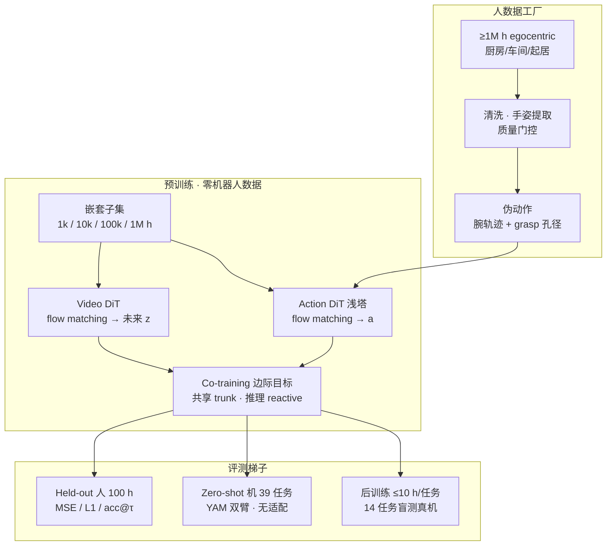

# Dyna-2（Dyna Robotics · 百万小时 WAM 缩放律）

**Dyna-2** 是 **Dyna Robotics**（2026-08 研究长文）发布的旗舰 **World-Action Model（WAM）**：在 **≥1,000,000 小时** egocentric 人类操作视频上预训练（预训练 **不含** 机器人数据），报告 held-out 人数据幂律缩放，并主张首次在 **零样本机器人离线评测** 上测到随人数据小时数单调的 **人→机跨具身缩放律**；后训练仅用少量机器人数据即可覆盖静止双臂、WUJI-2 灵巧手与半人形原型。

| 机构 | 戴纳机器人（Dyna Robotics） |
|------|------------------------------|
| 类型 | 公司 Research 技术报告（非 arXiv） |
| 入口 | <https://www.dyna.co/dyna-2> |
| 预训练数据 | **≥1M h** egocentric 人视频（嵌套 1k/10k/100k/1M） |
| 开源 | **未开源**（2026-08-11） |

## 一句话定义

**用百万小时级人类 egocentric 视频 + 视频/动作 flow-matching 共训，把 WAM 的缩放律从人 held-out 延伸到从未见过的机器人离线指标与后训练真机表现。**

## 英文缩写速查

| 缩写 | 英文全称 | 简要说明 |
|------|----------|----------|
| WAM | World-Action Model | 联合预测未来世界与动作的具身模型族 |
| VLA | Vision-Language-Action | Dyna-1 生产对照；反应式语义策略 |
| MoT | Mixture-of-Transformers | 多模态分塔 + 互注意力骨架 |
| DiT | Diffusion Transformer | 视频/动作塔的扩散式骨干 |
| MSE | Mean Squared Error | 动作 chunk 连续误差（缩放律主指标之一） |
| NFE | Number of Function Evaluations | 一步视频蒸馏相对 teacher 步数 |

## 为什么重要

- **把人视频缩放轴推到 1M h：** 相对 [EgoScale](../methods/egoscale.md)（~20k h、VLA + 人–机对齐 mid-training），Dyna-2 声称在 **不做对齐/共训** 的设定下，仍测到 **人→机零样本** 离线缩放——若成立，将改写「人数据必须先对齐才能服务机器人」的默认配方。
- **钉死世界建模必要性：** 同架构消融显示 **action-only** 无法建立可靠跨具身缩放；**video co-training**（含无动作标签视频）才是缩放出现的主驱动 → 与 [WAM 概念](../concepts/world-action-models.md)「未来预测参与表示塑造」一致，且明确 **推理可保持 reactive**。
- **产业对照样本：** 与 [Sunday ACT-2](./sunday-robotics-act2.md)、[GEN-1 千手](./generalist-gen1-thousand-hands.md) 同属 **闭源人类数据预训练** 路线，但主张点落在 **WAM 目标 + 跨具身幂律**，而非家用 Solve 或末端多样性。

## 流程总览

## 核心原理

### 架构（Joint 族 · 推理可 action-only）

- **MoT + 分模态 DiT：** 视频与动作各自 tokenize 与 DiT 层；proprio 进动作塔；文本 cross-attn 进视频侧。
- **浅动作塔接早期视频层：** 作者称时序推理多在早期层，此设计换 **实时延迟**。
- **Flow matching：** 对未来视频 latent 与动作 chunk 分别沿直线噪声路径拟合速度场。
- **缩放律配方的 \(\mathcal{L}_{\mathrm{co}}\)：** 视频与动作 **边际** 速度场共训；动作塔 **不** 吃噪声未来视频 → 推理时 **不** 滚未来视频（仍属 WAM：预训练世界损失塑造共享表示）。

### 缩放实验设计

| 设计选择 | 含义 |
|----------|------|
| 嵌套精确小时 | 更大预算只 **加数据**，不换分布 |
| 固定训练/评测配置 | 唯一变量 = 人数据小时数 |
| 零对齐后训练 | 归因「仅预训练缩放」；作者承认对齐可能更高，但会混淆因果 |
| 多连续 + 阈值指标 | 降低「阈值指标伪涌现」风险（引 Schaeffer et al.） |

### 关键自报数字（读作公司内部结果）

| 结果 | 数量级 |
|------|--------|
| 人 held-out 幂律 | 四指标均单调；例 MSE \(R^2\approx0.92\) |
| 后训练 14 任务归一化均值 | **20% → 53%**（1k → 1M h 预训练） |
| Bottle Cap / ~13 min 数据 | 随预训练升至约 **50%** SR |
| Lockbox Key Turning | ≤100k：**0%**；1M：**90%** |
| 早版 WAM vs Dyna-1 VLA | 成功率约 **1.55×**；现场 pass **87% vs 46%** |
| 语言跟随综合分 | action-only **0.35** → full video co-train **0.96** |
| 一步视频蒸馏 | **10.2 s → 0.11 s** / 3s 三视角片段（1×H100） |

## 工程实践

| 项 | 读法 |
|----|------|
| 选型 | 若目标是 **「人视频能否不经对齐就抬升机端」**，优先读本页 + [EgoScale](../methods/egoscale.md) 对照（后者显式 mid-training 对齐） |
| 伪动作接口 | 腕 + 连续 grasp；**非** 高 DoF 重定向手指空间（与 EgoScale Sharpa 22-DoF 不同） |
| 部署栈 | 公司站：DYNA-VLM → **Dyna-2** → System0 → SAUR；本页只钉 WAM 研究主张 |
| 开源边界 | **无可运行实现** → 源码运行时序图 **不适用** |
| 复现策略 | 独立方应优先复现 **嵌套小时梯子 + 固定机端评测集** 的协议，而非追逐 headline SR |

### 源码运行时序图

**不适用** — 截至 2026-08-11，研究页与公司站 **未发布** 训练/推理代码、权重或数据集；无可辨识 README 入口。

## 局限与风险

- **非 peer-reviewed / 无 arXiv：** 定量全部来自公司技术报告与客户现场；缺第三方基准。
- **确认未开源（2026-08-11）：** 无 GitHub / HF；百万小时语料与清洗管线均不可审计。
- **「首次」跨具身缩放律：** 需对照 EgoScale（人 loss 缩放 + 对齐后真机）、RDT2 / LAP（单点零样本跨具身）等；本页采纳作者 **「零适配、纯人预训练梯子」** 定义，但仍是 **自报**。
- **1M 点源混合差异：** 文中注明 ~1M 臂的 diamond 点 **源混合** 与嵌套梯子不同——读曲线时勿把最右点与左侧完全同分布。
- **生产数字与研究梯子配方不同：** §4 多用「production」检查点；勿与 §3 缩放律检查点混为一谈。

## 结论

**Dyna-2 是目前最强的「百万小时人视频 × Joint WAM × 跨具身缩放」产业主张：世界建模（尤其无标签视频共训）被写成跨具身幂律的必要条件，而不是可选装饰。**

- 真影响指标是 **嵌套小时梯子上的人/机离线幂律** 与 **同后训练协议下的真机归一化均值**，不是单任务 demo。
- 与 EgoScale 对照时，关键差在 **是否做人–机对齐 mid-training** 与 **VLA vs WAM 目标**。
- 工程上应按 **闭源参照** 读：可指导数据采集预算与目标设计，不能当可复现基线。
- 若需开源 Joint WAM 落地，转向 [DreamWAM](./paper-dreamwam.md)、[DiT4DiT](./paper-dit4dit-video-action-model.md) 等已发权重工作。
- 下一步观察点：是否发布 arXiv、是否开放评测协议/子集、10M h 曲线是否延续。

## 关联页面

- [World Action Models](../concepts/world-action-models.md) — WAM 边界与 Joint/Cascaded 族谱
- [Embodied Scaling Laws](../concepts/embodied-scaling-laws.md) — 具身缩放概念层
- [EgoScale](../methods/egoscale.md) — ~20k h 人视频 VLA + 对齐 mid-training 对照
- [VLA](../methods/vla.md) — Dyna-1 生产对照范式
- [DreamWAM](./paper-dreamwam.md) / [ω-0](./paper-omega-0.md) — 开源/WIP 学术 Joint WAM
- [ACT-2（Sunday）](./sunday-robotics-act2.md) / [GEN-1 千手](./generalist-gen1-thousand-hands.md) — 闭源人类数据预训练产业对照
- [WAM 纵深路线](../../roadmap/depth-wam.md) — Stage 3 / Stage 5 学习入口
- [Manipulation](../tasks/manipulation.md) — 任务语境

## 参考来源

- [sources/blogs/dyna_2_million_hour_wam.md](../../sources/blogs/dyna_2_million_hour_wam.md) — 研究长文归纳摘录
- [sources/sites/dyna-co-dyna-2.md](../../sources/sites/dyna-co-dyna-2.md) — 研究页开源核查
- [sources/sites/dyna-co.md](../../sources/sites/dyna-co.md) — 公司站与分层栈
- 官方页：<https://www.dyna.co/dyna-2>

## 推荐继续阅读

- [Dyna-2 官方研究页](https://www.dyna.co/dyna-2)（含视频与缩放曲线）
- Zheng et al., *EgoScale* — [arXiv:2602.16710](https://arxiv.org/abs/2602.16710)
- Ye et al., *DreamZero*（WAM 零样本策略）— [arXiv:2602.15922](https://arxiv.org/abs/2602.15922)
