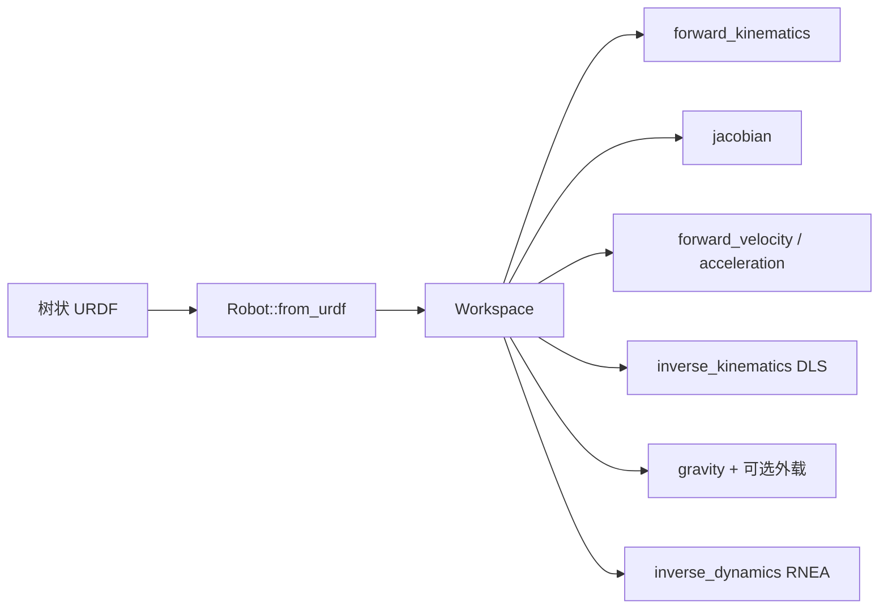
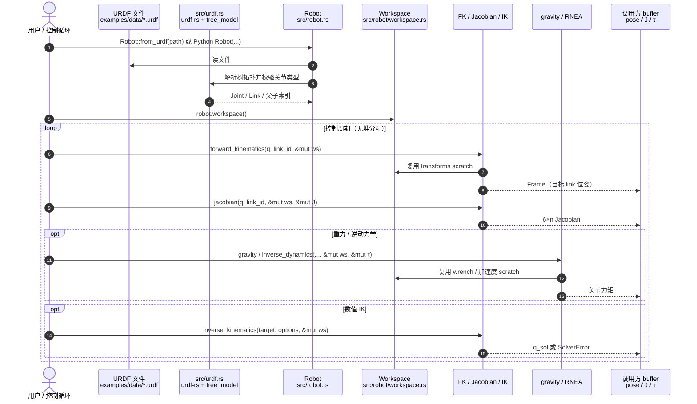

# Dynibo（Rust 运动学与动力学库）

**Dynibo**（[xiaojie-xue/dynibo](https://github.com/xiaojie-xue/dynibo)）是一个 **快速、轻量、可复现验证** 的机器人运动学与动力学库：在运行时从 **URDF** 加载树状拓扑，通过可复用 **`Workspace`** 把内存分配移出计算循环，并在同一套 Rust 核心上暴露 **Rust / Python / C / C++** 接口。定位是「最常用运动学–动力学原语」而非完整最优控制或可微仿真栈。

## 一句话定义

> 用 Rust 实现、计算期零分配的树状 URDF 运动学/动力学内核：FK、Jacobian、数值 IK、重力补偿与 RNEA，Python/C/C++ 共用同一核心。

## 英文缩写速查

| 缩写 | 英文全称 | 简要说明 |
|------|----------|----------|
| FK | Forward Kinematics | 由关节配置求目标 link 位姿 |
| IK | Inverse Kinematics | 由目标位姿求关节角（Dynibo 为阻尼最小二乘数值解） |
| RNEA | Recursive Newton–Euler Algorithm | 递归牛顿–欧拉逆动力学 $\tau=ID(q,\dot q,\ddot q)$ |
| URDF | Unified Robot Description Format | 统一机器人描述；Dynibo 运行时解析树状模型 |
| DLS | Damped Least Squares | Dynibo `inverse_kinematics` 使用的阻尼最小二乘 |
| ABI | Application Binary Interface | C 绑定与 Pinocchio bench 计时中需扣除的固定开销语境 |

## 为什么重要

- **轻量常用子集：** 控制环、遥操作与嵌入式侧大量场景只需 FK / Jacobian / 重力 / RNEA / 数值 IK；Dynibo 故意不做完整 ABA/CRBA/解析导数生态，换取小依赖面（Rust 核心仅 `nalgebra` + `urdf-rs`）。
- **计算期零分配：** 先创建 `Workspace` 与输出 buffer，再进循环——与硬实时 / 高频控制环的内存纪律一致；官方测试显式覆盖 allocation-free 路径。
- **相对 Pinocchio 的选型锚点：** README Criterion（同 URDF、同关节状态；模型与 Workspace 创建不计时）报告相对 Pinocchio 3.9.0 约 **1.17–2.70×**；同时用 Pinocchio 作 **oracle** 对照 FK/Jacobian/gravity/RNEA，降低「快但不对」风险。
- **多语言同一内核：** `cargo add dynibo`、`pip install dynibo`、CMake `dynibo::dynibo` 共享实现，避免 Python 原型与 C++ 部署两套动力学语义。

## 核心原理

### 1. 运行时拓扑 + Workspace

| 类型 | 角色 |
|------|------|
| `Robot` | 自 URDF 校验并缓存树：`Joint` / `Link` / 父子索引 / 深度 |
| `Workspace` | 按模型尺寸预分配变换、速度、加速度、wrench 等 scratch |
| `LinkId` / `Frame` / `Twist` / `Wrench` | 目标 link 句柄与空间量 |

加载后主路径为：**配置 `q`（及可选 $\dot q,\ddot q$）→ 复用 Workspace → 写出位姿/Jacobian/力矩到调用方 buffer**。

### 2. 公开算法面

- **运动学：** 目标 link 位姿、6D Jacobian、空间速度/加速度。
- **IK：** 阻尼最小二乘（`InverseKinematicsOptions`：迭代上限、位姿容差、`damping`、`max_step_norm`）。
- **动力学：** 重力补偿（可附 `IndexedLoad` 外载）与 RNEA 逆动力学；**不暴露**完整 ABA/CRBA/解析导数 API（与 [Pinocchio](./pinocchio.md) 分工见下）。

### 3. 与相邻库的分工

| 库 | 定位 | 典型选用 |
|----|------|----------|
| **Dynibo** | Rust 轻量 FK/ID/数值 IK；零分配 Workspace | 高频控制环、Rust/嵌入式、要小依赖的 Python 调用 |
| **[Pinocchio](./pinocchio.md)** | C++ 刚体算法全家桶 + 解析导数 | WBC/MPC/DDP、浮动基与质心动量、Crocoddyl 等生态 |
| **[ssik](./ssik.md)** | 6R/7R **解析全分支** IK | 需枚举肩/肘/腕构型；非「单次 DLS 收敛」语义 |
| **adam**（[ami-iit/adam](../../sources/repos/ami-iit-adam.md)） | 多后端可微动力学 | 优化 / 批处理 / 自动微分，而非硬实时零分配 |

## 源码运行时序图

官方仓库入口对齐 `examples/franka.rs`、`src/robot.rs` 与 `bindings/python/dynibo`：一次「加载 → FK / Jacobian / 重力」交互如下。

**复现路径：** Rust `cargo add dynibo` + `examples/franka.rs`；Python `pip install dynibo`（v0.1.0）；对照性能 `cargo bench --features pinocchio-bench --bench pinocchio -- --quick`；全套 `bash ci/test-all.sh`。

## 工程实践

| 步骤 | 建议 |
|------|------|
| 快速验证 | `pip install dynibo` 或 `cargo add dynibo` → 跑 `examples/franka.rs`（Franka FER 法兰 FK/J/gravity） |
| 控制环接入 | 进程启动时 `from_urdf` + `workspace()` + 预分配输出；循环内只写 `q` 与 buffer |
| 与 Pinocchio 对照 | 同一 URDF 用官方 oracle/bench；数值不一致时先查关节顺序、fixed 关节占位与重力方向 |
| C/C++ 部署 | `cmake -S . -B build/c` → install → 链接 `dynibo::dynibo` |
| 覆盖率门禁 | 上游 CI：行 ≥85%、分支 ≥75%；合入前跑 `ci/test-all.sh` |

**开源状态（截至 2026-08-09）：** **已开源（MIT）** — [GitHub](https://github.com/xiaojie-xue/dynibo)、[PyPI `dynibo` 0.1.0](https://pypi.org/project/dynibo/)、Release `v0.1.0`（2026-08-05）；无独立项目页；无权重/数据集依赖。作者声明项目仍处早期，欢迎 issue/PR。

## 局限与风险

- **早期版本（v0.1.0）：** API 与模型假设可能仍变；生产接入前应钉版本并用 Pinocchio oracle 做回归。
- **算法面窄于 Pinocchio：** 无公开 ABA/CRBA、无解析导数、无质心动量/浮动基专用高层 API；做 WBC/DDP 仍应优先 [Pinocchio](./pinocchio.md) / Crocoddyl 生态。
- **树状 URDF only：** 拒绝非树拓扑；关节限于 revolute / continuous / prismatic / fixed。README 亦提示 fixed 关节当前仍占配置向量一项——对接厂商 URDF 时需核对 `joint_count` 与驱动自由度。
- **IK 语义：** 阻尼最小二乘 **单解/种子依赖**，不是 [ssik](./ssik.md) 式全分支解析；奇异附近依赖 `damping` 与步长限制。
- **性能数字语境：** 加速比来自作者本机 Criterion、且已扣除 Pinocchio C ABI 固定开销；换 CPU/编译选项/模型后需自测，勿直接当作跨平台 SLA。

## 关联页面

- [Pinocchio](./pinocchio.md) — 行业标准刚体动力学与解析导数栈，Dynibo 的对照与 oracle
- [Articulated Body Algorithms（ABA / RNEA）](../formalizations/articulated-body-algorithms.md) — RNEA/ABA 形式化；Dynibo 暴露 RNEA 侧
- [URDF（统一机器人描述格式）](../concepts/urdf-robot-description.md) — Dynibo 运行时模型入口
- [ssik（解析逆运动学）](./ssik.md) — 全分支解析 IK，与 Dynibo DLS-IK 互补
- [Pinocchio 快速上手](../queries/pinocchio-quick-start.md) — 同类三步心智模型的对照读本
- [重力补偿](../concepts/gravity-compensation.md) — `gravity()` 即 $g(q)$ 控制用法

## 参考来源

- [sources/repos/dynibo.md](../../sources/repos/dynibo.md) — 本页编译依据（仓库 README / 目录 / PyPI / Release 核查）

## 推荐继续阅读

- [dynibo GitHub README](https://github.com/xiaojie-xue/dynibo)（英）与 [README.zh.md](https://github.com/xiaojie-xue/dynibo/blob/main/README.zh.md)（中）
- [Pinocchio 官方文档](https://stack-of-tasks.github.io/pinocchio/) — 需要完整动力学/导数时的默认升级路径
