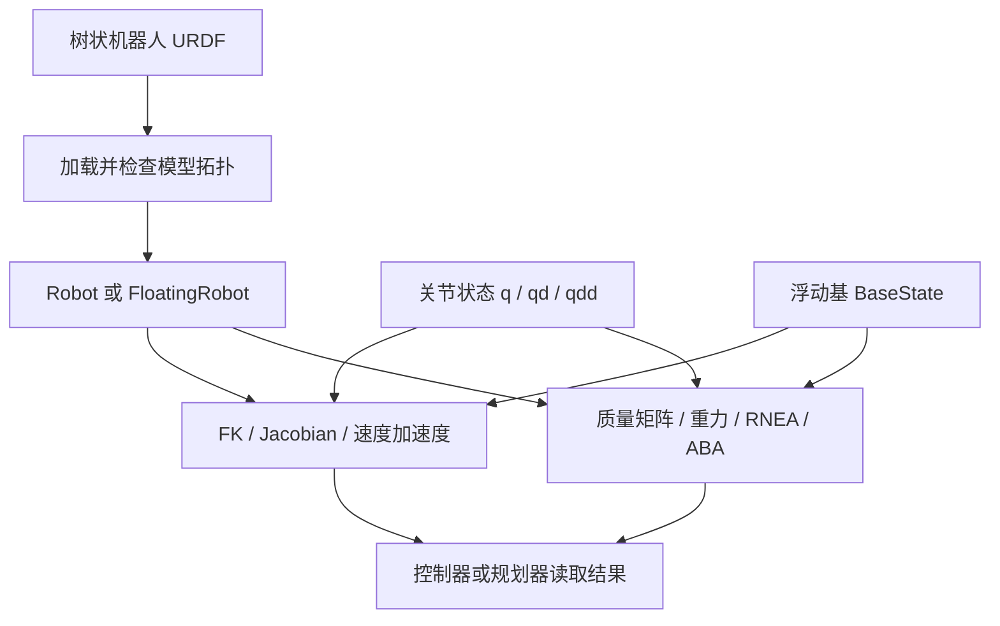

# Dynibo（Rust 运动学与动力学库）

**Dynibo**（[xiaojie-xue/dynibo](https://github.com/xiaojie-xue/dynibo)）是面向控制器开发的机器人运动学与动力学库。它以 Rust 为核心，从 URDF 加载树状机器人模型，支持固定基座与浮动基座，并提供 Rust、Python、C、C++ 接口。它提供可嵌入控制器与上层工具的算法原语，不是完整的运动规划、强化学习或仿真框架。

## 一句话定义

> 以同一 Rust 核心为多种语言提供机器人运动学与动力学计算；通过固定/浮动基座模型和复用内部工作区，覆盖 FK、Jacobian、RNEA 与 ABA 等常用算法。

## 英文缩写速查

| 缩写 | 英文全称 | 简要说明 |
|------|----------|----------|
| URDF | Unified Robot Description Format | 描述连杆、关节及惯量属性的机器人模型格式 |
| FK | Forward Kinematics | 根据关节配置计算目标 link 位姿 |
| IK | Inverse Kinematics | 根据目标位姿求关节配置；Dynibo 的 DLS 求解器仅适用于固定基座 |
| RNEA | Recursive Newton–Euler Algorithm | 递归牛顿—欧拉逆动力学算法 |
| ABA | Articulated-Body Algorithm | 铰接体算法，用于线性时间复杂度的正动力学求解 |
| DLS | Damped Least Squares | 带阻尼的最小二乘数值逆运动学方法 |

## 为什么重要

- **从模型到计算：** 直接读取运行时 URDF，建立树状拓扑；API 返回 link 位姿、Jacobian、质量矩阵、广义力或加速度。
- **适合高频计算路径：** 官方说明 Rust 核心在创建机器人后复用内部存储，主计算路径避免循环内堆分配或容量变化。实际控制周期仍需在目标硬件和编译配置下测量。
- **多语言共享语义：** Rust、Python、C 和 C++ 都调用同一 Rust 核心，减少原型和部署端各自实现算法产生的差异。
- **能力边界清楚：** 现有版本支持 RNEA 与 ABA 等动力学算法；Pinocchio 仍有更广的算法和下游优化生态，选型应按接口需求，而非只看单个速度数字。

## API 与模型范围

| 类别 | 接口 / 约定 | 工程含义 |
|------|-------------|----------|
| 固定基座 | `Robot` | 根 link 位姿固定；广义量由关节组成 |
| 浮动基座 | `FloatingRobot`、`BaseState` | 六自由度根状态显式传入；浮动模型的 root link 要有正质量 inertial block |
| 运动学 | FK、Jacobian、Jacobian derivative、正向速度/加速度 | 浮动基 Jacobian 的前六列对应基座运动 |
| 逆运动学 | 固定基座 DLS-IK | 由容差、阻尼、最大迭代数和步长限制控制；不支持浮动基 IK |
| 动力学 | `mass_matrix`、`velocity_product_forces`、`gravity`、`inverse_dynamics`、`forward_dynamics` | 对应质量矩阵、速度乘积力、重力、RNEA 逆动力学和 ABA 正动力学 |
| 外部载荷 | link 局部 wrench / load | 可传给重力与动力学运算 |
| URDF 关节 | revolute、continuous、prismatic、fixed | fixed joint 不占广义量维度；输入长度按 API 约定检查 |

浮动基座的关节向量仍只包含 URDF 中的关节坐标；基座位姿与速度通过 `BaseState` 显式传入，不要把四元数或 6 个基座变量拼入关节向量。浮动基座的广义速度、广义力和 Jacobian 才在关节维度前增加 6 个基座分量。

## 计算流程

```mermaid
flowchart TB
  URDF["树状机器人 URDF"] --> Load["加载并检查模型拓扑"]
  Load --> Robot["Robot 或 FloatingRobot"]
  State["关节状态 q / qd / qdd"] --> Kin["FK / Jacobian / 速度加速度"]
  Robot --> Kin
  Base["浮动基 BaseState"] --> Kin
  Robot --> Dyn["质量矩阵 / 重力 / RNEA / ABA"]
  State --> Dyn
  Base --> Dyn
  Kin --> Consumer["控制器或规划器读取结果"]
  Dyn --> Consumer
```

图中展示算法边界与输入，不代表库自带控制器或规划器。浮动基计算需要与调用匹配的 `BaseState`；固定基计算无需该状态。

## 动力学与控制接口

Dynibo 文档将刚体动力学写为：

$$
\tau = M(q)\dot{\nu} + C(q,\nu)\nu + g(q).
$$

- `mass_matrix` 返回对称广义惯性矩阵。fixed joint 不占矩阵行列，但其子树惯量仍通过连杆关系影响可动祖先关节。
- `velocity_product_forces` 返回科氏与离心项对应的广义力；不包括重力、外部载荷或用户给定的基座加速度。
- `gravity` 可用于静态重力补偿，也支持 link 局部外部载荷。
- `inverse_dynamics` 以 RNEA 根据关节状态、重力和可选 load 计算广义力；浮动基模式还需显式传入基座状态。
- `forward_dynamics` 以 ABA 计算广义加速度。浮动基模式中，输入力和输出加速度都包含世界坐标系下基座的角、线分量；奇异 articulated inertia 会返回 solver error。

## 性能与验证

作者 README 报告了与 Pinocchio 的基准对照。模型分别是 7 关节固定基 Franka 和 29 关节浮动基 Unitree G1；下表为 README 当前列出的加速比，是作者基准结果，不等同于跨平台性能保证。

| 运算 | Rust：Franka | Rust：G1 | Python：Franka | Python：G1 |
|------|-------------:|----------:|---------------:|-----------:|
| Jacobian | 1.59× | 1.80× | 1.28× | 1.38× |
| RNEA | 1.74× | 1.81× | 1.17× | 1.54× |
| ABA | 1.20× | 1.14× | 1.81× | 1.89× |

基准脚本位于上游 `benches/`。测试还包含 URDF 生成用例、有限差分、动力学一致性、浮动基、外部载荷、错误输入、分配行为，以及与独立 Pinocchio oracle 的数值对照。比较结果前应查看基准脚本的数据、计时范围和运行环境，并在目标控制器 CPU 上重测。

## 工程实践与局限

| 使用场景 | 建议 |
|----------|------|
| 控制环集成 | 加载模型后复用 `Robot` / `FloatingRobot` 内部计算存储；Rust/C 输出写入调用方 buffer，目标周期另做 profiling |
| 浮动基机器人 | 确认 root inertial 的质量有效；每次调用显式传入基座位姿和速度 |
| 并行计算 | 每个机器人对象拥有自己的 workspace；用 `fork()` 创建隔离实例，不要让并行任务共享同一可变对象 |
| Python 原型 | PyPI 页面核查时仍列 v0.1.0；上游 GitHub 最新 release 为 v0.5.1，需确认所需 API 是否已发布到 Python 包 |
| C/C++ 集成 | 从上游 Release 获取平台预编译包，或用 CMake 构建并链接 `dynibo::dynibo` |

开源状态已核实：核心仓库公开、MIT 许可；Rust crate、Python binding 与 C/C++ binding 均在公开仓库中。GitHub 最新 release 为 **v0.5.1（2026-09-15）**，包含 Linux x86-64、macOS ARM64、Windows x86-64 的 C/C++ 压缩包。PyPI 项目页仍显示 **v0.1.0（2026-08-05）**，因此 Python 包版本与 GitHub release 存在版本差异。仓库附带的 Franka / Unitree 示例机器人描述保留各自第三方许可；不要将 MIT 许可理解为这些资产也统一采用 MIT。

此工具不包含传感器驱动、状态估计、实时调度器、控制策略或安全验证。零分配路径和基准数据不能单独证明它满足某个机器人的硬实时、稳定性或安全要求。

## 关联页面

- [Pinocchio](./pinocchio.md) — 算法面和下游优化生态更广的刚体动力学库
- [Articulated Body Algorithms（ABA / RNEA）](../formalizations/articulated-body-algorithms.md) — RNEA 逆动力学与 ABA 正动力学原理
- [URDF（统一机器人描述格式）](../concepts/urdf-robot-description.md) — Dynibo 运行时读取的机器人模型
- [ssik（解析逆运动学）](./ssik.md) — 和 Dynibo 固定基 DLS-IK 的解法对照
- [Pinocchio 快速上手](../queries/pinocchio-quick-start.md) — 同类模型、FK 与动力学工具链对照
- [重力补偿](../concepts/gravity-compensation.md) — 使用 `gravity` 估计静态补偿项

## 参考来源

- [Dynibo 来源归档](../../sources/repos/dynibo.md) — 仓库结构、README、当前版本、性能声明与开放状态
- [Dynibo 官方文档：运动学](https://dynibo.readthedocs.io/en/latest/zh/user-guide/kinematics/)
- [Dynibo 官方文档：动力学](https://dynibo.readthedocs.io/en/latest/zh/user-guide/dynamics/)
- [Dynibo 官方文档：固定与浮动基座](https://dynibo.readthedocs.io/en/latest/zh/user-guide/fixed-and-floating-bases/)
- [GitHub Release v0.5.1](https://github.com/xiaojie-xue/dynibo/releases/tag/v0.5.1)
- [PyPI dynibo](https://pypi.org/project/dynibo/)

## 推荐继续阅读

- [Dynibo 仓库](https://github.com/xiaojie-xue/dynibo) — README、示例、基准、测试与语言绑定
- [Pinocchio 官方文档](https://stack-of-tasks.github.io/pinocchio/) — 需要更广刚体算法和优化生态时对照
