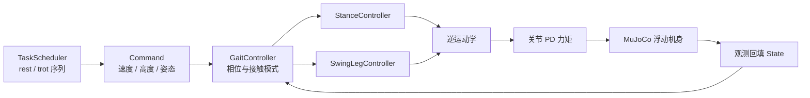

# easy_quadruped（Pupper 控制栈 + MuJoCo 闭环）

## 一句话定义

**easy_quadruped** 是在 [StanfordQuadruped](https://github.com/stanfordroboticsclub/StanfordQuadruped)（[Stanford Pupper](./stanford-doggo-and-pupper.md) 软件 lineage）基础上独立维护的二次开发仓库：保留 **步态调度、支撑/摆腿足端规划、行为状态机与逆运动学**，并补齐 **MuJoCo 浮动机身仿真、观测回填与可脚本化任务序列**，便于在不依赖大规模 RL 训练的前提下理解四足控制闭环。

## 英文缩写速查

| 缩写 | 英文全称 | 简要说明 |
|------|----------|----------|
| IK | Inverse Kinematics | 满足末端/姿态约束求解关节角的运动学逆解 |
| MuJoCo | Multi-Joint dynamics with Contact | 接触丰富的刚体物理仿真引擎 |
| RL | Reinforcement Learning | 通过与环境交互最大化长期回报来学习策略的范式 |
| PD | Proportional–Derivative | 关节位置/阻抗底层控制，策略输出常为其 setpoint |
| ROS 2 | Robot Operating System 2 | 机器人系统集成与通信的常用中间件 |
| VLM | Vision-Language Model | 视觉-语言多模态理解模型，VLA 的上游 |
| MJCF | MuJoCo XML Format | MuJoCo 的模型与场景描述格式 |
| Sim2Real | Simulation to Real | 把仿真中学到的策略迁移落地真机的工程主线 |
| DR | Domain Randomization | 训练时随机化仿真参数以提升跨域鲁棒迁移 |
| BOM | Bill of Materials | 物料清单，硬件零部件列表 |
| legged_gym | Legged Gym | 足式机器人 RL 训练的常用开源框架 |
| Isaac Gym | NVIDIA Isaac Gym | GPU 并行刚体仿真训练环境 |
| Locomotion | Robot Locomotion | 足式/人形等无轮移动能力的总称 |

## 为什么重要

- **与 RL 训练栈形成对照**：本库 [Legged Gym](./legged-gym.md)、[robot_lab](https://github.com/fan-ziqi/robot_lab) 等解决的是「如何在并行仿真里训策略」；easy_quadruped 展示的是「**时钟式步态 + 足端轨迹 + IK + 关节 PD**」这条经典模型控制链，对读懂四足底层控制更有直接性。
- **低成本教学载体**：对应 **早期 Pupper / StanfordQuadruped**（树莓派 + 舵机、模型步态），与当前 **[Pupper v3](./stanford-doggo-and-pupper.md)**（无刷 GIM4305 + ROS 2 monorepo + RL/VLM）不是同一代软件栈；公开快照把仿真入口收敛到 `run_floating_base.py`，降低上手摩擦。
- **MuJoCo 闭环样板**：`TaskScheduler → Controller → IK → PD → MuJoCo → State` 是小型四足在 [MuJoCo](./mujoco.md) 里做集成测试与调参的常见形态，可与 Menagerie / RL 环境区分使用场景。

> **非官方声明：** 维护方 Xzgz718 在 `NOTICE` 中明确本仓非 Stanford Student Robotics 官方发布；名称仅用于标明上游来源。

## 控制架构概览



**行为状态：** `REST`、`TROT`、`HOP` 等通过状态机切换；公开仿真以 **对角 Trot** 与静止 **Rest** 为主，`sim/task_scheduler.py` 支持段间平滑过渡步态与反馈增益（`vx`、`z_clearance`、`swing_time`、`attitude_kp` 等）。

## 公开快照包含什么

| 目录 | 职责 |
|------|------|
| `src/` | `Controller` 整合步态与足端规划；`Gaits` 计算接触模式 |
| `pupper/` | 机器人几何、`Config` 控制周期与步态 tick、舵机标定、硬件接口 |
| `sim/` | MJCF 生成、浮动机身闭环、`sim_robot` 观测桥接、任务调度 |
| `calibrate_servos.py` | 实机舵机零位标定 |

刻意未纳入：上游完整部署残留、本地 IDE/日志/课件草稿（见上游 README 说明）。

## 快速验证（仓库根目录）

```bash
pip install mujoco transforms3d numpy
python -m sim.build_floating_base_mjcf
python sim/run_floating_base.py --mode trot --duration 20
```

无界面任务序列示例：

```bash
python sim/run_floating_base.py --headless --duration 8 --task-sequence "rest:1.0,trot:4.0,rest"
```

更细参数与任务语法见上游 [`sim/README.md`](https://github.com/Xzgz718/easy_quadruped/blob/main/sim/README.md)。

## 与 Stanford Pupper / RL 生态的关系

| 路线 | 代表 | 本库角色 |
|------|------|----------|
| 开源硬件 + 模型控制 | [Stanford Doggo / Pupper](./stanford-doggo-and-pupper.md) | easy_quadruped 承接 **软件控制与 MuJoCo 仿真** 切片 |
| 并行 RL + sim2real | [Legged Gym](./legged-gym.md)、Isaac 系 | 互补：学 reward/DR 之前可先弄清步态相位与足端轨迹 |
| 步态理论 | [Gait Generation](../concepts/gait-generation.md) | 仓库内 **Trot 对角支撑** 是参数化步态调度器的具体实现 |

## 常见误区

1. **误当作官方 Stanford 发布** — 须读 `NOTICE`；硬件与 BOM 仍以社区 [StanfordPupper](https://github.com/stanfordroboticsclub/StanfordPupper) 等为准。
2. **与 legged_gym 混为一谈** — 本仓无 Isaac Gym 并行环境，也不训练神经网络 locomotion 策略。
3. **期待完整 ROS2/Gazebo 镜像** — 公开快照以 MuJoCo `run_floating_base` 为主；GitHub 描述中的 ros2/gazebo 可能指上游或其它分支，以仓库当前树为准。

## 关联页面

- [Stanford Doggo / Pupper](./stanford-doggo-and-pupper.md)
- [四足机器人](./quadruped-robot.md)
- [MuJoCo](./mujoco.md)
- [Legged Gym](./legged-gym.md)
- [Gait Generation（步态生成）](../concepts/gait-generation.md)
- [Locomotion 任务](../tasks/locomotion.md)

## 推荐继续阅读

- 上游官方 lineage：[StanfordQuadruped](https://github.com/stanfordroboticsclub/StanfordQuadruped)
- 本 fork 仓库：<https://github.com/Xzgz718/easy_quadruped>
- Pupper 社区硬件文档（交叉核对）：[StanfordPupper](https://github.com/stanfordroboticsclub/StanfordPupper)

## 参考来源

- [easy_quadruped（sources 归档）](../../sources/repos/easy_quadruped.md)
- 上游 MIT 项目：Stanford Student Robotics, [StanfordQuadruped](https://github.com/stanfordroboticsclub/StanfordQuadruped)（2020）
