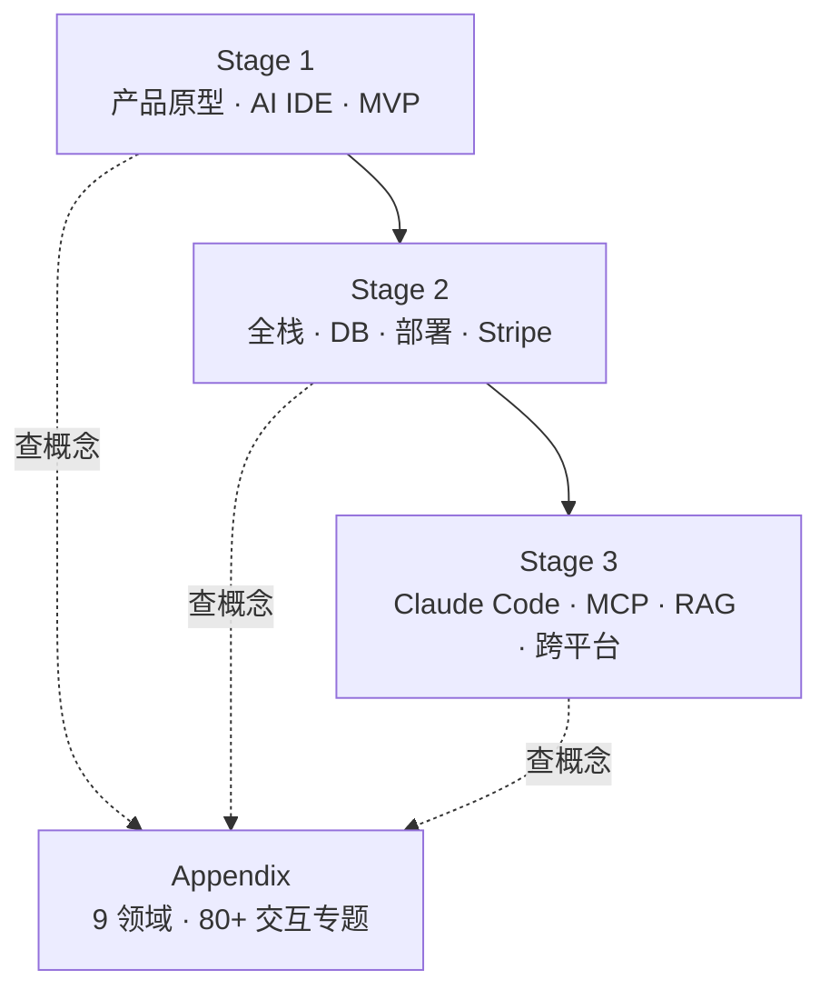

# Easy-Vibe（Datawhale）

**Easy-Vibe**（[datawhalechina/easy-vibe](https://github.com/datawhalechina/easy-vibe)）是 Datawhale 维护的 **vibe coding 101** 开源教程：**用自然语言描述想法 → AI IDE / Agent 协作 → 交付可演示乃至可上线的产品**。在线站 [datawhalechina.github.io/easy-vibe](https://datawhalechina.github.io/easy-vibe/) 提供 10 语言正文与大量 **交互式原理动画**（含 RAG 数据流「游戏化」演示）。

## 一句话定义

从零基础到 **AI-Native 工程**：先靠对话做出 MVP，再沿 Stage 2 走全栈，Stage 3 深入 **Claude Code、MCP、RAG、LangGraph** 与多端交付 — 是中文生态里 **路径最完整的 vibe coding 系统课** 之一。

## 英文缩写速查

| 缩写 | 英文全称 | 简要说明 |
|------|----------|----------|
| MVP | Minimum Viable Product | Stage 1 目标：可给用户看的原型 |
| MCP | Model Context Protocol | Stage 3：Claude Code 接 GitHub/DB/API |
| RAG | Retrieval-Augmented Generation | Stage 3 + 附录交互教程；见 [RAG 概念页](../concepts/retrieval-augmented-generation.md) |
| SaaS | Software as a Service | Stage 2  capstone：文案站 + Stripe |
| JTBD | Jobs to Be Done | Stage 1 附录：用户需求分析框架 |

## 为什么重要（对本知识库读者）

- **中文 vibe coding 入口：** 本库 [Agentic Coding 软件工程基础](../concepts/agentic-coding-software-fundamentals.md) 讲 **有 agent 仍要懂 SE 取舍**；Easy-Vibe 教 **第一轮怎么把想法做出来** — 宜 **先快赢、再补工程纪律**（对照 [mattpocock/skills](mattpocock-skills.md)、[Superpowers](superpowers-obra.md)）。
- **RAG 可视化入门：** Stage 3 [RAG 原理](https://datawhalechina.github.io/easy-vibe/en/stage-3/ai-advanced/rag-introduction/) 与附录 **点击式 RAG 流程** 适合在读完 [RAG 概念页](../concepts/retrieval-augmented-generation.md) 后 **动手建立直觉**；进阶链 [LangGraph 高级 RAG](https://datawhalechina.github.io/easy-vibe/en/stage-3/ai-advanced/langgraph-advanced-rag/)。
- **Agent 维护本库的可参照物：** 根目录 **`llms.txt`** 为 OpenClaw/Cursor/Trae 等提供 **阶段决策树** — 与本站 [LLM Wiki](../references/llm-wiki-karpathy.md) + [ingest 规范](../../schema/ingest-workflow.md) 的「给 Agent 一张地图」同构。
- **与 LearnPrompt 分工：** [LearnPrompt](learnprompt.md) 偏 **任务卡 + Skill 工坊 + Obsidian 记忆**；Easy-Vibe 偏 **产品/全栈/跨平台课纲** + Datawhale 社区规模 — 机器人维护者做 **文档站、工具页、内部 dashboard** 时可并用。

## 核心结构：3+1 阶段

| 阶段 | 典型读者 | 关键模块 |
|------|----------|----------|
| **Stage 1** | 零基础 / PM / 创始人 | 学习地图、贪吃蛇体感、AI IDE 对比、Double Diamond / Mom Test、原型与 AI 能力集成 |
| **Stage 2** | 初级开发 / 独立黑客 | Figma→代码、Supabase、Git、部署、Stripe、SaaS 大作业、微信小程序后端 |
| **Stage 3** | AI-Native 开发者 | Claude Code 基础/MCP/Skills/长任务/Superpowers、RAG + LangGraph、小程序/Android/iOS/Electron 项目 |
| **Appendix** | 所有人 | 计算机基础、前后端、数据、架构、运维、AI 原理（交互动画） |

## 工程实践

| 场景 | 建议入口 |
|------|----------|
| 第一次 vibe coding | [AI 能力体感（游戏）](https://datawhalechina.github.io/easy-vibe/en/stage-1/ai-capabilities-through-games/) |
| 维护 markdown 知识库 | Stage 1 产品思维 + 本站 [ingest](../../schema/ingest-workflow.md)；Agent 读 [`llms.txt`](https://github.com/datawhalechina/easy-vibe/blob/main/llms.txt) |
| 接 MCP / Claude Code | [Stage 3 MCP 指南](https://datawhalechina.github.io/easy-vibe/en/stage-3/core-skills/mcp/) → 对照 [OpenClaw](openclaw.md) / [LangChain](painode-125-langchain.md) |
| 学 RAG 流水线 | [RAG 介绍](https://datawhalechina.github.io/easy-vibe/en/stage-3/ai-advanced/rag-introduction/) → [RAG 概念页](../concepts/retrieval-augmented-generation.md) |
| 本地预览教程站 | 克隆仓后按 README **Run Locally**（npm）；License **CC BY-NC-SA 4.0** |
| OpenClaw 入门 | 官方链 [hello-claw](https://github.com/datawhalechina/hello-claw) → [OpenClaw 实体页](openclaw.md) |

## 局限与风险

- **非机器人/具身主线：** 课纲面向 **通用 AI 产品**；Sim2Real、运动控制、VLA 需回到本站 `wiki/tasks/`、`wiki/methods/`。
- **vibe coding 速度 vs 工程深度：** 课程强调 **先做出来**；直接上生产需叠加 [Agentic Coding 软件工程基础](../concepts/agentic-coding-software-fundamentals.md) 与 [Superpowers](superpowers-obra.md) 式 TDD/评审 — 避免「能 demo 不能运维」。
- **工具链漂移：** AI IDE、Claude Code、Stripe/Supabase API 更新快 — 以仓库 **News** 与 GitHub 当前 HEAD 的 commit 为准。
- **License NC：** CC BY-NC-SA 限制 **商业再分发**；学习、内部引用、链到官方站无碍；二次商用需另议授权。

## 关联页面

- [Agentic Coding 时代的软件工程基础](../concepts/agentic-coding-software-fundamentals.md) — vibe coding 之后必补的 SE 取舍
- [Retrieval-Augmented Generation（RAG）](../concepts/retrieval-augmented-generation.md) — 理论概念 + Easy-Vibe 交互演示
- [LearnPrompt](learnprompt.md) — 中文 Agent/Skill 实战对照
- [OpenClaw](openclaw.md) — hello-claw 侧链
- [LangChain](painode-125-langchain.md) — Stage 3 RAG 生态常提及框架
- [LLM Wiki（Karpathy 模式）](../references/llm-wiki-karpathy.md) — llms.txt 导航同构
- [Ingest Workflow](../../schema/ingest-workflow.md) — 本仓库维护规范

## 参考来源

- [Easy-Vibe 仓库归档（本站）](../../sources/repos/easy-vibe.md)
- [Easy-Vibe 在线站归档（本站）](../../sources/sites/easy-vibe-datawhale.md)
- [datawhalechina/easy-vibe（GitHub）](https://github.com/datawhalechina/easy-vibe)
- [Easy-Vibe 在线教程](https://datawhalechina.github.io/easy-vibe/)

## 推荐继续阅读

- [开始学习 · Stage 1 学习地图](https://datawhalechina.github.io/easy-vibe/en/stage-1/learning-map/)
- [Appendix 交互知识库](https://datawhalechina.github.io/easy-vibe/en/appendix/)
- [Datawhale RSI 科普综述（本库 ingest）](../../sources/blogs/wechat_datawhale_rsi_survey_2026-09-19.md) — 同社区 AI 前沿叙事
