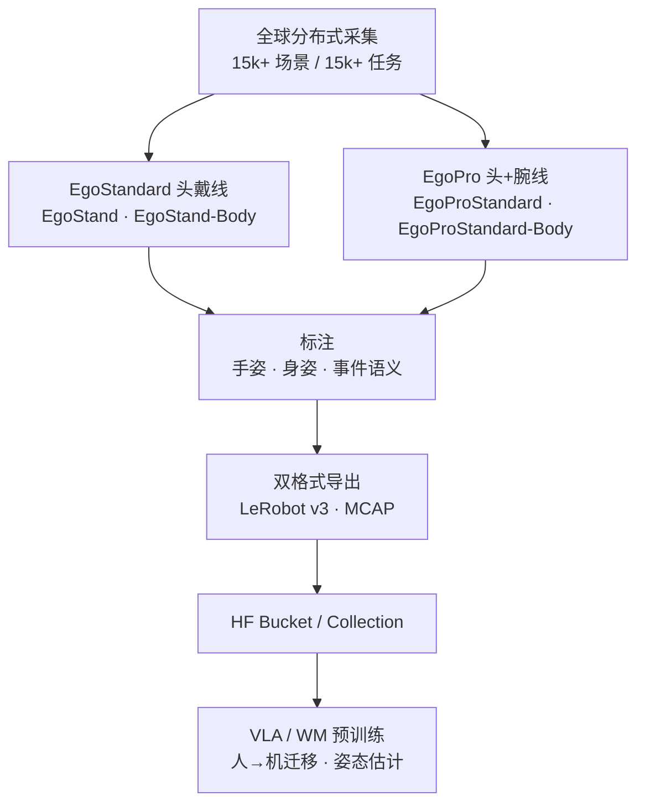

# EgoSuite-Open100K

**EgoSuite-Open100K** 是 [光轮智能（Lightwheel）](https://lightwheel.ai/) 与 [Hugging Face](https://huggingface.co/LightwheelAI) 联合发布的 **开放 egocentric 人类活动** 数据基础设施：全量规划 **100,000 小时**、**15,000+** 任务与场景，**首批 10,000 小时** 已在 Hub 上线（2026-08-26 blog）。官方入口：[项目页](https://egosuite100k.lightwheel.ai)、[HF Collection](https://huggingface.co/collections/LightwheelAI/egosuite-open100k)。

## 一句话定义

**全球最大规模之一的全标注开放第一人称人类活动语料：按 EgoStandard（头戴）与 EgoPro（头+腕）分线发布，附带 3D 手/身姿态与部分事件语义，以 LeRobot v3 与 MCAP 双格式可直接喂 VLA / 世界模型 / 人→机预训练——首批 1 万小时已开放，余量分阶段放出。**

## 英文缩写速查

| 缩写 | 英文全称 | 简要说明 |
|------|----------|----------|
| Ego | Egocentric | 第一人称 / 头戴（或头+腕）视角 |
| VLA | Vision-Language-Action | 视觉–语言–动作策略；宣称核心预训练下游 |
| MCAP | MCAP Container Format | 机器人/多模态日志容器；与 LeRobot 并列存储格式 |
| HF | Hugging Face | 数据集托管与 Bucket 分发平台 |
| HOI | Hand-Object Interaction | 手物交互；腕部视角子集针对接触细节 |
| Physical AI | Physical Artificial Intelligence | 需在物理世界中感知、推理与行动的 AI 系统 |

## 核心信息

| 项 | 内容 |
|----|------|
| **机构** | 光轮科技（Lightwheel） |
| **全量规划** | 100,000 h · 15,000+ 任务 · 15,000+ 场景 |
| **已发布** | 10,000 h（截至 2026-08-26；余量渐进发布） |
| **环境** | 7 大类 / 128 场景类型 / 18 任务类别 |
| **许可** | 学术研究 + **商业训练**（逐数据卡核对条款） |
| **格式** | LeRobot v3（Hub 流式）+ MCAP（同一 episode，不可重复计小时） |

### 数据集速查

| 子集 | HF 入口 | 规划规模 | 相机 | 姿态 |
|------|---------|----------|------|------|
| **EgoStand** | [EgoStandard](https://huggingface.co/datasets/LightwheelAI/EgoStandard) | 80,000 h | 头戴 | 手部 |
| **EgoStand-Body** | 同上 | 10,000 h | 头戴 | 手 + 全身 |
| **EgoProStandard** | [EgoPro](https://huggingface.co/datasets/LightwheelAI/EgoPro) | 8,000 h | 头 + 腕 | 手部 |
| **EgoProStandard-Body** | 同上 | 2,000 h | 头 + 腕 | 手 + 全身 |
| **EgoDemo** | [EgoDemo](https://huggingface.co/datasets/LightwheelAI/EgoDemo) | 50 h | 全 Sub-SKU 小样 + raw 变体 | 同上 |

## 为什么重要

- **把「人视频预训练」推到十万小时且全标注开放：** 相对 [Ego4D](./paper-ego4d.md)（~3.7k h、任务基准导向）与 [EgoWorld-100W](./egoworld-100w.md)（百万条但申请制），本集强调 **已上线 Hub 的可下载小时数 + 手/身 3D 姿态 + 商业许可**，与 [EgoScale](../methods/egoscale.md) 等人视频缩放叙事直接对话。
- **头/腕双配置覆盖操纵盲区：** [EgoPro](https://huggingface.co/datasets/LightwheelAI/EgoPro) 针对接触、遮挡、细粒度抓取补强头戴像素不足——与仅头戴的大规模语料形成 **可选型组合**。
- **LeRobot v3 原生：** 降低进 [VLA](../methods/vla.md) / 模仿学习管线的格式摩擦；MCAP 路径对接 [LW-Egosuite-DevKit](./cn-os-lw-egosuite-devkit.md) 与 Foxglove/LW-VIZ 质检。
- **标准对齐：** 通过 [EgoVerse](./paper-sa-2604-07607-egoverse.md) 联盟推进 egocentric 采集/标注/共享规范，缓解跨数据集拼接时的 schema 碎片化。

## 核心结构 / 机制

### 采集与覆盖

全球分布式采集者 + 标准化连续流程；跟踪采集者地理分布、场景库与任务分配，避免「十万小时但只有几个厨房」。

环境示例：家庭、酒店、零售、体育、物流、办公、工业；任务涵盖装配安装、烹饪、库存、工具使用、维修维护、打包等日常与专业劳动。

### 标注栈

1. **手部 3D 姿态** — 针对小目标、快速运动、遮挡优化。
2. **身体 3D 姿态**（`*-Body` Sub-SKU）— 把手臂动作锚定到任务与环境。
3. **事件级语义**（部分子集）— 标注「发生了什么」，非仅运动学轨迹。

### 数据分发

- 主数据经 **HF Bucket**（`hf buckets list/sync`）；数据集仓为数据卡与访问网关。
- 需 HF 登录并通过 access；Bucket 前缀清单为真源。

## 流程总览

## 工程实践

| 目标 | 做法 |
|------|------|
| 快速试水 | 下 [EgoDemo](https://huggingface.co/datasets/LightwheelAI/EgoDemo)（50 h，覆盖四 Sub-SKU） |
| 头戴大规模预训练 | `hf buckets sync` [EgoStandard](https://huggingface.co/datasets/LightwheelAI/EgoStandard) 前缀 → LeRobot v3 训练脚本 |
| 接触/抓取密集任务 | 优先 [EgoPro](https://huggingface.co/datasets/LightwheelAI/EgoPro) 头+腕子集 |
| MCAP 质检 | [LW-Egosuite-DevKit](https://github.com/LightwheelAI/LW-Egosuite-DevKit) 转换可视化 → LW-VIZ |
| 与 Ego4D / EgoScale 混训 | 统一 fps/schema 后按 [具身规模法则](../concepts/embodied-scaling-laws.md) 做 log-linear 消融；注意 **许可与字段对齐** |

**开源状态（2026-09-14 项目页核查）：**

| 组件 | 状态 |
|------|------|
| **数据集（EgoStandard / EgoPro / EgoDemo）** | **已开放获取**（HF access + Bucket） |
| **LW-Egosuite-DevKit** | **已开源** — MCAP 转换与可视化 |
| **官方训练/推理代码** | **无** 独立仓库；消费方自建管线 |

## 局限与风险

- **渐进发布：** 截至 blog 仅 **10k / 100k h**；Sub-SKU 小时数为 **规划口径**，以 Bucket manifest 为准。
- **Bucket 可变：** 前缀与文件列表会更新；CI 勿硬编码路径。
- **人→机 gap 仍在：** 提供手/身 3D 姿态，但 **非** 机器人关节轨迹；上真机仍需 retarget / mid-training（对照 [EgoScale](../methods/egoscale.md)）。
- **双格式勿重复计数：** LeRobot 与 MCAP 是同一 episode 的表示，混训时去重。
- **测试域门户：** 用户提供的 `egosuite-oepn-100k-test.lightwheel.ai` 为 SPA 测试入口；生产域见 `egosuite100k.lightwheel.ai`。

## 关联页面

- [LW-Egosuite-DevKit](./cn-os-lw-egosuite-devkit.md) — 官方 MCAP 工具链
- [Ego4D](./paper-ego4d.md) — 经典大规模 egocentric 日常语料对照
- [EgoScale](../methods/egoscale.md) — 人视频规模 ↔ VLA 性能实证
- [EgoVerse](./paper-sa-2604-07607-egoverse.md) — 联盟式 egocentric 标准与共训
- [EgoWorld-100W](./egoworld-100w.md) — 百万条申请制商业语料对照
- [VLA](../methods/vla.md) — 典型消费模型族
- [Manipulation](../tasks/manipulation.md) — 操纵任务语境
- [Ego 数据采集分类](../overview/ego-category-01-data-collection.md) — 自中心数据谱系入口

## 参考来源

- [HF Blog：EgoSuite-Open100K 官方介绍](../../sources/blogs/hf_lightwheel_egosuite_open100k.md)
- [项目页归档](../../sources/sites/egosuite-open100k-lightwheel.md)
- [HF Collection 归档](../../sources/sites/hf-egosuite-open100k-collection.md)
- [EgoStandard 数据卡](../../sources/datasets/lightwheel-egostandard.md)
- [EgoPro 数据卡](../../sources/datasets/lightwheel-egopro.md)
- [LW-Egosuite-DevKit 源码](../../sources/repos/lw-egosuite-devkit.md)

## 推荐继续阅读

- [Hugging Face Collection: EgoSuite-Open100K](https://huggingface.co/collections/LightwheelAI/egosuite-open100k)
- [EgoStandard 数据集卡](https://huggingface.co/datasets/LightwheelAI/EgoStandard) · [EgoPro 数据集卡](https://huggingface.co/datasets/LightwheelAI/EgoPro)
- [Lightwheel Discord](https://discord.gg/29r9Zu4Kk5) — 社区反馈与发布节奏
