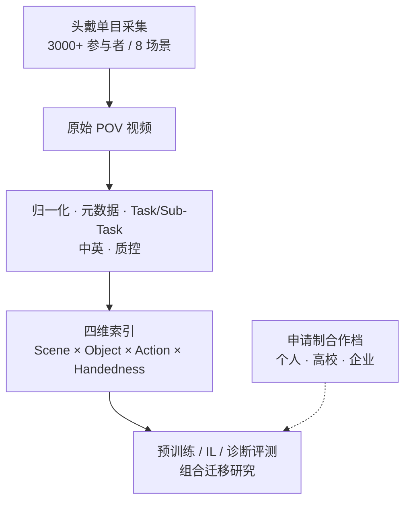

# EgoWorld-100W（百万级自中心操作数据集）

**EgoWorld-100W** 是 [星际硅途（StellarNex Robotics）](https://stellarnexrobotics.com/) 发布的 **头戴第一人称操作视频** 数据产品（官方介绍：[blog](https://stellarnexrobotics.com/blog)）。名称中 “100W” 取中文「万」，表示 **百万量级** 视频条数。

> **同名消歧：** 本页是 **数据集 / 数据引擎产品**；[EgoWorld（exo→ego）](./paper-egoworld.md) 是 LG/KAIST/Oxford 的 **ICLR 2026 视图翻译论文**，二者无关。

## 一句话定义

**用单目头戴在真实多场景采集百万级第一人称操作视频，并按场景、物体、动作、手性四维组织 Sub-Task，服务具身预训练、组合迁移与诊断性泛化评测——当前以申请制合作获取，而非公开镜像下载。**

## 英文缩写速查

| 缩写 | 英文全称 | 简要说明 |
|------|----------|----------|
| Ego | Egocentric | 第一人称 / 头戴视角 |
| VLA | Vision-Language-Action | 视觉–语言–动作模型；本数据宣称的预训练下游之一 |
| HOI | Hand-Object Interaction | 手物交互；自中心操作数据的核心内容 |
| MPJPE | Mean Per Joint Position Error | 手关节误差；页面用 HaMeR 做保真度示例 |
| POV | Point of View | 官网自称 POV Data Network / 第一视角数据网络 |

## 核心信息

| 项 | 内容 |
|----|------|
| **机构** | 星际硅途（StellarNex Robotics） |
| **规模口径（宣传）** | **100 万+** 视频 · **10,000+** 小时 · **3,000+** 参与者 |
| **覆盖** | **8** 场景大类；估 **20 万+** 视觉背景；估 **2,800+** 物体类 / **190+** 动作类 |
| **结构** | Task → Sub-Task；四维 **Scene × Object × Action × Handedness** |
| **开放** | **申请制合作**（个人 / 高校 / 企业）；**无** 公开 GitHub/HF 全量下载（截至 2026-07-24） |

### 数据集速查

| 维度 | 内容 |
|------|------|
| **规模** | 宣传口径：100 万+ 视频 · 10,000+ 小时 · 3,000+ 参与者 |
| **模态** | 头戴第一人称 RGB 视频；Task/Sub-Task 自然语言；场景/物体/动作/手性元数据；官网另有双目硬件产品线（不等于本语料已含双目全量） |
| **许可证** | **申请制合作**（个人体验 / 高校研究 / 企业共创与商用）；非公开镜像许可证 |
| **重定向就绪度** | **低（公开信息不足）**：blog 强调 Task 语义与四维条件，**未**披露可直接用于机器人的腕/手指关节或 SMPL 轨迹字段；需到手版本数据卡后再评估 retargeting |

## 为什么重要

- **把「规模」推进到「条件组合覆盖」：** 不只报小时数，而强调场景–物体–动作–手性交叉，便于问「模型在未见组合上掉点」——与 [具身规模法则](../concepts/embodied-scaling-laws.md)、[EgoScale](../methods/egoscale.md) 的人视频缩放叙事同向但切口不同。
- **真人多场景操作长尾：** 家庭/工业/物流等并存，比单厨房语料更接近开放部署分布偏移来源。
- **选型提醒：** 截至入库日为 **厂商宣传 + 申请制**，工程选型须先核对手头版本的许可、标注字段与质控报告，勿当作已开源语料。

## 核心结构 / 机制

### 标注粒度

1. **Task：** 视频级自然语言任务描述（可中英）。
2. **Sub-Task：** 1–3 个不可再分操作步骤，作覆盖统计与迁移分析的最小单元。
3. **四维锚定：** 每个 Sub-Task 绑定场景、物体（含材质/尺度等操作属性叙事）、动作（条件化实例而非孤立动词）、手性（左/右/双手）。

### 场景分布（页面示例）

家庭 ~34%、办公 ~17%、工业 ~15%、零售 ~15%、餐饮 ~6%、物流 ~6%、公共 ~5%、其他 ~2%（长尾）。

### 采集与质控叙事

- 轻量化头戴 **单目** 第一人称；大规模参与者自然执行。
- 处理链：分辨率/时间轴规范化、元数据绑定、场景分类、Task 撰写、双语与质控。
- 官网另有双目硬件与 3D 姿态重建产品线，与本数据集介绍互补。

## 流程总览

## 工程实践

| 项 | 要点 |
|----|------|
| **获取** | 主页飞书「合作需求登记」；blog 写明三档合作 |
| **开源状态** | **未公开全量下载**；**无** 官方训练代码仓（入库日） |
| **保真度示例** | HaMeR：轨迹 MAE 0.0212 m；腕距 MAE 0.013 m；MPJPE 0.0126 m |
| **下游读法** | 适合当 **人侧 egocentric 预训练/诊断语料候选**；动作标签是否可直接监督机器人需看发放版本字段 |
| **与硬件** | 官网双目头戴支持 LeRobot/MCAP 等录制模式——属产品线，不等于本数据集已含双目全量 |

## 与相邻语料对比

| 对照 | EgoWorld-100W 的定位（按官网叙述） |
|------|-------------------------------------|
| **EPIC-KITCHENS / Ego4D** | 更偏厨房细粒度或通用第一视角理解；本数据强调 **多真实场景操作 + 四维结构** |
| **EgoMimic / EgoDex** | 更贴 IL/灵巧高精度；本数据强调 **规模 × 条件组合覆盖** |
| **[EgoScale](../methods/egoscale.md)** | 学术人视频缩放 + 显式腕手标签预训练；本页为 **商业数据引擎产品**，标签体系以 Task/四维为主 |
| **[EgoSteer / EgoSmith](./paper-egosteer.md)** | 开源策展栈洗野外视频；本页是 **自采网络 + 申请制发放** |
| **[EgoWorld 论文](./paper-egoworld.md)** | **同名异物**（视图翻译方法） |

## 局限与风险

- **误区：** 看到 “EgoWorld” 就链到 ICLR 论文或以为 GitHub 可下一键全量。
- **口径风险：** 「估计」类别数、对比雷达图来自宣传页，需用到手数据卡复核。
- **许可：** 企业/商用与学术档可能不同；引用前确认授权范围。
- **无公开基线：** 截至入库日缺少独立第三方复现表，保真度数字为厂商自报示例任务。

## 关联页面

- [EgoWorld（exo→ego 论文）](./paper-egoworld.md) — **同名消歧**。
- [EgoScale](../methods/egoscale.md) — 人视频规模预训练方法对照。
- [EgoSteer](./paper-egosteer.md) — 开源 egocentric 策展与策略全栈对照。
- [EgoMimic](./paper-ego-03-egomimic.md) — 第一视角人数据进 IL。
- [Manipulation](../tasks/manipulation.md) — 操作任务总览。
- [Ego 数据采集分类](../overview/ego-category-01-data-collection.md) — 自中心数据采集生态。
- [具身规模法则](../concepts/embodied-scaling-laws.md) — 「规模 vs 覆盖结构」讨论背景。

## 参考来源

- [EgoWorld-100W 博客归档](../../sources/blogs/stellarnex_egoworld_100w.md)
- [StellarNex 官网归档](../../sources/sites/stellarnex-robotics.md)

## 推荐继续阅读

- 官方介绍：<https://stellarnexrobotics.com/blog>
- 公司主页：<https://stellarnexrobotics.com/>
- 对照方法：[EgoScale](../methods/egoscale.md)
- 同名方法论文：[EgoWorld（exo→ego）](./paper-egoworld.md)
