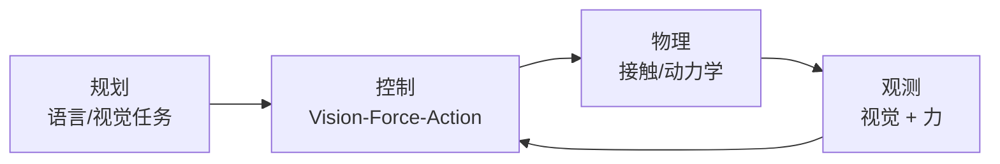
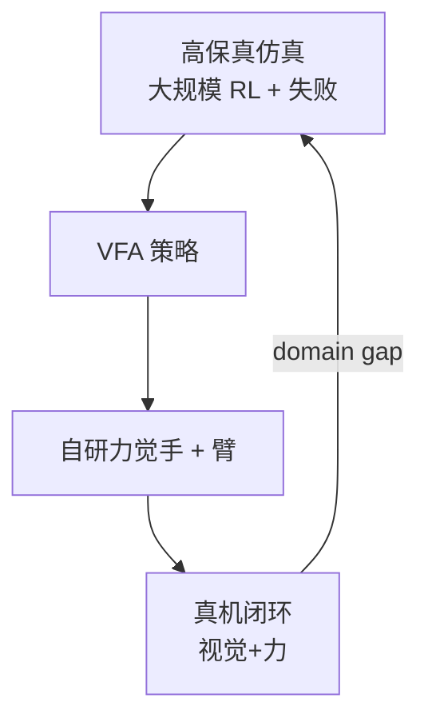

# Eka Robotics — Vision-Force-Action（VFA）

**Eka Robotics**（[ekarobotics.com](https://www.ekarobotics.com/)）是 **2026 年前后走出 stealth** 的机器人智能公司（剑桥；CEO **Pulkit Agrawal**，MIT；联合创始团队背景含 **DeepMind** 等，见官网 TEAM 段与 [Actuate 26 演讲整理](../../sources/blogs/wechat_sourcemind_eka_vfa_actuate26_2026-09-26.md)）。其公开技术核心是 **Vision-Force-Action（VFA）** 模型：把 **力反馈** 与视觉、动作并列，作为 **接触丰富操作** 的主通道，并通过 **高保真仿真中的强化学习** 规模化训练，而非仅依赖人类遥操作/视频模仿。

## 一句话定义

**VFA = 以力为「物理母语」的操作基础模型路线**：视觉负责计划与场景理解，**力觉驱动闭环控制**；训练数据优先来自 **仿真 RL（含失败轨迹）**，目标是在 **通用性** 不牺牲的前提下达到 **产品级速度×可靠性**，并支持 **人机共存安全**。

## 英文缩写速查

| 缩写 | 英文全称 | 简要说明 |
|------|----------|----------|
| VFA | Vision-Force-Action | Eka 提出的视觉–力–动作统一操作模型 |
| VLA | Vision-Language-Action | 行业主流「语言+视觉→动作」路线；VFA 公开叙事为 **并行替代谱系** 而非简单扩展 |
| RL | Reinforcement Learning | 仿真内从成功与失败中优化策略 |
| Sim2Real | Simulation to Real | 仿真策略迁移真机；Eka 宣称已用于覆盆子等未见物体抓取 |
| WAM | World Action Model | 生成式「下一帧/下一状态」路线；演讲对比其 **缺力觉** 与 **慢动作** 演示 |
| CEO | Chief Executive Officer | Pulkit Agrawal（MIT CSAIL） |

## 为什么重要

- **重新打开「性能×通用性」取舍：** 官网与演讲均强调：仅扩大 **视频/遥操作** 数据改善 **泛化**，不自动带来 **工业级速度与可靠性**；VFA 把 **接触力学** 放回中心，对准 **付费门槛**（见 [VLA 方法页](../methods/vla.md) 中的 latency/部署讨论）。
- **与 VLA 生态对照轴清晰：** 语言被定位为 **规划辅助** 而非物理本体；力与视觉同为 **闭环控制** 输入——与 [FM-VLA](../entities/paper-fm-vla.md)（力 token 注入 π₀.₅）、[T-Rex](../entities/paper-trex-tactile-reactive-dexterous-manipulation.md)（触觉 mid-training）等同属 **力/触觉增强** 谱系，但 Eka 宣称 **foundation 级统一模型 + 自研手硬件**。
- **仿真 RL 作为数据引擎：** 对齐本库 [Sim2Real](../concepts/sim2real.md) 主线；演讲明确 **人类示范偏慢、难覆盖失败**；规模化依赖 **GPU + 物理仿真** 而非线性堆人力采集。
- **证据等级需冷静读：** 截至入库日 **无 arXiv 论文、无 GitHub**；数字（如 **1500 vs 600 picks/h**、换灯泡、25× 慢放覆盆子）来自 **Actuate 26 讲者陈述** 与官网演示，**待独立 benchmark / 第三方复现**。

## 核心原理

### 控制环（讲者框架）

- **VLA/世界模型（批评视角）：** 数据多来自 **视觉+语言**，擅长 **规划** 与部分开环控制，**弱建模接触物理** → 慢、脆。
- **VFA（主张）：** **力** 与视觉共同闭合 **高频接触环**；策略在仿真中学会 **质量、摩擦、柔顺** 等隐含变量。

### 三目标（官网 + 演讲）

| 维度 | 含义 |
|------|------|
| **General** | 跨物体/任务/环境单一模型 |
| **Performant** | 速度 + 可靠性（超越「能做成」到「值得买」） |
| **Interactive / Safe** | 人类近场协作；演讲展示高速手在人类旁侧运行 |

### 系统拆分（讲者）

- **VFA 大脑**：宣称 **跨平台** 可接不同机器人。
- **自研触觉机械手**：模型与手 **联合优化** 以达「性能黄金标准」（无第三方手 URDF 依赖的公开说明）。

### 流程总览（训练–部署，归纳）

## 方法 / 评测 / 对比

### 方法（公开信息）

| 要素 | Eka 公开表述 |
|------|----------------|
| 模态 | 视觉 + **力** + 动作（**非** VLA 式语言主干） |
| 数据 | **仿真 RL** 为主；批评纯人类视频/遥操作 scaling |
| 硬件 | 自研 **触觉手** + 自研策略栈 |
| 迁移 | 宣称 sim-to-real 用于 **覆盆子/多类物体/耳机线/换灯泡** 等 |

### 评测与证据（当前）

| 类型 | 状态 |
|------|------|
| 标准 benchmark（LIBERO、RoboTwin 等） | **未见公开数字** |
| 第三方复现 | **无开源** |
| 演示 | 官网视频；演讲 **8× 世界模型 vs 25× 慢放 Eka** 对比叙事 |
| 吞吐 | 演讲：**~1500 grabs/h** vs 人 **~600**（**讲者陈述**） |

### 对比（选型坐标）

| 路线 | 数据引擎 | 力/触觉 | 语言 | 本库入口 |
|------|----------|---------|------|----------|
| **VFA（Eka）** | 仿真 RL | **一等** | 非核心 | 本页 |
| **VLA（π 系等）** | 人类演示 + 互联网 VLM | 多为后验/外接 | **一等** | [VLA](../methods/vla.md) |
| **FM-VLA 等** | 微调 π₀.₅ | 力 **token 记忆** | 继承 VLA | [paper-fm-vla](./paper-fm-vla.md) |
| **WAM** | 视频生成 | 通常无 | 可选 | [world-action-models](../concepts/world-action-models.md) |

## 工程实践

| 项 | 读者动作 |
|----|----------|
| 跟踪官方 | [ekarobotics.com](https://www.ekarobotics.com/) · hello@ekarobotics.com |
| 学术背景 | [Pulkit Agrawal（MIT）](https://people.csail.mit.edu/pulkitag/) |
| 复现 | **暂无** 官方仓库；勿假设与 OpenPI/VLA 栈即插即用 |
| 集成想象 | 若未来发布 API，可能类似 **ZMQ/websocket 策略 server** 形态（本库已有 [GR00T](./isaac-gr00t.md) 先例）——**推测**，非官方 |

## 源码运行时序图

**不适用** — 截至入库日 [项目页核查](../../sources/sites/eka_robotics_com.md) **未列 GitHub** 或可运行训练/部署入口。

## 局限与风险

- **闭源 + 无论文：** 能力边界、失败模式、sim2real 域随机化细节 **无法审计**。
- **营销数字：** 吞吐、安全旁侧运行等 **仅演讲/演示**；与制造业 KPI 或标准 dexterity benchmark 尚未对齐。
- **与 VLA 长期关系未定：** 市场可能并存（VFA 低层 + VLA 语义规划），也可能收敛；本页按 **2026 公开对立叙事** 记录。
- **硬件锁定风险：** 自研手可能限制 **第三方臂** 复现，需关注后续 SDK 策略。

## 与其他页面的关系

- VLA 主链与误区：[VLA](../methods/vla.md)
- Sim2Real 方法论：[sim2real](../concepts/sim2real.md)
- 具身 foundation 全景：[embodied-infra-2026-panorama](../overview/embodied-infra-2026-panorama.md)
- Pulkit Agrawal 历史论文索引：[DexHub/DART 实体](./paper-notebook-dexhub-and-dart-towards-internet-scale-robot-dat.md) 等

## 推荐继续阅读

- [Eka Robotics 官网](https://www.ekarobotics.com/)
- [Pulkit Agrawal — MIT CSAIL](https://people.csail.mit.edu/pulkitag/)

## 参考来源

- [Eka Robotics 官网（一手）](../../sources/sites/eka_robotics_com.md)
- [SOURCEMIND — Actuate 26 VFA 演讲整理（微信）](../../sources/blogs/wechat_sourcemind_eka_vfa_actuate26_2026-09-26.md)
