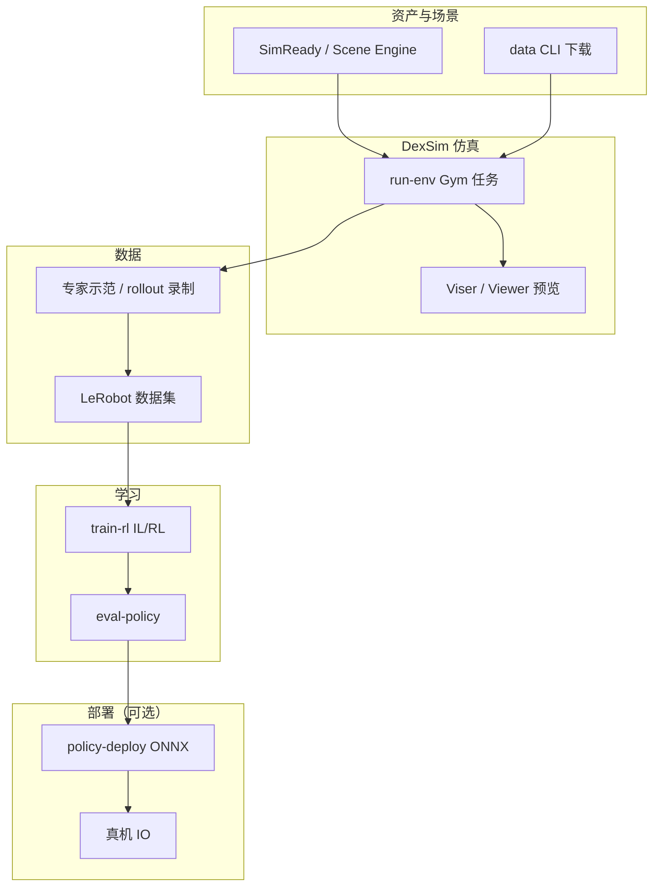
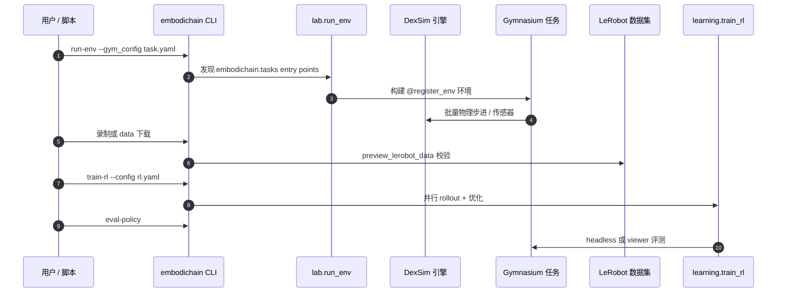

# EmbodiChain

**EmbodiChain** 是 **灵巧智能（DexForce）** 发布的 **端到端、GPU 加速、模块化** 具身智能平台（[GitHub](https://github.com/DexForce/EmbodiChain)，[文档](https://dexforce.github.io/EmbodiChain/main/index.html)，[产品页](https://dexforce.com/embodichain/index.html#/EmbodiChain)）。它在自研 **DexSim** 物理渲染引擎之上，统一仿真环境、示范数据采集、IL/RL 训练与策略评测，并与 **LeRobot** 数据集格式对接。

## 一句话定义

用 **DexSim GPU 仿真 + 官方/可扩展 Gym 任务 + 统一 CLI**，把「建场景 → 采数据 → 训策略 → 评策略」串成一条可复现流水线——当前为 **Alpha**，适合需要 DexForce 栈或 RoboSynChallenge 复现的研究者，而非追求成熟社区 benchmark 榜的单点选型。

## 英文缩写速查

| 缩写 | 英文全称 | 简要说明 |
|------|----------|----------|
| IL | Imitation Learning | 模仿学习；框架提供示范采集与 LeRobot 数据集预览 |
| RL | Reinforcement Learning | 强化学习；`embodichain train-rl` / `eval-policy` |
| GPU | Graphics Processing Unit | DexSim 批量仿真与光线追踪传感器依赖 NVIDIA GPU |
| Sim2Real | Simulation to Real | 文档与产品页强调的真机部署环节 |
| ONNX | Open Neural Network Exchange | 可选 `[policy-deploy]` extra 用 ONNX Runtime 跑策略 |
| Gym | Gymnasium | 标准环境接口；任务经 `@register_env` 注册 |

## 先说结论

- **选型：** 若你要跑 **[RoboSynChallenge](./paper-robosynchallenge.md)**、复现 DexForce 论文栈，或需要 **DexSim + LeRobot** 一体化 GPU 数据/训练闭环，EmbodiChain 是官方底座；若只要公开 kitchen/manipulation **leaderboard**，优先 [RoboCasa](./robocasa.md) / [Isaac Lab-Arena](./isaac-lab-arena.md)。
- **成熟度：** v0.2.4、**Alpha**；API 与 roadmap 仍快速迭代，**勿当生产栈**。
- **安装门槛：** 除 GitHub 源码外，须配置 **DexForce PyPI index** 安装 `dexsim_engine`；首推 Docker 镜像 `dexforce/embodichain:ubuntu22.04-cuda12.8`。
- **开源：** GitHub **已开源**（Apache 2.0）；仿真后端 wheel 经 DexForce index 分发，非默认 PyPI 一键装。

## 为什么重要

- **闭环：** 单仓库覆盖 SimReady/Scene Engine 资产生成、Gym 任务、LeRobot 录制、RL 训练与策略评测，减少「仿真器 × 数据格式 × 训练框架」拼装成本。
- **GPU 吞吐：** 刚体/可变形物体、光线追踪传感器、批量 rollout，面向大规模数据生成与并行评测。
- **生态锚点：** [RoboSynChallenge](./paper-robosynchallenge.md) 的安装、21 套 HF 数据集与 PI0/Motus/ACT/DP 基线均建立在 EmbodiChain 之上。
- **可扩展任务：** `embodichain_tasks` 随主包安装；第三方可通过 `embodichain.tasks` entry point 或 [task template 仓](https://github.com/DexForce/embodichain_task_template) 扩展。

## 核心架构

### 分层模块

| 层 | 组件 | 职责 |
|----|------|------|
| 引擎 | **DexSim**（`dexsim_engine`） | GPU 物理、渲染、传感器；可选 Newton 后端（部分任务 YAML） |
| 实验室 | `embodichain.lab` | `run-env`、资产/场景预览、Viser 浏览器远程可视化 |
| 数据 | `data_pipeline` + `data` CLI | 资产下载、LeRobot  episode 校验 |
| 生成式仿真 | `gen_sim`（可选 `[gensim]`） | SimReady 管线、Scene Engine（图像→场景） |
| 学习 | `embodichain.learning` | `train-rl`、`eval-policy`；依赖 `lerobot>=0.4.4,<0.5` |
| 任务 | `embodichain_tasks` | manipulation / classic-control 等官方任务配置 |

### 流程总览

### 源码运行时序图

最短复现路径：`pip install -e .`（含 DexForce index）→ `embodichain run-env --gym_config embodichain_tasks/configs/tasks/manipulation/repeated_pick_place/task.franka.yaml` → 按需 `train-rl` / `eval-policy`。

## 工程实践

| 项 | 说明 |
|----|------|
| **安装** | Linux + NVIDIA GPU + CUDA 12.x；DexForce index + 可选 Docker |
| **Python** | 3.10–3.12；`gensim` 需独立 3.11 环境（Blender `bpy`） |
| **CLI** | `run-env`、`list-task`、`train-rl`、`eval-policy`、`data`、`simready` 等 |
| **LeRobot** | 核心依赖；与 [LeRobot](./lerobot.md) 数据集/训练栈互操作 |
| **可选组件** | `[policy-deploy]` ONNX GPU；cuRobo V2 运动规划单独安装 |
| **源码运行时序图** | 见上节；适用于官方仓库可运行 CLI 入口 |

## 局限与风险

- **Alpha 阶段：** API、任务集与文档快速变化；生产部署风险高。
- **安装摩擦：** `dexsim_engine` 依赖 DexForce 私有 index，离线/防火墙环境可能失败。
- **平台：** 文档明确 **Linux x86_64 + NVIDIA**；无 macOS/纯 CPU 官方支持路径。
- **benchmark 生态：** 尚无 RoboCasa 级公开 leaderboard；跨栈 SR 数字不可直接与 MuJoCo/Isaac 榜混比。
- **Newton 后端：** 部分任务 YAML 支持 `--physics newton`，与默认 DexSim 路径并存，复现时须钉配置。

## 与其他页面的关系

- **[RoboSynChallenge](./paper-robosynchallenge.md)：** 下游挑战赛；合成 state-action 训练 + 真机评测，依赖本栈安装与 HF 数据。
- **[LeRobot](./lerobot.md)：** 数据格式与训练互操作；EmbodiChain 不是 EnvHub 替代品，而是 DexSim 侧完整栈。
- **[Isaac Lab-Arena](./isaac-lab-arena.md) / [RoboCasa](./robocasa.md)：** 同为 GPU/大规模 manipulation 评测方向；Arena 绑 Isaac Sim 专有组件，RoboCasa 绑 MuJoCo 厨房榜——分工不同。
- **[仿真器选型指南](../queries/simulator-selection-guide.md)：** locomotion 三选一（MuJoCo/Isaac/Genesis）之外，EmbodiChain 代表 **DexForce 一体化 embodied 流水线** 选项。

## 推荐继续阅读

- [EmbodiChain 安装指南](https://dexforce.github.io/EmbodiChain/main/quick_start/install.html)
- [官方任务 README](https://github.com/DexForce/EmbodiChain/blob/main/embodichain_tasks/README.md)
- [RoboSynChallenge 论文](https://arxiv.org/abs/2608.12416) — EmbodiChain 栈上的合成数据挑战赛

## 参考来源

- [EmbodiChain 仓库归档](../../sources/repos/embodichain.md)
- [EmbodiChain 官方文档与产品页](../../sources/sites/embodichain.md)
