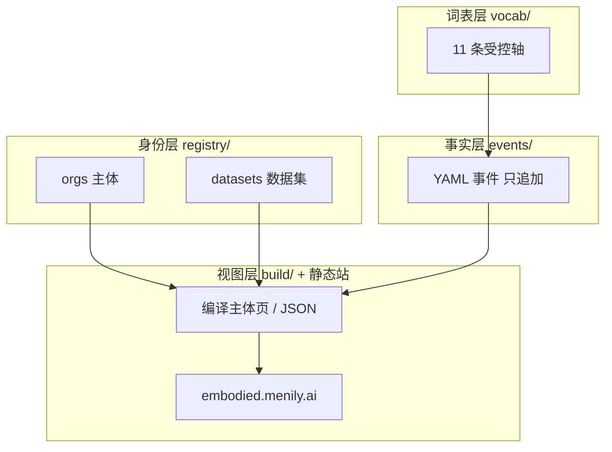
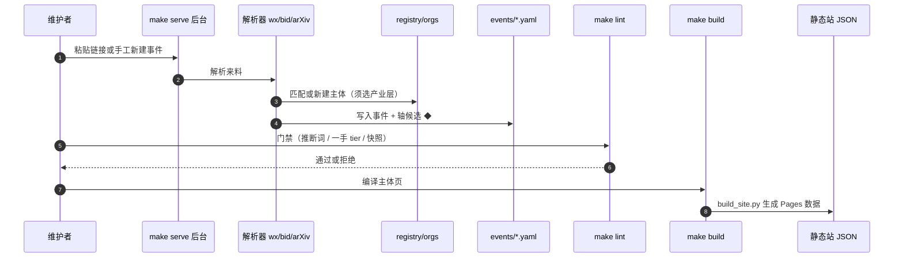

# 具身产业库（Embodied Industry DB）

**具身产业库**（GitHub：[MasashiToda1/embodied-industry-db](https://github.com/MasashiToda1/embodied-industry-db)，在线：[embodied.menily.ai](https://embodied.menily.ai)）记录**哪些公司在用什么技术栈、什么时间做了什么事**——只收可核查事实、按时间排列，**不做推断、不打分、不排名**。

| 字段 | 内容 |
|------|------|
| 维护 | MasashiToda1（独立仓库；schema 设计参考 Robotics_Notebooks ingest/lint 思路） |
| 版本 | V0.1（事件仍在积累；工具链与门禁已有测试） |
| 许可 | 数据/文档 CC BY 4.0；代码 MIT |
| 定位 | 结构化产业事实库 + 入库后台，非算法训练仓 |

## 一句话定义

用**受控词表 + 不可变事件 YAML + 来源快照**把具身产业的技术选择与商业信号压成可横向对比的时间序列；技术页定义在本库（Robotics_Notebooks），本库只存轴取值与可核查事件。

## 英文缩写速查

| 缩写 | 英文全称 | 简要说明 |
|------|----------|----------|
| EID | Embodied Industry DB | 具身产业库项目简称 |
| YAML | YAML Ain't Markup Language | 事件与 registry 的机器可读事实格式 |
| VLA | Vision-Language-Action | 受控技术轴之一（取值链到本库 wiki 页） |
| Sim2Real | Simulation to Real | 技术栈轴常见取值；历史记录不删 |
| PR | Pull Request | 每条事件一文件，便于 git diff 与逐条审阅 |

## 为什么重要

- **与本库分工明确**：上游 [DESIGN.md](https://github.com/MasashiToda1/embodied-industry-db/blob/main/DESIGN.md) 写明技术轴每个取值指向 **Robotics_Notebooks** 对应页，不在产业库重建定义——适合当本库 wiki 的**产业侧镜像索引**。
- **收敛可观测**：11 条受控轴、历史取值不删；把所有主体在同轴上的取值按时间铺开，才能看分散度是否下降（自由文本产品字段做不到）。
- **商业信号补位**：[Humanoid Motion Intelligence](./humanoid-motion-intelligence.md) 有公司主表与时间线，但 NC-SA 许可与本库不兼容；产业库用 CC BY 4.0 收招投标、定价、交付形态等，且**必须回到一手来源存快照**。
- **名录自建**：租赁、集成、场景运营等不发论文的主体，HMI 等以论文/产品为线索的库天然覆盖不到；产业库 `registry/orgs/` 自行维护骨架。

## 核心结构

### 四层数据模型

| 层 | 路径 | 性质 |
|----|------|------|
| 身份 | `registry/orgs/`、`registry/datasets/` | 人工维护；lint 校验事件引用主体必须存在 |
| 事实 | `events/` | 追加、不可变；每条带日期精度、来源、快照 |
| 词表 | `vocab/` | 11 轴合法取值；技术栈禁止自由文本 |
| 视图 | `build/`、`docs/` | 编译产物；主体页上每条事实标事件 id |

### 在线五视图

| 视图 | 读什么 |
|------|--------|
| 时间线 | 全局事件 chronology |
| 主体卡片 | 单主体编译页（事实 → 事件 id → 原始链接） |
| 轴 / 收敛 | 技术/商业轴取值分布与收敛热力 |
| 图谱 | 仅事件内关系（投资/客户/供应）；共享技术栈为可选虚线层 |
| 商业信号 | 投资、采购、场景、已披露定价 |

### 收录边界

**成员规则**：以**通用机器人本体**为最终载体的技术与商业主体（人形、运控、VLA、数据、仿真、部件、集成、场景运营等在内；纯工业臂、AGV、无人机、扫地机在外）。

## 流程总览（入库 → 编译 → 浏览）

## 源码运行时序图

> 典型复现：`make setup` → `make serve`（:8790）投料 → `make lint` → `make build`；本地浏览 `make site-serve`（:8800）。无长期机器可用时 README 推荐 **GitHub Codespaces**。

## 工程实践

| 场景 | 建议 |
|------|------|
| 查某公司技术栈变迁 | 在线主体卡片 → 沿事件 id 读来源与快照 |
| 观察行业收敛 | 轴/收敛视图；注意 V0.1 事件量仍少，结论需样本足够后再下 |
| 补 HMI 线索 | 从 [HMI 公司/信号页](./humanoid-motion-intelligence.md) 找**原始链接**，在本库按 schema 新建事件并存快照——**勿复制 HMI 表格** |
| 补本库未覆盖 wiki 的技术轴 | 先在 Robotics_Notebooks 建/链概念页，再在产业库事件里引用轴取值 |
| Agent 抓不到的见闻 | GitHub Issues「手工事件」模板或后台「一手 tier」路径（访谈/展会/询价等） |

**开源状态（2026-09-23）：** 仓库与静态站 **已开源**；`make serve` 入库后台与 lint/build 测试 **可运行**。V0.1 数据仍薄，`make lint-strict` 会对事件不足 3 条的主体失败——属预期。源码运行时序图 **适用**（见上节）。

## 局限与风险

- **V0.1 数据起步阶段**：schema 与工具先于规模；早读收敛图易过拟合小样本。
- **不做排名与推断**：lint 拦截「预计」「大概率」等措辞；读者自行判断，库不提供投资建议。
- **HMI 许可硬边界**：humanoid-motion-intelligence 为 CC BY-NC-SA 4.0，**不得导入其编排**；仅作发现主体的线索通道。
- **一手信息单独 tier**：`first-party` 事件须交代渠道类型（受控词表）与获取日期，不与公开来源混装成「可第三方核验」。
- **与本库关系**：产业库引用本库 wiki 作技术定义上游；本页是**导航与分工说明**，不镜像 `events/` 全文。

## 关联页面

- [Humanoid Motion Intelligence](./humanoid-motion-intelligence.md) — 论文/开源/公司线索索引（互补，非依赖）
- [国内具身开源 76 家技术地图](../overview/china-domestic-embodied-opensource-76-companies-technology-map.md) — 公司维度策展对照
- [HMI 开源主表覆盖索引](../queries/hmi-opensource-projects-coverage.md) — 工程入口侧读法
- [Sim2Real](../concepts/sim2real.md) — 常见技术轴取值主题

## 参考来源

- [具身产业库仓库归档](../../sources/repos/embodied-industry-db.md)
- [embodied.menily.ai 站点归档](../../sources/sites/embodied-menily-ai.md)

## 推荐继续阅读

- [GitHub 仓库 README](https://github.com/MasashiToda1/embodied-industry-db) — 收录边界、入库规矩、Codespaces 快速开始
- [DESIGN.md（Schema V0.1）](https://github.com/MasashiToda1/embodied-industry-db/blob/main/DESIGN.md) — 四层模型、Event 字段、11 轴设计 rationale
- [在线时间线](https://embodied.menily.ai) — 五视图浏览入口
