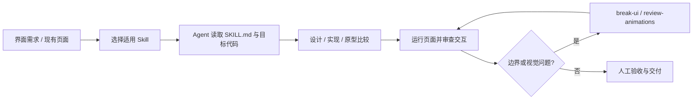

# Emil Kowalski Skills

**Emil Kowalski Skills**（[emilkowalski/skills](https://github.com/emilkowalski/skills)）是设计工程师 Emil Kowalski 发布的一组可通过 `npx skills` 安装的 Agent Skills，用操作规约把动效、界面品味、原型迭代与前端边界测试经验带入 coding-agent 工作流。

## 英文缩写速查

| 缩写 | 英文全称 | 简要说明 |
|------|----------|----------|
| UI | User Interface | 用户界面；技能面向界面设计与实现 |
| UX | User Experience | 用户体验；涵盖交互反馈与移动端细节 |
| CLI | Command-Line Interface | 安装技能的命令行入口（`npx skills`） |
| MIT | Massachusetts Institute of Technology License | 仓库采用的宽松开源许可证 |

## 为什么重要

- **覆盖从判断到验证：** 除了视觉/动效建议，集合中还包括动画审查、原型对比与 `break-ui` 反例测试，能把「看起来不错」推进到边界数据下检查。
- **可组合而非整套绑定：** 每个技能可按需安装；同一个项目可组合总体设计、实现动效、审查和移动端体验技能。
- **与通用设计技能互补：** [Anthropic frontend-design](anthropic-frontend-design-skill.md) 偏向生成界面时的整体审美与实现指引；Emil 的技能更细分于动画设计工程、交互细节与具体验证步骤。

## 核心技能（上游快照）

| 技能 | 主要用途 |
|------|----------|
| `emil-design-eng` | 动效与界面设计的总指导 |
| `animate` / `animate-expo` | Web 或 Expo/React Native 动效实现 |
| `review-animations` / `improve-animations` | 单项动效审查、代码库动画审计 |
| `find-animation-opportunities` | 判断哪些 UI 状态值得动、哪些不应动 |
| `animation-vocabulary` | 用精确术语描述期望的动效 |
| `apple-design` | 提炼 WWDC 界面与动效原则并映射到 Web |
| `prototype` | 生成多个界面方案供切换比较 |
| `mobile-native` | 修正 Web 在手机上的触控、视口、安全区等体验问题 |
| `break-ui` | 用长文本、空列表、极端数量、多语言等真实边界数据进行 UI 压测 |
| `pick-ui-library` / `write-swift` / `ask-sonner` | UI 库选型、Swift 编写、Sonner toast 使用 |

仓库 README 在 2026-10-02 的快照列出 14 项技能；此表按主题归并，不能替代上游变动中的技能清单。

## 工作流

安装命令：`npx skills@latest add emilkowalski/skills`。安装后应针对任务选具体技能，并由 agent 在目标仓库中读取技能文件；验证环节仍需真实运行应用或检查截图，不能只凭技能文本判定完成。

## 局限与使用边界

- **Skill 是提示与流程资产，不是可执行产品代码。** 不能提供组件、设计稿或动画运行时；它影响 agent 的工作方式，实际质量仍取决于模型与上下文。
- **审美建议不是客观验收。** 品牌规范、无障碍、性能和设备差异仍需项目自己的设计系统与测试。
- **上游持续变化。** 技能数和内容会增加/调整；本页清单标注为 2026-10-02 README 快照。
- **验证条件很关键。** 若 agent 无法启动应用或无法访问真实设备，动效和触控建议通常只能做静态推断。

## 关联页面

- [find-skills（Vercel 元技能）](find-skills-skill.md) — 搜索与安装 Agent Skills 的发现层
- [frontend-design（Anthropic）](anthropic-frontend-design-skill.md) — 通用界面生成与审美指导
- [Skills For Real Engineers（mattpocock）](mattpocock-skills.md) — 通用工程能力与反馈型技能集合
- [HumanLayer Skills](humanlayer-skills.md) — 同为可组合的仓库级 Agent Skills

## 参考来源

- [Emil Kowalski Skills 来源归档](../../sources/repos/emil-kowalski-skills.md)
- [上游 GitHub 仓库（MIT）](https://github.com/emilkowalski/skills)
- [上游 README 快照 e8a175d](https://github.com/emilkowalski/skills/blob/e8a175de22ae1e49370fc144c1f3bb9aeedf988d/README.md)

## 推荐继续阅读

- [Emil 的技能目录](https://github.com/emilkowalski/skills/tree/main/skills) — 阅读具体 `SKILL.md` 前先核对内容与适用范围
- [Agent Skills 发现 CLI](https://github.com/vercel-labs/skills) — 安装与跨 agent 运行时分发
