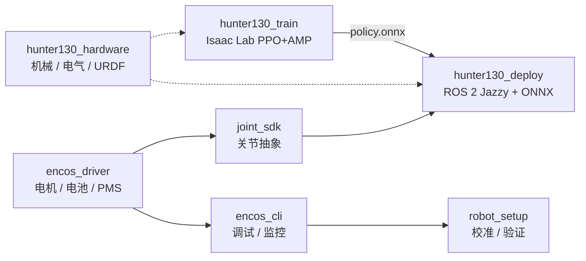

# Encos Hunter 130（Hunter V2 / EC H130-V2）

## 一句话定义

**Encos Hunter 130**（产品名 **Hunter V2**，硬件型号 **EC H130-V2**）是南京因克斯（EncosTech）与桥介数物联合推进的 **130 cm 级开源人形**：硬件与 URDF 在 [`hunter130_hardware`](https://github.com/EncosTech/hunter130_hardware) 以 **CERN-OHL-S-2.0** 发布，软件栈从 **Encos 电机驱动 → 关节 SDK → Isaac Lab 行走训练 → ROS 2 Jazzy + ONNX 实机** 拆成多仓，由 [`hunter130_collection`](https://github.com/EncosTech/hunter130_collection) 统一导航。

## 英文缩写速查

| 缩写 | 英文全称 | 简要说明 |
|------|----------|----------|
| DoF | Degrees of Freedom | 硬件 README 称全身 **25 DoF**；行走训练任务控制 **23** 关节 |
| RL | Reinforcement Learning | `hunter130_train` 使用 PPO + AMP |
| AMP | Adversarial Motion Priors | 参考动作先验，与 TienKung-Lab 路线一致 |
| ONNX | Open Neural Network Exchange | 训练仓回放导出，部署仓 ONNX Runtime 推理 |
| ROS 2 | Robot Operating System 2 | 实机栈目标 **Jazzy** + ros2_control |
| URDF | Unified Robot Description Format | 硬件仓与 deploy 描述包 |
| PMS | Power Management System | Encos 配电/电源管理板（驱动库覆盖） |
| Sim2Real | Simulation to Real | Isaac Lab 策略经 ONNX 接入实机控制器 |

## 为什么重要

- **全尺寸开源硬件 + 闭环软件：** 与仅开放 URDF 或仅开放 RL 训练的整机方案相比，Encos 同时公开 **STEP/电气/URDF**、**EtherCAT/CAN 驱动** 与 **ROS 2 部署**，适合研究「从图纸到行走策略」的端到端复现路径（制造门槛仍高，见局限）。
- **Isaac Lab 训练栈可对照天工：** `hunter130_train` 明确 Fork 自 [TienKung-Lab](./tienkung-lab.md)，便于与 [天工开源人形](./tienkung-humanoid-open-source.md) 在奖励设计、AMP 与导出格式上横向阅读。
- **模块化驱动生态：** `encos_driver` / `joint_sdk` / `encos_cli` 可脱离 Hunter 整机，用于 Encos 关节模组与其他 Encos 设备的底层开发。

## 核心信息

| 字段 | 内容 |
|------|------|
| 机构 | 南京因克斯智能科技有限公司（EncosTech）；训练/部署软件协作：桥介数物（BridgeDP） |
| 产品 | Hunter V2 / EC H130-V2（Hunter 130） |
| 规格（硬件 README） | 身高 **130 cm**，约 **32 kg**，**25 DoF**，第二代 Encos 快拆关节模组 |
| GitHub 入口 | [EncosTech/hunter130_collection](https://github.com/EncosTech/hunter130_collection) |
| 官网 | <https://www.encos.cn> |

## 流程总览

## 子仓库与工程要点

| 组件 | 作用 | 备注 |
|------|------|------|
| `hunter130_hardware` | STEP/Parasolid、电气 PDF、URDF+STL、安装手册 | **CERN-OHL-S-2.0** |
| `encos_driver` | C++17 驱动库；CAN/EtherCAT 等插件 | 静态/动态插件可选 |
| `joint_sdk` | 旋转/连续旋转/双电机耦合关节 API | 依赖 driver |
| `encos_cli` | TUI/CLI 扫描、基准、轨迹播放 | 底层 bring-up |
| `hunter130_train` | `encos130_walk` 任务；Isaac Sim **5.1**；导出 **policy.onnx** | 上游 TienKung-Lab；BSD-3-Clause |
| `hunter130_deploy` | `ec_joint_hardware` / IMU / IBUS 遥控 / 站立与 RL 行走控制器 | **GPL-3.0**；Ubuntu 24.04 + Jazzy |
| `robot_setup` | Web UI 与脚本：ID、校准、整机运动验证 | 许可证待各仓声明 |

典型工作流（与上游 README 一致）：确认硬件版本 → 安装 driver 与 CLI 调试 → joint_sdk 开发 → Isaac Lab 训练并导出 ONNX → `hunter130_deploy` 实机 → `robot_setup` 交付前检查。

## 工程实践

| 主题 | 建议 |
|------|------|
| 训练环境 | 按 Isaac Lab 官方 pip 指南对齐 **Sim 5.1**；显存不足时降低 `--num_envs` |
| 策略格式 | 训练仓 `play.py` 在运行目录 `exported/` 生成 `policy.pt` 与 `policy.onnx` |
| 实机启动 | `ros2 launch ec_controller real.launch.py`；IBUS 遥控需单独 `ec_radio` 节点 |
| 许可证合规 | 硬件 OHL、部署 GPL、驱动 MIT 并存——商用或闭源分发前逐仓阅读 LICENSE |

## 局限与风险

- **制造与成本：** 130 cm、32 kg 级整机并非桌面 DIY 档位；开源的是设计与资料，不等于低成本一键复刻。
- **入口分散：** 八个子仓独立版本；集成问题应在 `hunter130_collection` 讨论并附版本日志。
- **DoF 表述差：** 硬件 **25 DoF** 与训练 **23 受控关节** 并存，接入自定义控制器时需对照 URDF 与 `walk_cfg.py`。
- **安全：** 上游强调急停、固连与限速；首次策略部署需现场监护。

## 源码运行时序图

**不适用** — 本页为**多仓库聚合实体**，无单一官方「一键运行」入口；运行时序应分别阅读 `hunter130_train`（训练/回放）与 `hunter130_deploy`（`real.launch.py` + ros2_control）的 README。底层通信见 `encos_driver` 插件文档。

## 推荐继续阅读

- 聚合 README：<https://github.com/EncosTech/hunter130_collection>
- 硬件仓：<https://github.com/EncosTech/hunter130_hardware>
- [TienKung-Lab](./tienkung-lab.md) — 训练栈上游
- [开源人形硬件方案对比](./open-source-humanoid-hardware.md)

## 参考来源

- [sources/repos/hunter130_collection.md](../../sources/repos/hunter130_collection.md)
- [sources/sites/encos.cn.md](../../sources/sites/encos.cn.md)

## 关联页面

- [人形机器人（Humanoid Robot）](./humanoid-robot.md) — 平台总览
- [天工 Lite / Pro（开源人形）](./tienkung-humanoid-open-source.md) — 同源 Isaac Lab / Open-X-Humanoid 生态对照
- [高擎机电（HighTorque Robotics）](./hightorque-robotics.md) — 另一套「小型人形 + Isaac + ROS 部署」国产开源对照
- [Sim2Real](../concepts/sim2real.md) — ONNX 迁移语境
- [Locomotion](../tasks/locomotion.md) — 行走任务背景
