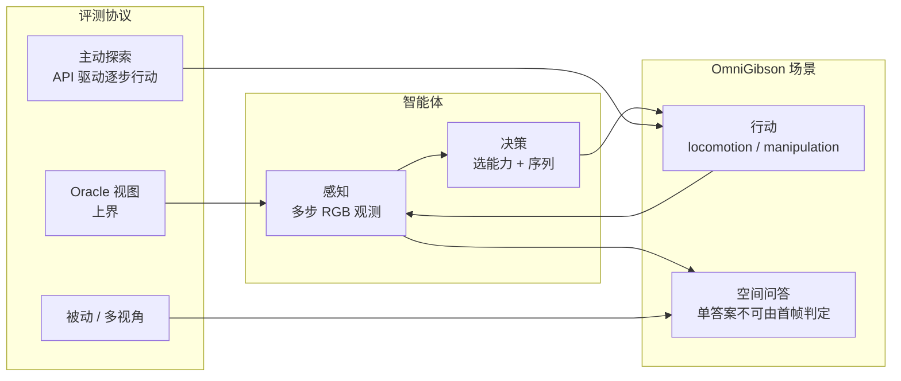

---

type: entity
tags: [benchmark, embodied-ai, spatial-intelligence, mllm, omnigibson, behavior-1k, evaluation, vlm, huggingface]
status: complete
updated: 2026-07-12
related:
  - ../concepts/3d-spatial-vqa.md
  - ../tasks/vision-language-navigation.md
  - ../methods/vla.md
  - ./paper-wem-world-ego-modeling.md
  - ./ewmbench.md
  - ./robo-bench.md
sources:
  - ../../sources/papers/esi_bench_arxiv_2605_18746.md
  - ../../sources/sites/esi-bench-project.md
  - ../../sources/repos/esi_bench.md
summary: "ESI-Bench（arXiv:2605.18746）在 OmniGibson 上评测具身空间智能：10 类 29 子类 3081 题，要求智能体通过感知/移动/操作主动闭合感知–行动环；揭示 MLLM 的行动盲、不完美 3D 与元认知缺口。"
---

# ESI-Bench（具身空间智能基准）

**ESI-Bench**（*Embodied Spatial Intelligence Benchmark*，arXiv:2605.18746，[项目页](https://esi-bench.github.io/)，[代码](https://github.com/ESI-Bench/ESI-Bench)，[数据](https://huggingface.co/datasets/esi-bench/ESI-Bench)）把 **空间智能** 从「被动看一张图 / 多视角拼图」推进到 **观察者即行动者**：智能体须决定何时 **看、走、抓、倒**，并通过行动序列积累足以回答 **单帧无法判定** 的空间问题。基准在 **OmniGibson** 上构建 **3081** 实例，任务 taxonomy 对齐 **Spelke 四类核心知识**，并对 **GPT-5、Gemini** 等 SOTA **MLLM** 在 **被动、主动探索、oracle 视图** 等协议下做系统对照。

## 一句话定义

用 **感知–行动闭环** 度量「是否知道 **如何行动才能看见** 隐藏的空间结构」，而非仅度量「给定足够像素后能否答对空间题」。

## 英文缩写速查

| 缩写 | 英文全称 | 简要说明 |
|------|----------|----------|
| ESI | Embodied Spatial Intelligence | 具身空间智能：在感知–行动环中推理隐藏空间结构 |
| MLLM | Multimodal Large Language Model | 多模态大语言模型，本基准主要评测对象 |
| VLM | Vision-Language Model | 视觉-语言多模态理解模型，VLA 的上游 |
| VLA | Vision-Language-Action | 视觉-语言-动作多模态基础策略方向 |
| GT | Ground Truth | 真值；oracle 协议沿最优行动轨迹渲染观测 |

## 为什么重要

- **与被动 3D VQA / 多视角基准的分野**：许多空间基准默认 **oracle 或随机多视角**；ESI-Bench 显示 **被动多视角常加噪**（更多图像 ≠ 更好答案），而 **主动探索** 可无指令自发出现 **move-behind、俯视、拿起、倒出** 等策略。
- **行动盲 vs 感知盲**：在合适视点下 MLLM 感知可接近人类（oracle 下 Partial Occlusion 等任务跃升显著）；失败主因常是 **选错行动 → 观测无信息 → 后续行动更差** 的级联，而非单纯「看不懂图」。
- **3D 表示的代价**：真值 3D 在深度敏感任务上可稳定推理；**VGGT 类不完美重建** 可能 **低于 2D**，因错误场景图 **主动扭曲** 空间关系——对「先重建再推理」路线是直接警示。
- **元认知缺口**：模型高置信 **过早定案**、少做证伪性探索；单靠更强 VLM 或更多交互步数不能自动补上 **何时停、何时改信念**。

## 相对既有空间基准的三点超越（论文表述）

| 维度 | 要点 |
|------|------|
| **从 sensing 到 competence** | 不只评「看见什么」，还评「是否知道为看见而 **部署何种能力**」 |
| **选择性传感** | 须优先任务相关信息，而非冗余视角堆砌 |
| **消解感知幻象** | 在误导性观测下推断 **遮挡后结构、物理约束、功能** |

## 任务与知识组织

**规模：** 10 任务类 · 29 子类 · **3081** 实例（OmniGibson + BEHAVIOR-1K 场景素材）。

**Spelke 四系统 → 任务族（项目页归纳）：**

| 核心知识 | 代表任务类（示例子类） |
|----------|------------------------|
| 物体表征 / 容纳 | Physical Capacity（Rigid Containment、Liquid Volume、Deformable Fitting） |
| 物理动力学 | Physical Dynamics（Inclined Plane、Stacking & Stability） |
| 几何与关系 | Metric Comparison、Spatial Relations、Specular Reflection |
| 感知接地 | Perceptual Grounding（Partial Occlusion、View Hallucination、Material Transparency） |
| 数量 | Enumerative Perception（遮挡计数、分区、结构封闭内计数等） |
| 布局与拓扑 | Cognitive Mapping（Topology、Traversable Passage、Long-Term Navigation） |
| 时间与行动 | Temporal Scene、Action Sequencing |

完整子类列表与能力说明见 [项目页 Task Taxonomy](https://esi-bench.github.io/)。

**任务形式化（论文 §3.1）：** 每实例为 \((\mathcal{S}, p_0, q, y^*)\)——**BEHAVIOR-1K** 场景 \(\mathcal{S}\)、智能体初始位姿 \(p_0\)、自然语言空间问题 \(q\) 与真值答案 \(y^*\)。智能体在 **\(T_{\max}=30\)** 步内交替 **egocentric 观测** 与 **高层离散行动**，最终以 `answer(ŷ, c)` 提交答案与置信度 \(c\)。

### 智能体动作空间（高层 API）

| 类型 | 动作 | 说明 |
|------|------|------|
| **Locomotion** | `move_forward` / `move_backward` / `move_left` / `move_right` / `move_up` / `move_down` | 沿视轴或侧向/垂直平移 |
| **Perception** | `turn_left` / `turn_right` / `turn_up` / `turn_down` | 水平/垂直转头 |
| **Manipulation** | `pick_up` / `put inside` / `put on` / `fill with water` / `pour` | 抓取、放置、注水、倾倒等交互 |
| **Terminal** | `answer(ŷ, c)` | 提交最终答案与置信度 |

评测 API 驱动 **GPT-5、Gemini 3.1** 等 MLLM 逐步选行动；亦支持 **VGGT 重建 3D** 或 **真值 3D** 作为额外输入做对照。

### 与相关基准的定位（论文 Table 1 归纳）

| 基准 | 具身环境 | 主动感知 | 动作空间 | 隐藏状态 | 与 ESI-Bench 关系 |
|------|----------|----------|----------|----------|-------------------|
| VSI-Bench / MMSI-Bench | ✗ | ✗ | 仅 P | ✗ | 被动 egocentric 空间 QA；**无行动选择** |
| EmbodiedBench / EmbodiedEval | ✓ | ✓ | L+P+M | ✗ | 导航/操作/QA 综合，少测 **遮挡/容纳/透明** 等隐藏空间属性 |
| CHAIN | ✓ | ✓ | P+M | ✓ | 机械谜题闭环物理推理；任务域更窄 |
| [RoboBench](./robo-bench.md) | ✗（被动 QA） | ✗ | 仅 P（多图 QA） | 部分 | 评 **操纵流水线 System 2** 五维认知；与 CALVIN/LIBERO VLA 相关 |
| **ESI-Bench** | ✓ | ✓ | **L+P+M** | **✓** | **10 类空间 faculty** + **主动传感** + **隐藏结构** 三合一 |

## 流程总览（感知–行动环）

## 评测范式与主要发现（摘要）

| 范式 | 角色 |
|------|------|
| **被动** | 固定或随机多视角；常 **不增** 甚至 **降低** 准确率 |
| **主动探索** | 模型在步数预算内选择行动；整体显著优于被动，可出现 **涌现策略** |
| **Oracle** | 给出「理想视点」上界；用于分离 **感知** 与 **行动选择** 瓶颈 |

**三条结论（与项目页一致）：**

1. **行动盲主导**，且与差观测 **耦合级联**（例：Structural Enclosure 上 active→oracle 差距可达约 **49.7 pt**）。
2. **完美 3D 有帮助，坏 3D 更糟**（Material Transparency +16.4 pt vs 2D；Geometric Configuration 重建可跌至 **9.9%**）。
3. **元认知**：人类偏证伪与信念更新；模型 **高置信早停**，重复同向探索。

## 工程复现要点

- **环境：** 官方 README 使用既有 **`behavior` conda** 环境；需本地 **OmniGibson + BEHAVIOR-1K** 资产。
- **运行器：** `src/active_explore` 加载场景 → 逐步截图 → **OpenAI / Gemini** → `answer.json`（见 [仓库归档](../../sources/repos/esi_bench.md)）。
- **数据：** `dataset/json_clean/` 按任务类分目录；HF **`esi-bench/ESI-Bench`**。

## 常见误区或局限

- **不是操纵技能学习基准**：焦点是 **空间推理 + 探索策略**，而非长程 loco-manipulation 成功率（对照 [WEM / HTEWorld](./paper-wem-world-ego-modeling.md) 的混合长程视频世界建模）。
- **不是通用视频生成评测**：与 [EWMBench](./ewmbench.md) 的 EWM 三轴（场景/运动/语义）正交；ESI-Bench 评 **MLLM 在空间 QA 上的具身交互**。
- **仿真依赖重**：复现成本主要在 BEHAVIOR 栈与 API 调用，而非单卡静态 VQA。

## 关联页面

- [3D 空间 VQA](../concepts/3d-spatial-vqa.md) — 被动/多视图空间 QA 范式；ESI-Bench 强调 **主动闭合环**
- [视觉–语言导航（VLN）](../tasks/vision-language-navigation.md) — 同为「语言 + 空间 + 行动序列」，VLN 偏 **导航轨迹**，ESI-Bench 偏 **细粒度空间问答**
- [VLA](../methods/vla.md) — 高层语义策略仍依赖 **何时采集何种观测**；本基准量化 **行动选择** 短板
- [WEM / HTEWorld](./paper-wem-world-ego-modeling.md) — 共享 **BEHAVIOR-1K / OmniGibson** 生态的不同评测切面
- [EWMBench](./ewmbench.md) — 具身 **视频世界模型** 生成质量评测，互补
- [RoboBench](./robo-bench.md) — 操纵流水线 **MLLM embodied brain** 五维 QA；与下游 VLA 分数相关

## 参考来源

- [ESI-Bench 论文摘录](../../sources/papers/esi_bench_arxiv_2605_18746.md)
- [ESI-Bench 项目页归档](../../sources/sites/esi-bench-project.md)
- [ESI-Bench 仓库与运行归档](../../sources/repos/esi_bench.md)
- Hong et al., *ESI-Bench: Towards Embodied Spatial Intelligence that Closes the Perception-Action Loop*, [arXiv:2605.18746](https://arxiv.org/abs/2605.18746)

## 推荐继续阅读

- Spelke & Kinzler (2007) — 核心知识系统理论背景（项目页引用）
- Li et al., *OmniGibson* (CoRL 2022) — 仿真平台一手论文
- [ESI-Bench/ESI-Bench（GitHub）](https://github.com/ESI-Bench/ESI-Bench) — `active_explore` 与 JSON 任务格式
- [VSI-Bench](https://arxiv.org/abs/2412.14171) — 被动 egocentric 空间 VQA 对照（见 [3D 空间 VQA](../concepts/3d-spatial-vqa.md)）
