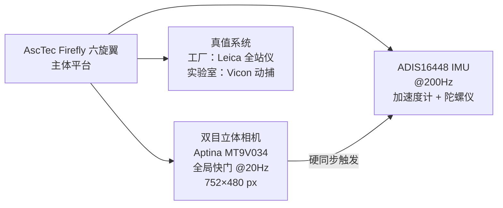
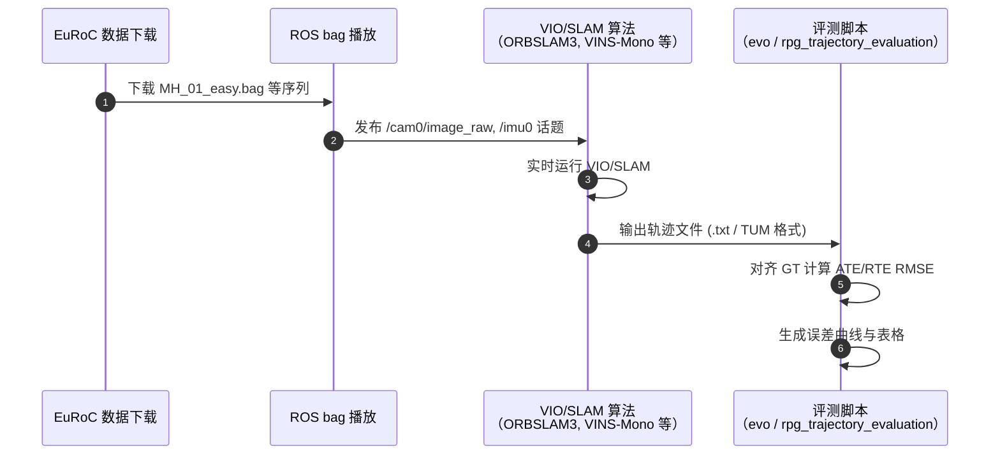

# EuRoC MAV 数据集（The EuRoC Micro Aerial Vehicle Datasets）

**EuRoC MAV Datasets**（*The EuRoC Micro Aerial Vehicle Datasets*，[DOI: 10.1177/0278364915620033](https://doi.org/10.1177/0278364915620033)，IJRR 2016，ETH ASL / Roland Siegwart 课题组，**IJRR Test of Time Award 2026**）提供 **11 个序列** 的精密同步 **双目立体相机 + IMU + 6-DOF 真值轨迹** 数据，采集于 **工业厂房** 与 **动作捕捉实验室** 两类场景，覆盖不同难度（Easy / Medium / Hard），成为过去十年视觉惯性里程计（VIO）与视觉 SLAM 算法的 **事实上的标准基准**。

## 数据集速查

| 属性 | 详情 |
|------|------|
| 序列数 | 11（机房 6 + 动捕实验室 5） |
| 传感器 | 双目全局快门相机（Aptina MT9V034 @20Hz）+ IMU（ADIS16448 @200Hz） |
| 真值来源 | Leica 全站仪（工厂精确绝对坐标）+ Vicon 动作捕捉（实验室 mm 级） |
| 场景 | 工业厂房（V1/V2/MH 序列）；Vicon 动捕室（V1_01 等） |
| 难度分级 | Easy / Medium / Hard（主要依据运动动态与纹理） |
| 下载 | <http://rpg.ifi.uzh.ch/docs/IJRR17_Burri.pdf>（数据页 ASL 站点） |
| 许可证 | 学术非商业使用（具体见数据集页面声明） |
| 重定向就绪度 | **不适用**（位姿真值基准，非人体/机器人动作重定向资产） |
| 引用次数 | 数千次（截至 2026 年，Google Scholar） |

## 一句话定义

**EuRoC 是十年来 VIO/SLAM 算法最权威的视觉惯性基准——11 序列同步双目 + IMU + 高精度真值，工厂与实验室双场景，三难度分级，催生了无数 VIO/SLAM 论文的标准评测规程。**

## 英文缩写速查

| 缩写 | 英文全称 | 简要说明 |
|------|----------|----------|
| EuRoC | European Robotics Challenge | 数据集所出欧洲机器人挑战赛项目框架 |
| MAV | Micro Aerial Vehicle | 微型无人机；数据集采集平台类型 |
| VIO | Visual-Inertial Odometry | 视觉惯性里程计；EuRoC 最主要的评测算法类别 |
| SLAM | Simultaneous Localization and Mapping | 同时定位与建图；另一主要评测方向 |
| IMU | Inertial Measurement Unit | 惯性测量单元；与相机数据同步 @200Hz |
| RMSE | Root Mean Square Error | 均方根误差；EuRoC 位置/旋转误差主指标 |
| ASL | Autonomous Systems Lab | ETH 自主系统实验室；数据集主要发布机构 |
| IJRR | International Journal of Robotics Research | 发表期刊；2026 Test of Time Award 来源 |

## 为什么重要

- **十年标准基准地位：** EuRoC 发布于 2016 年，此后几乎所有 VIO/SLAM 顶会论文（IROS、ICRA、RSS 等）均在 EuRoC 上报告结果，形成跨算法、跨年份的横向可比性——这是评测数据集最核心的价值。
- **传感器同步精度高：** 双目全局快门相机与 IMU 的 **硬同步**（相比软同步 USB 相机方案误差小 10× 以上），加上 Leica/Vicon 真值精度，使评测结果置信度远超自行录制数据集。
- **多场景多难度覆盖：** 工厂纹理丰富但光线稳定；实验室动态变化较大；难度分级允许算法做能力边界分析，而非只报「最好序列」指标。
- **IJRR Test of Time Award 2026：** 十年后仍被广泛使用，验证了其作为基础设施的持久价值。

## 核心原理

### 数据采集平台

EuRoC 采用 **AscTec Firefly** 六旋翼平台搭载定制传感器套件：

### 序列说明

| 序列前缀 | 场景 | 序列数 | 真值方式 |
|---------|------|--------|---------|
| MH（Machine Hall） | 工业厂房，大空间 | 5 | Leica 全站仪绝对坐标 |
| V1/V2（Vicon Room） | Vicon 动捕实验室 | 6 | Vicon 系统 mm 级真值 |

难度划分：Easy（慢速平稳）→ Medium（中速，适量旋转）→ Hard（快速激进运动）。

### 评测指标

- **ATE（Absolute Trajectory Error）：** 全轨迹绝对位置 RMSE，衡量全局一致性
- **RTE（Relative Trajectory Error）：** 局部段位姿漂移，衡量短期精度
- 旋转误差（deg）作为辅助指标

## 工程实践

### 经典使用流程

关键复现路径：ROS bag 播放 → 算法订阅 cam/imu 话题 → 输出 TUM 格式轨迹 → `evo_ape` 计算 ATE。

### 常用评测工具

- **evo**（<https://github.com/MichaelGrupp/evo>）：通用轨迹评测，支持 EuRoC 格式
- **rpg_trajectory_evaluation**（<https://github.com/uzh-rpg/rpg_trajectory_evaluation>）：ETH RPG 官方评测脚本

### 代表性在 EuRoC 上测试的算法

| 算法 | 类型 | 特点 |
|------|------|------|
| VINS-Mono | 紧耦合 VIO | 2018 年 VIO 标杆 |
| ORBSLAM3 | 多模态 SLAM | 支持单目/双目/IMU 多组合 |
| OKVIS | 基于优化的 VIO | 早期紧耦合优化 VIO |
| Kimera | VIO + 稠密建图 | 语义 SLAM 方向 |
| [Isaac ROS Visual SLAM](./isaac-ros-visual-slam.md) | GPU 加速 VIO | NVIDIA 硬件加速路线 |

## 局限与风险

- **室内/受控场景：** 工厂与实验室场景光线受控、动态物体少，与真实户外 MAV 运行（强光变化、GPS 拒止等）存在分布差距。
- **小规模序列集：** 11 序列总时长有限，不能覆盖所有运动模式；近年数据集（如 TartanAir、SubT-MRS）补充了更多多样性。
- **静态场景假设：** 无人工移动物体，运动目标鲁棒性测试不足。
- **2016 年传感器规格：** 相机分辨率与帧率偏低，不反映当前高帧率 event 相机或高分辨率相机的场景。
- **十年后的「刷榜」风险：** 部分 VIO 算法专门针对 EuRoC 特性调参，泛化到其他数据集时性能显著下降——单独用 EuRoC 结果判断算法通用性需谨慎。

## 关联页面

- [EgoPlanner Swarm](./ego-planner-swarm.md) — ETH/ZJU MAV 规划栈；常与 EuRoC-trained VIO 联用
- [ORB-SLAM3](./orb-slam3.md) — EuRoC 上测试的代表性多模态 SLAM
- [Isaac ROS Visual SLAM](./isaac-ros-visual-slam.md) — GPU 加速 VIO；EuRoC 评测案例
- [HDL Graph SLAM](./hdl-graph-slam.md) — LiDAR SLAM 参考；与视觉 SLAM 对比语境

## 参考来源

- [量子位：RSS 2026 三项最佳论文报道](../../sources/blogs/wechat_qbitai_rss2026_awards_2026-07-16.md)
- [EuRoC MAV Datasets 论文摘录（IJRR 2016）](../../sources/papers/euroc_mav_datasets_ijrr_2016.md)
- [EuRoC 数据集归档](../../sources/datasets/euroc_mav.md)

## 推荐继续阅读

- Burri et al., [*The EuRoC MAV Datasets*](https://doi.org/10.1177/0278364915620033) — 原始 IJRR 论文
- [ASL Datasets 页面](https://ethz-asl.github.io/datasets/) — ETH ASL 数据集发布站
- Grupp, [evo 评测工具](https://github.com/MichaelGrupp/evo) — 最常用的 EuRoC/TUM 格式轨迹评测工具
- TartanAir（Wang et al., 2020）— 覆盖多样户外场景的大规模 VIO 数据集，作为 EuRoC 的补充
