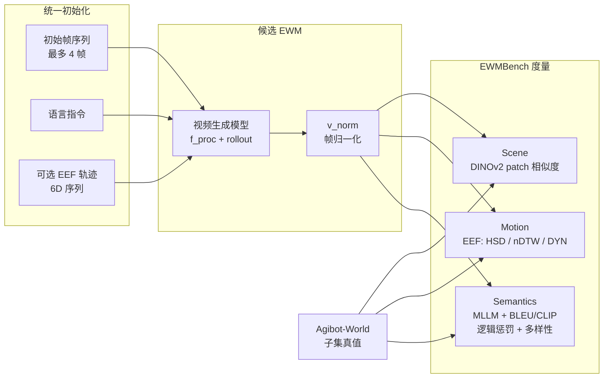

# EWMBench（具身世界模型生成评测）

**EWMBench**（*Embodied World Model Benchmark*，arXiv:2505.09694）把「文生 / 图生视频」模型放在 **机器人操作** 语境里考核：给定 **初始场景帧** 与 **自然语言指令**（以及论文协议中可选的 **6D 末端位姿序列**），模型需 **自回归续写** 未来帧直至任务语义完成；评测侧对照 **Agibot-World** 精选真值，从 **场景一致性、运动正确性、语义对齐与多样性** 三个互补维度打分，并发布 **GitHub 评测代码** 与 **Hugging Face 数据/权重** 入口。

## 一句话定义

用 **统一初始化 + 多维度量（视觉布局守恒 / EEF 轨迹对齐 / MLLM 语义与逻辑）** 把「像不像电影」与「像不像可执行的机器人 rollout」区分开来的 **EWM 专用基准**。

## 为什么重要

- **问题对准「通用视频指标 ≠ 具身可用」**：VBench 等基准难以单独暴露 **静态场景漂移、末端时序错乱、指令步骤缺失** 等操纵任务失效模式；EWMBench 显式把这些维度拆开报告（论文 Table 1 与 §4.1–4.3）。
- **与生成式世界模型路线直接对齐**：当研究把扩散式视频模型当作 [生成式世界模型](../methods/generative-world-models.md) 或 [视频即仿真](../concepts/video-as-simulation.md) 的像素接口时，需要一个 **可复现、与真机数据同源** 的坐标系；EWMBench 的数据子集直接构建于 **Agibot-World** 开源操纵数据。
- **工程可落地**：官方仓库提供 **目录约定、`config.yaml`、预处理脚本与依赖版本**，降低「论文指标无法复现」的摩擦（细节以 README 为准）。

## 核心结构

| 组件 | 作用 |
|------|------|
| **统一初始化** | 至多 **4** 张初始图 + 语言指令 +（可选）轨迹；不同模型可用子集输入，输出经 **归一化** 后进入同一评测算子。 |
| **任务子集** | **10** 类操作任务，强调 **动作顺序与 affordance**；每类多 episode；高层任务拆成 **4–10** 原子子动作并配 **逐步描述**，保证片段级对齐。 |
| **Scene 指标** | **DINOv2**（在 embodiment 数据上微调）patch 嵌入的帧间 / 相对首帧 **余弦相似度**，敏感于 **布局、物体恒常、视角漂移**。 |
| **Motion 指标** | 微调检测器提取 **末端轨迹**；**HSD**（空间最大偏差）、**nDTW**（时空对齐）、**DYN**（速度/加速度分布的 Wasserstein 风格一致性）；**每任务三条 rollout 取最优** 降低随机性。 |
| **Semantics 指标** | 视频 **MLLM** 生成全局/步骤级描述，与真值比对（**BLEU / CLIP** 等）；另设 **逻辑错误惩罚**；多样性用 **CLIP** 全局特征的 **1 − 相似度**。 |

## 流程总览（初始化 → 生成 → 评测）

## 常见误区或局限

- **不是「策略控制基准」**：论文当前主实验聚焦 **I2V / 文本驱动视频生成**；**动作条件视频生成** 留待未来（统一输入格式已预留轨迹通道）。
- **末端 vs 全臂**：指标主要基于 **单臂末端**；论文明确未来纳入 **整臂状态** 与 **动相机**。
- **依赖链重**：README 要求 **Qwen2.5-VL、CLIP、微调 DINOv2/YOLO-World** 等权重与 **CUDA 11.8** 级环境；复现前需核对 **HF 数据卡与许可证**。

## 关联页面

- [Generative World Models（生成式世界模型）](../methods/generative-world-models.md) — 像素域动力学与评测缺口语境
- [Video-as-Simulation（视频即仿真）](../concepts/video-as-simulation.md) — 视频 rollout 作为仿真接口时的失效模式
- [Manipulation（操作任务）](../tasks/manipulation.md) — 任务域：双臂/抓取等工程注意点与本基准当前子集范围对照
- [Model-Based RL（基于模型的强化学习）](../methods/model-based-rl.md) — 世界模型学习与规划文献脉络（EWMBench 评的是「生成式视频世界模型」子类）

## 参考来源

- [EWMBench 论文摘录](../../sources/papers/ewmbench.md)
- [EWMBench 仓库与运行归档](../../sources/repos/ewmbench.md)
- [Agibot-World 站点归档](../../sources/sites/agibot-world.md)
- Hu et al., *EWMBench: Evaluating Scene, Motion, and Semantic Quality in Embodied World Models*, [arXiv:2505.09694](https://arxiv.org/abs/2505.09694)

## 推荐继续阅读

- Huang et al., *VBench: Comprehensive Benchmark Suite for Video Generative Models*, [arXiv:2311.17982](https://arxiv.org/abs/2311.17982) — 通用文生视频多维基准，与 EWMBench 的 **embodied 特化** 维度形成对照
- [AgibotTech/EWMBench（GitHub）](https://github.com/AgibotTech/EWMBench) — 安装、目录结构与 `config.yaml` 约定的一手说明
