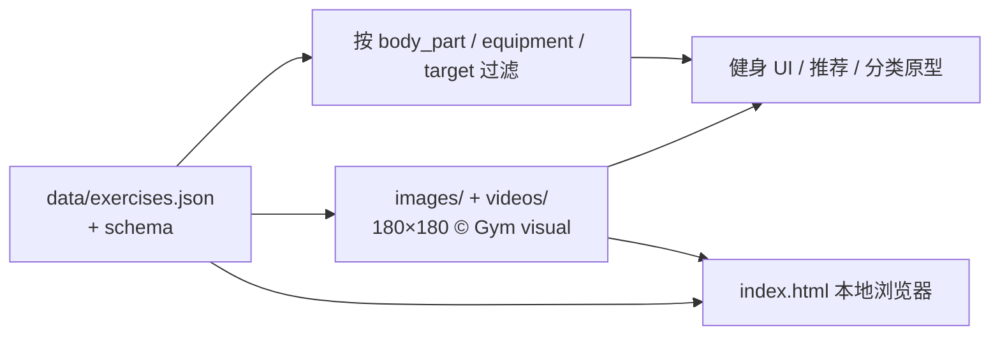

# Exercises Dataset（健身动作目录）

**Exercises Dataset**（[hasaneyldrm/exercises-dataset](https://github.com/hasaneyldrm/exercises-dataset)）是面向健身应用的 **结构化动作目录**：1,324 条记录提供部位、器械、目标肌群、10 语说明与逐步步骤，并附带 180×180 缩略图与动画 GIF；它是 [LogPress](https://github.com/hasaneyldrm/logpress-public) 的 exercise data layer，**不是** SMPL/BVH 动捕或机器人关节参考库。

## 英文缩写速查

| 缩写 | 英文全称 | 简要说明 |
|------|----------|----------|
| GIF | Graphics Interchange Format | 本集中每条动作的 180×180 循环动画演示 |
| JSON | JavaScript Object Notation | 主数据文件 `data/exercises.json` 的交换格式 |
| MIT | Massachusetts Institute of Technology License | 覆盖代码、JSON 结构与说明文本；**不含**媒体 |
| MoCap | Motion Capture | 人形参考运动常见来源；本集 **不具备** |
| WBT | Whole-Body Tracking | 全身跟踪类 RL；本集不能直接作为参考轨迹 |
| API | Application Programming Interface | `setup.html` 提供多语言客户端调用示例 |

## 为什么重要

- **选型防火墙**：公开仓库名带 “exercise / dataset”、星标很高，易被误当成 [AMASS](./amass.md) / [LaFAN1](./lafan1-dataset.md) 一类 **可重定向运动源**。入库后明确：**无关节角、无骨架、无时间序列轨迹**，不能跳过 [Motion Retargeting](../concepts/motion-retargeting.md) 去做 WBT。
- **标签与多语文本层**：`body_part` / `equipment` / `target` / `muscle_group` + 10 语 `instructions`，适合健身推荐、动作分类或文本–视觉原型，而不是物理模仿。
- **许可边界清晰**：说明文本与结构 MIT；媒体 © Gym visual，需单独合规——这是产品化时最容易踩坑的一点。

## 核心原理

### 数据对象

每条记录（见 `data/exercises.schema.json`）大致包含：

| 字段族 | 作用 |
|--------|------|
| `id` / `name` | 四位数字 ID 与英文动作名 |
| `category` ≈ `body_part` | 身体部位枚举（back、chest、upper arms…） |
| `equipment` / `target` / `muscle_group` / `secondary_muscles` | 器械与肌群标签 |
| `instructions.*` / `instruction_steps.*` | 10 语全文说明与逐步数组 |
| `image` / `gif_url` / `media_id` / `attribution` | 本地媒体路径与 Gym visual 署名 |

### 规模速查（与 README 一致）

| 维度 | 数量 |
|------|------|
| 动作条数 | **1,324** |
| 说明语言 | **10**（en/es/it/tr/ru/zh/hi/pl/ko/fr） |
| 部位最多 | Upper Arms 292 · Upper Legs 227 · Back 203 |
| 器械最多 | Body Weight 325 · Dumbbell 294 · Cable 157 · Barbell 154 |

### 流程总览（消费侧）



> 与人形管线对照：本图 **没有**「MoCap → 重定向 → WBT」边；若需要机器人可执行参考，应改选 [人形参考运动数据集选型](../comparisons/humanoid-reference-motion-datasets.md) 中的 MoCap / 预重定向 / 真机集。

## 工程实践

| 项 | 做法 |
|----|------|
| 开源状态 | **已开源（分层）** — 元数据/说明 **MIT**；媒体按 Gym visual 条款 + `NOTICE.md` |
| 快速浏览 | 打开仓库根目录 `index.html`（纯客户端，可按部位/器械过滤） |
| 接入后端 | `setup.html` 生成多库 SQL INSERT，并带 JS/Python/C#/Java/PHP/Go/cURL 示例 |
| 校验 | 用任意 JSON Schema 2020-12 校验器对照 `exercises.schema.json` |
| 机器人侧可用边界 | 仅作 **动作名/肌群/器械 taxonomy** 或演示 UI；若要从 GIF 估姿态，需另接 HMR（如 GVHMR）且质量远逊于光学 MoCap |
| 源码运行时序图 | **不适用** — 本仓是数据 + 静态 HTML 工具，无可训练策略 / 仿真部署入口 |

**Python 加载（README 摘录要点）：**

```python
import json
with open("data/exercises.json", encoding="utf-8") as f:
    exercises = json.load(f)
chest = [e for e in exercises if e["category"] == "chest"]
```

## 局限与风险

- **不是参考运动库**：按 [Motion Data Quality](../concepts/motion-data-quality.md) 四轴评估，本集在物理可行性 / 接触 / 形态差距上 **均不可用** 于 WBT——没有可执行状态轨迹。
- **媒体许可 ≠ MIT**：产品内嵌 GIF/缩略图前必须阅读 Gym visual Terms，并保留 attribution；仓库许可写明「克隆不等于获得媒体许可」。
- **分辨率与形态**：180×180 动画仅够 UI 演示；细节姿态、负荷、节奏不足以支撑精细模仿学习。
- **与 LogPress 分工**：本仓是数据层；App 逻辑、密钥与完整产品栈在 sanitized 的 `logpress-public`，勿把二者混为一谈。

## 关联页面

- [人形参考运动与操作数据集选型](../comparisons/humanoid-reference-motion-datasets.md) — 真正的 MoCap / 预重定向 / 真机操作集对照
- [AMASS](./amass.md) — SMPL 统一人体动捕元库（对照「什么才是跟踪参考」）
- [LaFAN1](./lafan1-dataset.md) — BVH 棚拍小集（对照「有骨架轨迹」）
- [Motion Retargeting](../concepts/motion-retargeting.md) — 人体序列 → 机器人参考的必要条件
- [Motion Data Quality](../concepts/motion-data-quality.md) — 为何 GIF 目录过不了四轴体检

## 参考来源

- [Exercises Dataset 仓库归档](../../sources/repos/exercises-dataset.md)
- 上游仓库：<https://github.com/hasaneyldrm/exercises-dataset>
- 媒体权利人：<https://gymvisual.com/>（Terms 见仓库 `NOTICE.md` 链接）

## 推荐继续阅读

- [LogPress public fork](https://github.com/hasaneyldrm/logpress-public) — 消费本数据集的健身 App 样板
- [人形参考运动数据集选型](../comparisons/humanoid-reference-motion-datasets.md) — 若目标是 humanoid tracking / loco-manipulation，从此页选型
