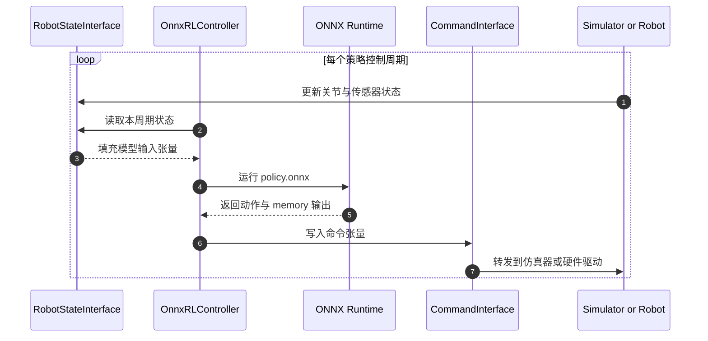

# Exploy

**Exploy**（EXport and dePLOY）是 RAI Institute 开源的强化学习部署工具：它把仿真环境的观测生成、策略网络和动作后处理编译到一个 ONNX 计算图，再由 C++/ROS 控制器将图的输入输出接入机器人状态与命令接口。

## 一句话定义

把“策略网络”和周围的控制计算一起导出，减少训练端 Python 与部署端 C++ 之间的重复实现。

## 英文缩写速查

| 缩写 | 英文全称 | 简要说明 |
|------|----------|----------|
| RL | Reinforcement Learning | Exploy 主要面向的策略训练范式 |
| ONNX | Open Neural Network Exchange | 保存可跨运行时执行的模型与计算图 |
| ORT | ONNX Runtime | Exploy C++ Controller 使用的推理运行时 |
| ROS 2 | Robot Operating System 2 | 可通过 wrapper 将 controller 接入 ROS 工作区 |
| RNN | Recurrent Neural Network | 循环 actor 可通过 memory 张量跨控制周期传递状态 |

## 为什么重要？

常见的 sim-to-real 导出只把 actor 的网络权重与前向算子放进 ONNX；关节状态拼接、坐标变换、历史观测、归一化、动作缩放或限幅仍留在 Python / C++ 两份实现里。只要其中一个处理顺序或数值不同，机器人实际得到的输入与仿真策略见过的输入就可能不一致。

Exploy 的工程价值是把更多“状态到动作”的计算路径绑定为一个可部署资产，并用同一 ONNX 图供 C++ 控制器调用。这样可以减少手工重写面，但不能替代真机驱动、通信与安全验证。

## 核心机制

### 1. Exporter：把环境逻辑编译进 ONNX

使用者为训练环境实现可导出的 adapter，再通过 context manager 登记外部输入、命名输出、分组张量、循环 memory 与附加元数据。Exporter 通过 tracing 捕获 observation 计算、actor 前向及 `process_actions` / `apply_actions` 等动作路径，生成供评估或部署加载的 ONNX 文件。

官方教程描述了两个子图：**Default** 在策略频率计算观测并运行 actor；**ProcessActions** 在仿真频率处理网络原始动作并映射到命令输出。RNN 等策略可通过显式 memory 输入/输出保留跨周期状态。

### 2. Evaluator：先比对导出结果

Exporter 配套 evaluator / SessionWrapper，可在同一组输入上比较原 PyTorch 环境与导出 ONNX 的结果，发现图转换或处理路径不一致。它是部署前的数值核验工具，不是“数值差异自动消失”的保证；仍应关注误差容限、输入覆盖范围与目标 ONNX Runtime 行为。

### 3. Controller：把 ONNX 张量接到设备接口

C++ `OnnxRLController` 基于 ONNX Runtime 执行推理，并通过 matcher 将模型张量输入、输出分配到组件。`RobotStateInterface` 提供机器人状态，`CommandInterface` 接收策略命令，`DataCollectionInterface` 可记录数据；使用者可扩展 matcher / component 对接自定义传感器、planner 或执行器。

内置 framework adapter 面向 **Isaac Lab** 和 **MjLab**。控制器接口通用，但每种机器人仍需编写状态和命令适配，Exploy 不会替用户生成 CAN、EtherCAT 或具体厂商驱动。

## 流程总览

## 源码运行时序图

这条运行时路径对应官方 Controller 教程的 `OnnxRLController::update()` 与接口抽象；设备采集、通信周期、命令限幅和急停逻辑仍需目标机器人集成方落实。

## 工程实践与复现

| 目标 | 官方入口 | 注意点 |
|------|----------|--------|
| 安装开发环境 | `pixi install`；`pixi run build` | 仓库提供隔离环境和锁文件；C++ 构建依赖 ONNX Runtime 等 |
| 从 Isaac Lab 导出 | `pixi run export-isaaclab` | 需先具备对应 Isaac Lab 任务与环境 |
| 从 MjLab 导出 | `pixi run export-mjlab` | framework adapter 不是任意训练仓库的零配置转换 |
| 验证导出 | 官方 exporter evaluator 比较 PyTorch / ONNX | 先覆盖代表性输入，再上真机；ONNX Runtime 版本/算子会影响结果 |
| 运行 C++ 示例 | `pixi run run-cpp-example-isaaclab` 或 `...-mjlab` | 官方示例提示需要 NVIDIA GPU；loopback 示例不等于具体机器人驱动 |
| 接入 ROS 2 | `colcon build --packages-up-to exploy_vendor` | ROS wrapper 暴露依赖，设备接口仍由应用实现 |
| 许可证 | MIT | 代码已开源；无统一部署成功率或延迟 benchmark |

RAI 介绍的实机/平台案例包括 Roadrunner、Spot、UMV、Unitree G1 与 Atlas；博客没有给出统一任务指标，故这里只记录应用范围，不将宣传性实例写成量化实验结论。

## 局限与风险

- **适配不是零成本**：用户需把环境状态和处理逻辑整理为可追踪 adapter；不支持的 PyTorch / ONNX 算子或动态行为可能需要改写。
- **控制 I/O 仍由集成方负责**：传感器驱动、状态抽取、命令写入、通信总线、调度和安全壳不因为策略图被导出而自动生成。
- **数值等价必须验证**：evaluator 能帮助发现差异，但容差、未覆盖输入、硬件 runtime 与浮点实现仍会造成偏差。
- **仿真迁移问题仍存在**：它减少软件实现造成的 gap，不会自动消除动力学、传感器噪声、执行器带宽、延迟或接触差异。
- **部署证据边界**：RAI 博客提到多个平台使用案例，但没有公开统一成功率、推理延迟或消融结果；应视为厂商/研究机构自述。

## 关联页面

- [ONNX](./onnx.md) — 模型交换格式与机器人控制管线导出
- [ONNX Runtime](./onnxruntime.md) — 执行 ONNX 的 C++ 推理引擎
- [Sim2Real](../concepts/sim2real.md) — 迁移差距不止来自物理，也来自软件实现
- [Whole-Body Tracking Pipeline](../concepts/whole-body-tracking-pipeline.md) — 人形 RL 策略从训练到部署的整体管线

## 参考来源

- [RAI Institute 官方介绍文章](../../sources/blogs/introducing_exploy_rai_2026-10-07.md)
- [Exploy 官方文档归档](../../sources/sites/exploy-docs.md)
- [rai-opensource/exploy 仓库归档](../../sources/repos/rai-opensource-exploy.md)

## 推荐继续阅读

- [Exporter Tutorial](https://rai-opensource.github.io/exploy/tutorial/exporter/exporter_tutorial.html)
- [Controller Tutorial](https://rai-opensource.github.io/exploy/tutorial/controller/controller_tutorial.html)
- [Exploy GitHub Repository](https://github.com/rai-opensource/exploy)
- [ONNX Runtime C++ API](https://onnxruntime.ai/docs/get-started/with-cpp.html)