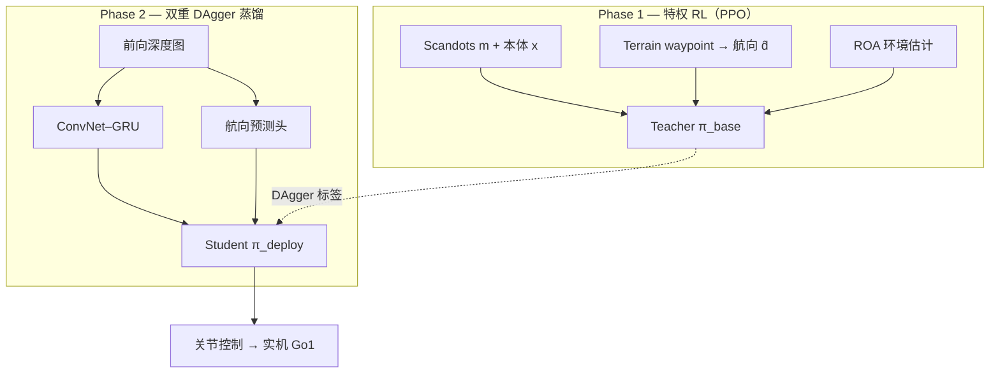

# Extreme Parkour（端到端四足感知跑酷）

**Extreme Parkour**（Cheng et al., [arXiv:2309.14341](https://arxiv.org/abs/2309.14341)，**ICRA 2024**）在 **Unitree Go1 级低成本四足** 上，用 **单目前向深度相机 + 大规模仿真 RL**，训练 **单神经网络** 直接输出关节控制，实现高跳、远跳、手倒立与斜 ramp 自主变向等 **极限跑酷** 技能。官方材料：[项目页](https://extreme-parkour.github.io/)、[GitHub](https://github.com/chengxuxin/extreme-parkour)。

## 一句话定义

**Phase 1 用特权 scandots 与 terrain waypoint 航向训 PPO Teacher，Phase 2 用 DAgger 把外感知与 yaw 决策蒸馏进 ConvNet–GRU 深度 Student——部署时仅深度图即可输出精确跑酷控制。**

## 为什么重要

- **端到端视觉 loco 的早期标杆：** 在 **执行器不精确、深度低频抖动** 的真实约束下，仍实现 **2× 身高 / 2× 体长** 级动态动作，影响后续 Robot Parkour Learning、DreamWaQ++ 等感知 locomotion 叙事。
- **双重蒸馏范式清晰：** 不仅蒸馏 **motor commands**，还蒸馏 **rapidly fluctuating heading**（ramp 跳上角与即时变向人类无法遥操作给 waypoint）——比「只换 scandots→深度」更完整。
- **训练成本可接受：** 官方 README 报告 **< 20 h（3090）** 两阶段合计，降低复现门槛；开源栈基于 **legged_gym + Isaac Gym**。
- **奖励设计可迁移：** **Inner-product 航向跟踪 + clearance 边缘惩罚** 解决跑酷中「绕障 exploit」与「贴边省能」两类典型失败（项目页 ablation）。

## 核心结构

| 模块 | 作用 |
|------|------|
| **Phase 1 Teacher（PPO）** | 输入本体 $x$、特权 **scandots** $m$、oracle 航向 $\hat{d}$（waypoint 计算）、行走标志与速度指令；**ROA** 从历史估计环境参数。 |
| **统一奖励** | $\hat{d}_w=(p-x)/\|p-x\|$ 与速度跟踪对齐；**$r_{\mathrm{clearance}}$** 惩罚足端距地形边缘 < 5 cm 的接触。 |
| **Phase 2 Student（DAgger）** | (1) **ConvNet–GRU** 深度管线替代 scandots（RMA 式）；(2) **从深度自预测 yaw**，替代人类 waypoint。 |
| **部署** | `save_jit.py` 导出 traced 模型；实机 **零微调** 叙事（论文 / 项目页设定）。 |

### 流程总览

## 方法栈（提炼）

- **与分模块 classical stack 对比：** 传统跑酷分别精密标定感知 / 执行 / 控制；本文 **单 NN + 仿真 RL** 在 **不改造硬件** 前提下习得多样技能。
- **Teacher–Student 谱系：** 与 [RMA](../concepts/privileged-training.md)、Robot Parkour Learning（ZiwenZhuang）同族；Extreme Parkour 特色是 **航向蒸馏** 与 **clearance 奖励** 针对跑酷几何。
- **与 DreamWaQ++ 差异：** DreamWaQ++ 强调 **点云多模态 + 非对称 AC 单阶段** 与传感器失效回退；Extreme Parkour 强调 **极限动态技能 + 深度端到端 + 两阶段蒸馏**（见 [DreamWaQ++](./dreamwaq-plus.md) 对比表）。

## 实验与 ablation（项目页）

- **技能：** High jump、Long jump、Handstand、Tilted ramp、Step / Gap / Hurdle 组合；**新障碍组合与不同物理属性** 泛化。
- **Vision locomotion 对照：** 分模块视觉 loco 在楼梯 **跌落**——说明跑酷需 **端到端** 或更强闭环。
- **无 clearance：** 大 gap **触边失败**。
- **无 direction distillation：** ramp **摇杆难以控制**。

## 常见误区或局限

- **误区：** 把 Extreme Parkour 等同于「又一个 legged_gym 走路」——其核心是 **parkour 地形 + 统一奖励 + 双重蒸馏**，普通 velocity tracking 奖励不能直接迁移。
- **误区：** 认为 Phase 1 可直接部署——Teacher 依赖 **scandots 与 oracle waypoint**，必须完成 Phase 2。
- **局限：** 栈绑定 **Isaac Gym Preview 3/4 + PyTorch 1.10** 等较旧环境；深度 **单目前向**、障碍以 **结构化 box course** 为主，野外 unstructured terrain 需自行扩展。后续 **人形 PHP**、**Hiking in the Wild** 等将跑酷推向更大机体与更长技能链。

## 英文缩写速查

| 缩写 | 英文全称 | 简要说明 |
|------|----------|----------|
| Sim2Real | Simulation to Real | 把仿真中学到的策略迁移落地真机的工程主线 |
| RL | Reinforcement Learning | 通过与环境交互最大化长期回报来学习策略的范式 |
| DAgger | Dataset Aggregation | 迭代收集策略诱导状态下的专家标注以纠偏的模仿学习方法 |
| PPO | Proximal Policy Optimization | 人形/足式 locomotion 中最常用的 on-policy 策略梯度算法 |
| GRU | Gated Recurrent Unit | 门控循环单元，处理时序观测 |
| legged_gym | Legged Gym | 足式机器人 RL 训练的常用开源框架 |
| Isaac Gym | NVIDIA Isaac Gym | GPU 并行刚体仿真训练环境 |
| RMA | Rapid Motor Adaptation | 从历史轨迹隐式估计环境参数的快速运动自适应 |
| Locomotion | Robot Locomotion | 足式/人形等无轮移动能力的总称 |

## 参考来源

- [Extreme Parkour 论文摘录（arXiv:2309.14341）](../../sources/papers/extreme_parkour_arxiv_2309_14341.md)
- [extreme-parkour 代码仓库归档](../../sources/repos/extreme-parkour.md)
- [Extreme Parkour 项目页归档](../../sources/sites/extreme-parkour-github-io.md)

## 关联页面

- [Privileged Training（特权信息训练）](../concepts/privileged-training.md) — scandots / oracle heading → 深度 Student
- [DAgger](../methods/dagger.md) — Phase 2 行为克隆与在线聚合
- [legged_gym](./legged-gym.md) — 上游训练框架与工程范式
- [Locomotion](../tasks/locomotion.md) — 四足 RL 与跑酷任务地图
- [Sim2Real](../concepts/sim2real.md) — ROA / 域随机与部署叙事
- [DreamWaQ++](./dreamwaq-plus.md) — 四足感知 loco 姊妹路线

## 推荐继续阅读

- Cheng et al., [Extreme Parkour with Legged Robots](https://arxiv.org/abs/2309.14341)（ICRA 2024）
- Zhuang et al., *Robot Parkour Learning*（2023）— Unitree 生态 Teacher–Student 跑酷
- Kumar et al., *RMA: Rapid Motor Adaptation*（2021）— scandots→深度的 adaptation 先例
