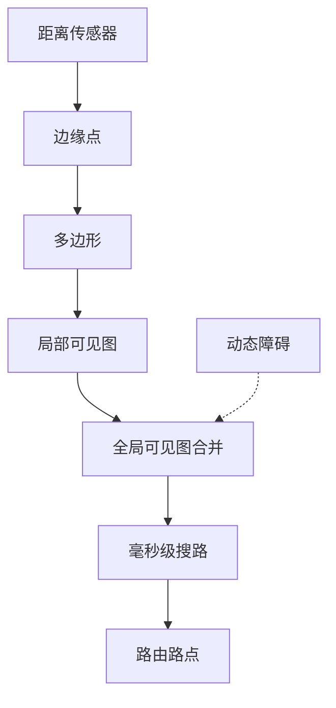
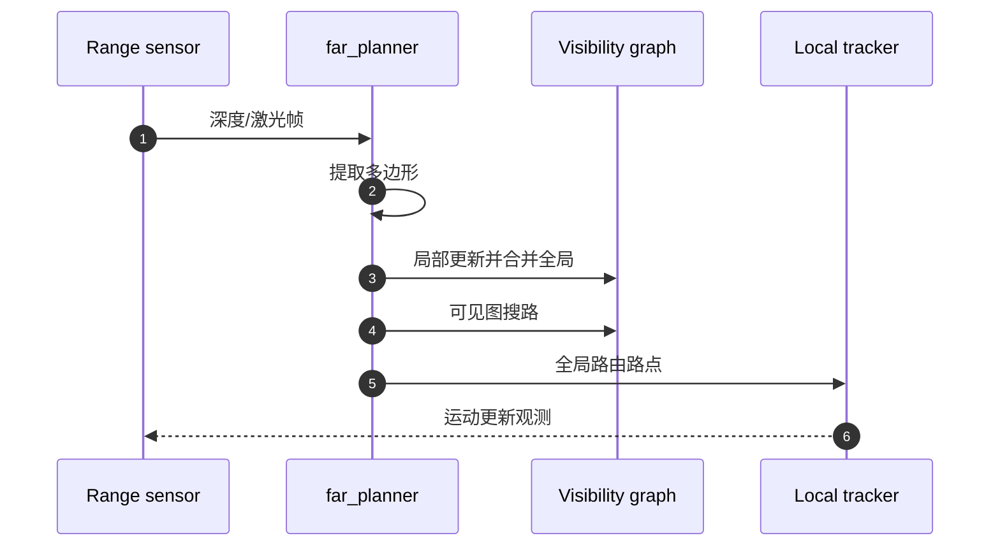

# FAR Planner

## 一句话定义

**FAR Planner**（Fast, Attemptable Route Planner）用 **动态更新的可见图（visibility graph）** 在已知或未知环境中做长距离快速重规划：障碍多边形化，局部层逐帧更新并合并到全局层，路径搜索可达毫秒级——课程第 5.3 节。

## 英文缩写速查

| 缩写 | 英文全称 | 简要说明 |
|------|----------|----------|
| FAR | Fast Attemptable Route | 本规划器缩写 |
| V-Graph | Visibility Graph | 可见边连接的路径图 |
| Attemptable | Attemptable Planning | 自由空间不可达时尝试未知区 |
| RRT\* / BIT\* | Sampling-based planners | 论文对照基线 |
| IROS | IEEE/RSJ IROS | 2022 发表会议 |
| Polygon | Obstacle polygon | 障碍封闭多边形表示 |

## 为什么重要

- 相对反复全图 [A\*](../methods/a-star.md)/RRT\*，可见图 **增量维护** 使长距离重规划更轻（论文报告搜路约数毫秒级，图更新约占单核 ~20%）。
- **Attemptable** 模式适合未知环境：先走自由空间，否则尝试穿越未知并在行驶中「学」布局。
- 与 [TARE](./tare-planner.md) 互补，同属 [CMU Exploration](../../sources/sites/cmu-exploration.md) 全栈。

## 核心原理

### 管道

1. 从距离图像/点云提取障碍边缘点。
2. 聚合成封闭多边形，多帧合并。
3. **局部层**建可见边 → 合并入 **全局可见图**。
4. 在图上搜路；动态障碍断开被挡边，恢复可见后再连。
5. Attemptable：自由空间无解时允许经未知的尝试路径（可视化常区分颜色）。

### 开源状态

**已开源** — [`MichaelFYang/far_planner`](https://github.com/MichaelFYang/far_planner)，论文 arXiv:2110.09460（IROS 2022）。集成于 CMU 自主探索开发环境。

## 源码运行时序图

RViz 可设 Goalpoint、重置可见图、读写 `.vgh`；`Planning Attemptable` 开关控制是否允许未知穿越。

## 工程实践

### 教学实验

| 实验 | 观察点 |
|------|--------|
| 已知室内图 | 路径应贴近可见边，重规划快 |
| 未知环境 | 蓝色/尝试路径出现，图随探索变密 |
| 动态障碍 | 被挡边断开，绕行后恢复 |
| 对照 A\* | 大地图重规划耗时差异 |

### 与局部层分工

- FAR：长距离路由（低频）。
- 局部 kinodynamic / [DWA](../methods/dwa.md)：跟线与避障（高频）。
- 不要指望可见图边本身满足差速曲率——需局部可行化。

### 参数直觉

| 项 | 影响 |
|----|------|
| 图像分辨率（m/pixel） | 多边形精度 vs CPU |
| 局部层窗口（如 40 m） | 更新范围 |
| 图更新频率（如 2.5 Hz） | 动态响应 |

## 局限与风险

- 多边形假设对杂乱植被、不规则堆物表达力有限。
- Attemptable 可能把车引入死胡同，需超时与恢复。
- 人形集成要加可通行性与落足约束，不能直接用地面车参数。

## 关联页面

- [TARE Planner](./tare-planner.md)
- [自主探索](../tasks/autonomous-exploration.md)
- [A\*](../methods/a-star.md)
- [DWA](../methods/dwa.md)
- [人形系统课程策展](./humanoid-system-curriculum.md)

## 参考来源

- [far_planner 仓库归档](../../sources/repos/far_planner.md)
- [CMU Exploration 站点](../../sources/sites/cmu-exploration.md)
- [深蓝学院人形系统课程大纲](../../sources/courses/shenlan_humanoid_system_theory_practice.md)

## 推荐继续阅读

- arXiv:2110.09460 FAR Planner 论文
- <https://www.cmu-exploration.com/>
