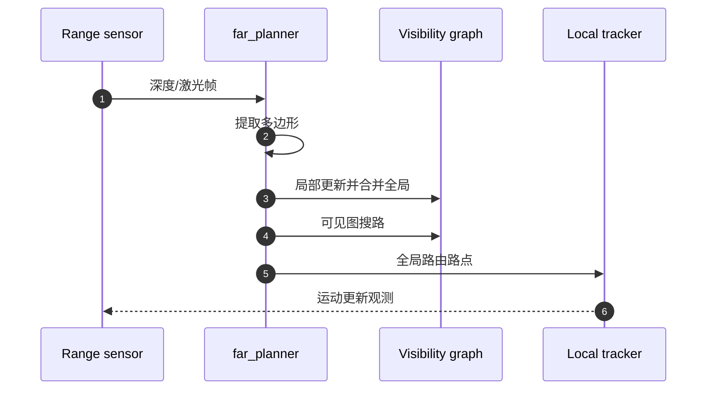

# FAR Planner

## 一句话定义

**FAR Planner**（Fast, Attemptable Route Planner）用 **动态更新的可见图** 在已知/未知环境中做长距离快速重规划：障碍多边形化，局部层逐帧建图并合并到全局层，路径搜索毫秒级——课程第 5.3 节。

## 英文缩写速查

| 缩写 | 英文全称 | 简要说明 |
|------|----------|----------|
| FAR | Fast Attemptable Route | 本规划器缩写 |
| V-Graph | Visibility Graph | 可见边连接的路径图 |
| Attemptable | Attemptable Planning | 自由空间不可达时尝试未知区 |
| RRT\* | Optimal RRT | 采样规划对照基线 |
| IROS | IEEE/RSJ IROS | 2022 发表会议 |

## 为什么重要

- 相对反复跑 [A\*](../methods/a-star.md)/RRT\* 全图搜索，可见图增量维护使 **重规划更轻**。
- 与 [TARE](./tare-planner.md) 分工：TARE 决定探索「去哪」，FAR 决定「怎么尽快赶到」。

## 核心原理

1. 从距离图像/点云提边缘点 → 封闭多边形。
2. 局部层建可见边，合并入全局可见图。
3. 自由空间搜路；若不可达且开启 attemptable，则借未知空间尝试。
4. 动态障碍：断开被挡可见边，恢复可见后再连。

开源状态：**已开源** — [`MichaelFYang/far_planner`](https://github.com/MichaelFYang/far_planner)（arXiv:2110.09460）。

## 源码运行时序图

## 工程实践

- RViz 设 Goalpoint，观察青色可见图增长；可保存/加载 `.vgh`。
- 与局部 kinodynamic 跟踪器联用（开发环境自带模块）。

## 局限与风险

- 多边形假设对杂乱植被等场景表达力有限。
- 官方示例偏地面/无人机开发环境，人形集成需额外可通行层。

## 关联页面

- [TARE Planner](./tare-planner.md)
- [自主探索](../tasks/autonomous-exploration.md)
- [人形系统课程策展](./humanoid-system-curriculum.md)

## 参考来源

- [far_planner 仓库归档](../../sources/repos/far_planner.md)
- [CMU Exploration 站点](../../sources/sites/cmu-exploration.md)
- [深蓝学院人形系统课程大纲](../../sources/courses/shenlan_humanoid_system_theory_practice.md)

## 推荐继续阅读

- arXiv:2110.09460 FAR Planner 论文
