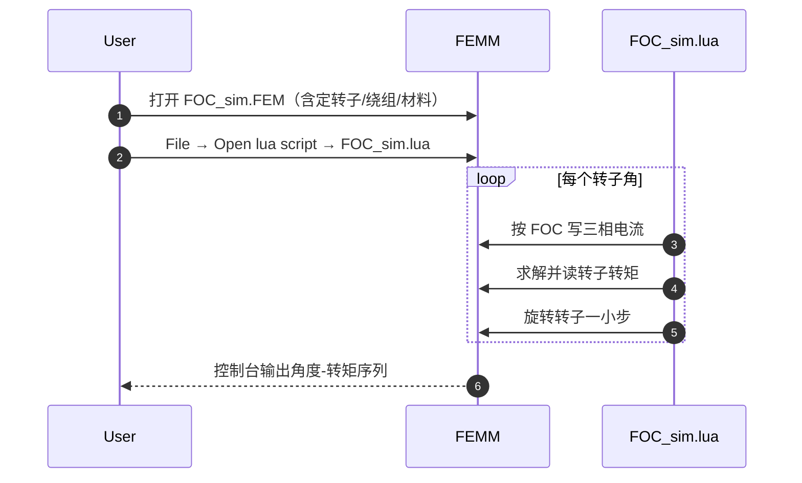

# FEMM-FOC-Simulation（FEMM 磁场定向控制教学仿真）

## 一句话定义

**FEMM-FOC-Simulation**（[yoga-cycle/FEMM-FOC-Simulation](https://github.com/yoga-cycle/FEMM-FOC-Simulation)）用开源 **FEMM** 对小型径向 BLDC 做 **FOC 电流 + 转子机械角扫描**，输出转矩—角度曲线；仓库提供 DXF、`.fem` 与 `FOC_sim.lua`。

## 英文缩写速查

| 缩写 | 英文全称 | 简要说明 |
|------|----------|----------|
| FEMM | Finite Element Method Magnetics | 开源 2D 电磁有限元 |
| FOC | Field-Oriented Control | 磁场定向控制 |
| BLDC | Brushless DC Motor | 无刷直流电机 |
| DXF | Drawing Exchange Format | 二维 CAD 交换格式，可导入 FEMM |
| Lua | Lua scripting language | FEMM 内置自动化脚本语言 |

## 为什么重要

- 把「打开 FEMM」拆成可跟做的七步：**DXF → 材料 → 绕组方向 → 磁钢磁化 → FOC 电流 → 扫角 → 平均转矩/脉动**。
- 成本接近零，比直接上 Maxwell/Motor-CAD 更适合 [力矩电机纵深 Stage 2](../../roadmap/depth-torque-motor-design.md) 入门。
- 与 [Ironless](./ironless-qdd-actuator.md) 的静态 FEMM 对照互补：本仓强调 **随转子角变化的 FOC 转矩**。

## 核心原理

README 设定玩具电机叠长约 **10 mm**；初始转子 d 轴与 A 相对齐。

## 工程实践

| 步骤 | 操作 |
|------|------|
| 1 | 下载 `resources/` |
| 2 | 安装 FEMM，打开 `FOC_sim.FEM` 观察绕组与磁钢 |
| 3 | 运行 `FOC_sim.lua`，记录转矩曲线 |
| 4 | 改电流幅值/相位，观察平均转矩与脉动 |
| 5 | （进阶）换自己的 DXF，迁移材料与电路定义 |

## 局限与风险

- **教学仿真**：尺寸小，非人形优化；无完整机械、热、绕线制造与成熟样机测试。
- GitHub 无 SPDX license 元数据——二次分发前自行确认。
- 2D 磁静力 + 脚本扫角 ≠ 驱动器实时 FOC；控制理论仍读 [FOC](../concepts/field-oriented-control.md)。

## 关联页面

- [开源力矩电机电磁设计完整度对比](../comparisons/open-source-torque-motor-em-design.md)
- [电机电磁仿真软件选型](../comparisons/motor-em-simulation-software.md)
- [PYLEECAN](./pyleecan.md) · [Ironless QDD](./ironless-qdd-actuator.md)
- [执行器驱动链选型闭环](../queries/actuator-drive-chain-selection-loop.md)
- [FOC 逐步推导](../formalizations/field-oriented-control-derivation.md)

## 参考来源

- [sources/repos/femm_foc_simulation.md](../../sources/repos/femm_foc_simulation.md)
- [开源力矩电机电磁设计策展](../../sources/personal/open_source_torque_motor_em_design_curator.md)

## 推荐继续阅读

- 仓库：<https://github.com/yoga-cycle/FEMM-FOC-Simulation>
- 灵感博文（README）：<https://things-in-motion.blogspot.com/2019/02/how-to-model-bldc-pmsm-motors-kv.html>
