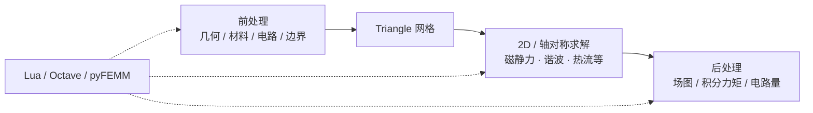
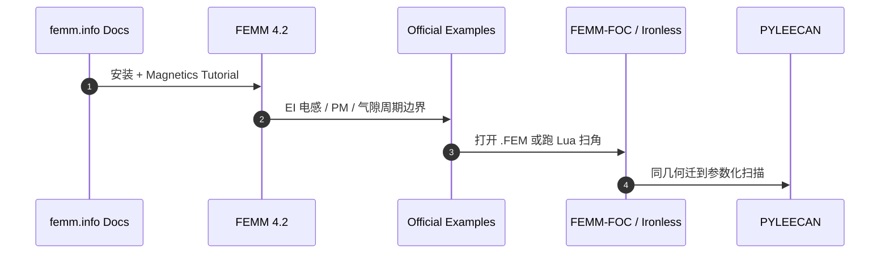

# FEMM（Finite Element Method Magnetics）

## 一句话定义

**FEMM**（[femm.info](https://www.femm.info/doku/doku.php?id=start)，作者 David C. Meeker）是面向 **2D 与轴对称** 问题的开源有限元求解器，覆盖 **磁、静电、热流、电流场**，带图形前后处理，并以 **Lua / Octave·Matlab / Python（pyFEMM）** 等接口做参数扫描与批处理。

## 英文缩写速查

| 缩写 | 英文全称 | 简要说明 |
|------|----------|----------|
| FEMM | Finite Element Method Magnetics | 本工具；历史名偏磁学，现含多物理场模块 |
| FEA | Finite Element Analysis | 有限元分析 |
| IABC | Improvised Asymptotic Boundary Conditions | 开放边界近似条件（官方示例） |
| Lua | Lua scripting language | FEMM 内嵌自动化脚本（**Lua 4.0**） |
| pyFEMM | Python interface to FEMM | Python 客户端；手册与 PyPI 包 |
| AFPL | Aladdin Free Public License | FEMM 程序本体许可 |

## 为什么重要

- 商业栈（Maxwell / Motor-CAD / JMAG）许可贵；FEMM 是人形/腿足 **关节电机电磁入门** 与开源复现链里最常见的 **零许可 2D FEA** 底座。
- 本库已有多条路径直接依赖它：[Ironless](./ironless-qdd-actuator.md) 的 `.FEM`、[FEMM-FOC](./femm-foc-simulation.md) 的 Lua 扫角、[PYLEECAN](./pyleecan.md) / [ACMOP](./acmop.md) 的自动求解耦合。
- 官方 [Examples](https://www.femm.info/doku/doku.php?id=examples) 覆盖气隙电感、径向磁轴承、感应/外转子 BLDC、周期气隙边界与 Matlab 多实例控制——比「只下安装包」更能建立工程直觉。

## 核心原理

| 能力 | 说明（以官方门户与 FAQ 为准） |
|------|-------------------------------|
| 问题类 | Magnetics、Electrostatics、Heat Flow、Current Flow |
| 几何 | **平面 2D** 或 **轴对称**；**无官方 3D 版** |
| 材料 | 非线性 B–H、永磁、电导率等；饱和可计入 |
| AC | 复振幅约定为 **Peak（非 RMS）**；永磁 DC 贡献在非零频率谐波解中不可见 |
| 力/矩 | 推荐加权应力张量体积分；转矩默认绕原点 (0,0) |
| 运动涡流 | FAQ：**不**模拟运动感应涡流 |
| 驱动 | 线圈以电流（circuit）施加；后处理可报电压 |

## 工程实践

### 安装与入口

| 项 | 建议 |
|----|------|
| 下载 | [Download](https://www.femm.info/doku/doku.php?id=download)：稳定 **21Apr2019** 安装包；源码同页 zip |
| 文档 | [Documentation](https://www.femm.info/doku/doku.php?id=documentation)：先做 Magnetics Tutorial，再读 User's Manual |
| Linux | 无原生版；按站点 **Linux Support** 走 Wine |
| 自动化 | 内嵌 Lua 4.0；OctaveFEMM / MathFEMM / **pyFEMM**；命令行可 `-lua-script=` |
| 社区 | [groups.io/g/femm](https://groups.io/g/femm/) |

### 人形关节学习路径（与本库对齐）

1. 门户 [start](https://www.femm.info/doku/doku.php?id=start) → 装稳定版 → 跟完 Magnetics Tutorial。  
2. 在 [examples](https://www.femm.info/doku/doku.php?id=examples) 选气隙电感、永磁、Induction Motor / Outrunner BLDC。  
3. 再进 [FEMM-FOC](./femm-foc-simulation.md) 或 Ironless `FEMM/`，最后用 [PYLEECAN](./pyleecan.md) 做槽极扫描。选型总览见 [仿真软件对比](../comparisons/motor-em-simulation-software.md)。

### 开源状态（项目页核查）

- **已开源：** Download 提供 **二进制 + `femm42src_*.zip` 源码**；许可 **Aladdin Free Public License**。  
- FAQ：用分析结果做商业项目 **无需额外许可**；再销售程序或把源码嵌入商业产品则需另议。  
- **非** GitHub 单仓维护模式；以 femm.info 发行页为准。pyFEMM 另见站点页与 PyPI。

## 局限与风险

- **2D/轴对称假设**：端部效应、复杂 3D 漏磁与斜槽需更高保真工具或实测修正。  
- **无原生 Linux / 无 3D**：集群与跨平台流水线成本高于纯 Python FEA；Wine 路径需自行验证。  
- **谐波/运动模型边界**：运动感应涡流不支持；AC 量 Peak 约定、PM 在谐波问题中的行为易踩坑（先读 FAQ）。  
- **不能替代** Motor-CAD 热地图或 Maxwell 产业工作流；连续功率仍看热与台架（见 [电机设计流程](../overview/motor-design-workflow.md)）。

## 关联页面

- [FEMM-FOC-Simulation](./femm-foc-simulation.md) · [PYLEECAN](./pyleecan.md) · [Ironless QDD](./ironless-qdd-actuator.md) · [ACMOP](./acmop.md)
- [电机电磁仿真软件选型](../comparisons/motor-em-simulation-software.md)
- [开源力矩电机电磁设计完整度对比](../comparisons/open-source-torque-motor-em-design.md)
- [力矩电机设计纵深](../../roadmap/depth-torque-motor-design.md)
- [执行器驱动链选型闭环](../queries/actuator-drive-chain-selection-loop.md)

## 参考来源

- [sources/sites/femm_info.md](../../sources/sites/femm_info.md) — start / documentation / examples（及 download、FAQ 核查）
- [sources/repos/femm_foc_simulation.md](../../sources/repos/femm_foc_simulation.md)
- [sources/repos/pyleecan.md](../../sources/repos/pyleecan.md)

## 推荐继续阅读

- 门户：<https://www.femm.info/doku/doku.php?id=start>
- 文档索引：<https://www.femm.info/doku/doku.php?id=documentation>
- 示例目录：<https://www.femm.info/doku/doku.php?id=examples>
- User's Manual (PDF)：<https://www.femm.info/doku/lib/exe/fetch.php?media=upload:files:manual.pdf>
- FAQ：<https://www.femm.info/doku/doku.php?id=faq>
