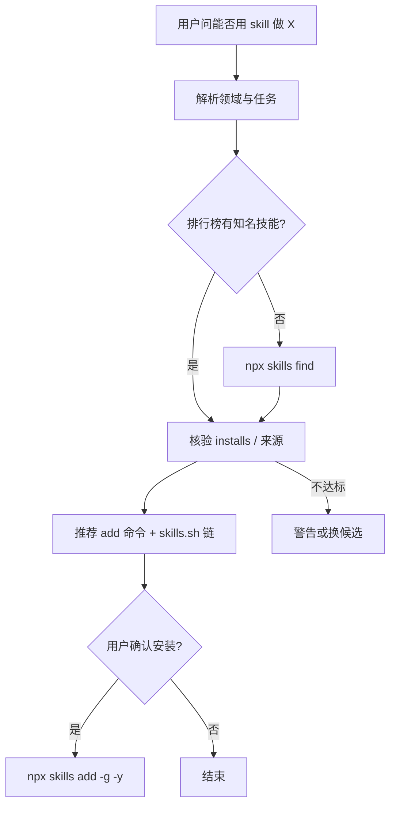

# find-skills（Vercel Labs 元技能）

**find-skills** 位于 [vercel-labs/skills](https://github.com/vercel-labs/skills) 的 `skills/find-skills/`，是开放 Agent Skills 生态的 **发现层规约**：把「有没有 skill 能做 X」转成 **可重复的检索 + 质量门槛 + 安装命令**，而不是让代理凭记忆瞎编包名。

## 一句话定义

用 **skills.sh 排行榜 + `npx skills find` + 安装量/来源/stars 核验**，帮用户从 75+ harness 共享的技能目录里 **找到并安装** 合适 `SKILL.md`，必要时退回 `npx skills init` 自建技能。

## 英文缩写速查

| 缩写 | 英文全称 | 简要说明 |
|------|----------|----------|
| CLI | Command-Line Interface | `npx skills` 包管理器 |
| LLM | Large Language Model | 执行 find-skills 工作流的 coding agent |
| SDLC | Software Development Lifecycle | 技能常按测试/部署/文档等 SDLC 阶段分类检索 |

## 为什么重要（对本知识库读者）

- **技能生态入口：** 本站索引的 [mattpocock/skills](mattpocock-skills.md)、[Anthropic frontend-design](anthropic-frontend-design-skill.md)、[Addy Osmani Agent Skills](agent-skills-addyosmani.md) 等均经 **同一 CLI** 安装；find-skills 是官方教代理 **如何选型** 的文档。对于聚焦设计工程、同时提供 CLI 与 MCP 目录的项目，可参见 [UI Skills（ibelick）](ibelick-ui-skills.md)。
- **与 Karpathy Wiki 对照：** [LLM Wiki](../references/llm-wiki-karpathy.md) 解决 **知识编译进 wiki**；skills 解决 **工程习惯编译进 SKILL.md** — find-skills 解决 **第三层：如何发现他人已编译的技能**。
- **维护本库时：** ingest 新工具、前端清单、浏览器验证（[agent-browser](vercel-agent-browser-skill.md)）前，可先 `npx skills find <query>` 避免重复造 skill。

## 核心结构

| 步骤 | 行为 |
|------|------|
| 1 | 从用户意图提取 **领域 + 具体任务** |
| 2 | 查 [skills.sh](https://skills.sh/) **排行榜**（高安装量 battle-tested 选项） |
| 3 | 不足则 `npx skills find [query] [--owner]` |
| 4 | **质量门槛：** 优先 1k+ installs；官方源（vercel-labs、anthropics、microsoft）；低 stars 仓 skeptic |
| 5 | 呈现安装命令与 skills.sh 链接；可选 `npx skills add … -g -y` |
| 6 | 无结果 → 直接帮做任务 + 建议 `npx skills init` |

### 流程总览

## 常见误区或局限

- **误区：find 结果等于安全。** 技能是 **提示级规约**，仍须读 SKILL 来源与仓库许可；高 installs 降低风险但不等于审计通过。
- **误区：替代具体领域 skill。** find-skills 不教 React/机器人仿真；只找已有包。
- **局限：** 排行榜与索引以 skills.sh 为准；私有 Git 技能需 `skills add` 凭据流程（见 vercel-labs/skills README）。

## 关联页面

- [agent-browser（Vercel）](vercel-agent-browser-skill.md) — 浏览器自动化 CLI skill
- [frontend-design（Anthropic）](anthropic-frontend-design-skill.md) — 官方 UI 审美 skill 样本
- [Taste Skill](taste-skill.md) / [Impeccable](impeccable.md) / [Skillry](skillry.md) — 前端交付与反 slop 选型（见 [对比](../comparisons/skillry-taste-skill-impeccable.md)）
- [Skills For Real Engineers（mattpocock）](mattpocock-skills.md) — 工程习惯技能库
- [UI Skills（ibelick/ui-skills）](ibelick-ui-skills.md) — 设计工程技能目录，提供 CLI 与 MCP 检索
- [Agent Skills（Addy Osmani）](agent-skills-addyosmani.md) — 全 SDLC 25 技能包
- [Hermes Agent](hermes-agent.md) — 常驻运行时与技能安装位
- [Ingest Workflow](../../schema/ingest-workflow.md) — 本仓库 wiki 维护规范

## 参考来源

- [vercel-labs/skills 仓库归档（本站）](../../sources/repos/vercel-labs-skills.md)
- [skills.sh find-skills 页核查](../../sources/sites/skills-sh-find-skills.md)
- [find-skills SKILL.md（GitHub）](https://github.com/vercel-labs/skills/tree/main/skills/find-skills)

## 推荐继续阅读

- [skills CLI README](https://github.com/vercel-labs/skills) — `add` / `use` / 私有仓格式
- [skills.sh](https://skills.sh/) — 公开排行榜与安装统计
