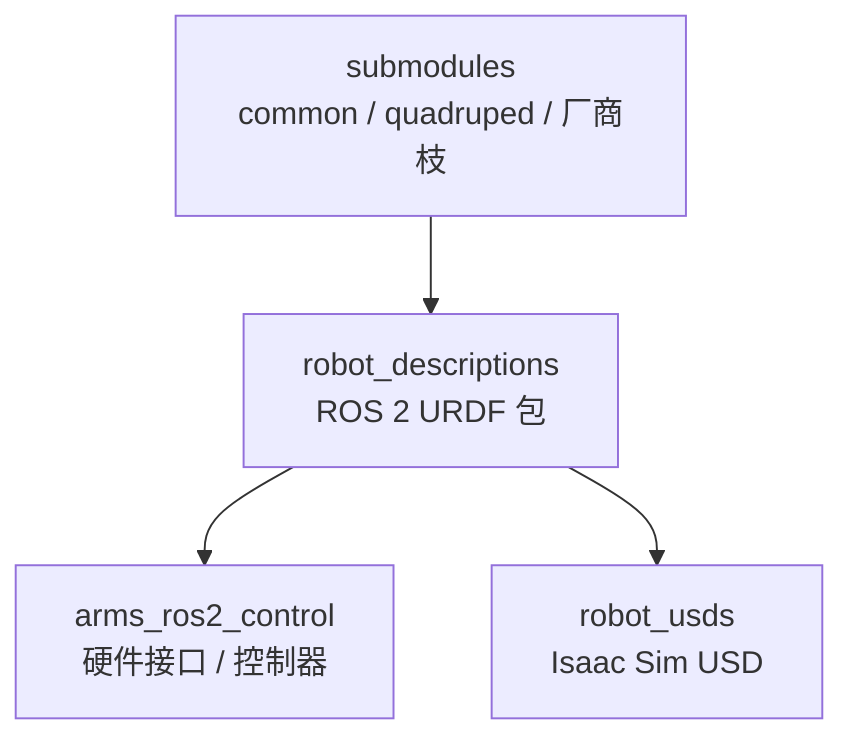

# fiveages-sim/robot_descriptions

[fiveages-sim/robot_descriptions](https://github.com/fiveages-sim/robot_descriptions) 是 **ROS 2 description 资产仓**：按 `humanoid/`、`manipulator/` 等目录放厂商 URDF 包，多数在 Blender 里重绘外观，并用 git submodule 拆公共手眼模型与部分整机。

## 一句话定义

给国内常见人形 / 轮式人形 / 四足 / 单臂提供可放进 ROS 2 工作空间的 `*_description` 包，并指向 **ros2_control** 与 **Isaac Sim USD** 两条下游仓。

## 英文缩写速查

| 缩写 | 英文全称 | 简要说明 |
|------|----------|----------|
| ROS 2 | Robot Operating System 2 | 本仓以 description 包形式分发 |
| URDF | Unified Robot Description Format | 包内主描述格式 |
| USD | Universal Scene Description | 姊妹仓 `robot_usds` 的 Isaac Sim 资产 |
| WBC | Whole-Body Control | `arms_ros2_control` README 的控制叙事之一 |

## 核心信息

| 字段 | 内容 |
|------|------|
| 机构 | **五纪元仿真（FiveAges）**（LICENSE 署名 Zhenbiao@FiveAges） |
| 许可 | 仓库 **Apache-2.0**（厂商网格条款仍可能更严） |
| 开源 | **主树已开源**；**Agibot G2 子模块 private** |
| 克隆 | 必须 `git clone --recursive` 或事后 `submodule update --init` |
| Stars | 82（2026-08-17 核查） |

## 为什么重要

- **补上 Awesome / robot_descriptions.py 的国内机型缺口：** Galaxea R1/R1 Pro、Agibot A2、EngineAI SA01/PM01、Astribot S1、Realman、Zerith、XSquare Quanta X1 等以 ROS 2 包出现。
- **仿真栈对齐 Isaac：** 姊妹 [robot_usds](https://github.com/fiveages-sim/robot_usds) 把本仓 URDF 做成 Isaac Sim USD，服务 ROS 2 Control 闭环，而不是只给 MuJoCo XML。
- **可视化友好是明确取舍：** README 用 Repaint 列标 Blender 重绘；这降低 RViz/Isaac 观感摩擦，**不**等于碰撞与惯量已做 SysID。

## 核心原理

主树分组（README）：

| 族 | 代表 |
|----|------|
| 轮式人形 | DexForce W1、Agibot G1、Airbot MMK2、Astribot S1、Galaxea R1/R1 Pro、Realman、Zerith H1、Ai2 Bot2、Quanta X1、MOZ 1 |
| 移动操作 | Galaxea R1 Lite、AgileX Aloha、Lekiwi |
| 单臂 | SO-ARM、Piper、Galaxea A1、Airbot Play、Realman RM、Elite EC、OpenArm、Panthera HT |
| 双足人形 | Unitree G1、Agibot A2、Booster T1、EngineAI SA01/PM01、RobotEra xbot |

子模块：`common`（夹爪、灵巧手、相机、launch）、`quadruped`、Dobot、Tianji、Rokae、ARX、Galbot、Panthera HT；**G2 private**。

下游（README Related Repos）：

- [arms_ros2_control](https://github.com/fiveages-sim/arms_ros2_control) — 单臂 / 双臂 / 轮式人形的 ROS 2 Control（Apache-2.0，已开源）
- [robot_usds](https://github.com/fiveages-sim/robot_usds) — Isaac Sim USD（Apache-2.0，已开源）

## 工程实践

1. **先 recursive 再编译 description 包**；缺 submodule 时四足和 common 手眼会整个消失，表现为 launch 找不到 mesh。
2. **不要当 Python 模块用：** 需要 `load_robot_description("g1_description")` 时走 [robot_descriptions.py](./robot-descriptions-py.md)（宇树 G1 两边都有，路径与网格版本可能不同，必须钉同一来源）。
3. **Isaac 路径：** URDF 在本仓 → USD 在 `robot_usds` → 训练/任务层仍要自己接 [Isaac Lab](./isaac-lab.md) 或 ROS 2 Control。
4. **G2：** 未获 private 权限就当该机型不存在，不要在论文里写「fiveages 已开源 G2 URDF」。

## 局限与风险

- **重绘 ≠ 真机模型：** 外观改过之后，visual 与 collision 可能分叉；控制前核对 collision 是否仍是简化凸包。
- **子模块漂移：** `--remote` 更新可能让 USD 姊妹仓与 URDF 主仓暂时不一致。
- **覆盖目标不同：** ANYmal、TALOS、iCub、Cassie 等学术经典机不在此仓主列表。

## 关联页面

- [机器人描述目录选型](../comparisons/robot-description-catalogs.md)
- [robot_descriptions.py](./robot-descriptions-py.md)
- [Awesome Robot Descriptions](./awesome-robot-descriptions.md)
- [URDF](../concepts/urdf-robot-description.md)
- [Isaac Sim](./isaac-sim.md)
- [Isaac Lab](./isaac-lab.md)
- [宇树](./unitree.md)

## 参考来源

- [fiveages-sim/robot_descriptions 归档](../../sources/repos/fiveages-sim-robot-descriptions.md)
- [robot_descriptions.py 归档](../../sources/repos/robot-descriptions-py.md)

## 推荐继续阅读

- 本仓：<https://github.com/fiveages-sim/robot_descriptions>
- [arms_ros2_control](https://github.com/fiveages-sim/arms_ros2_control)
- [robot_usds](https://github.com/fiveages-sim/robot_usds)
