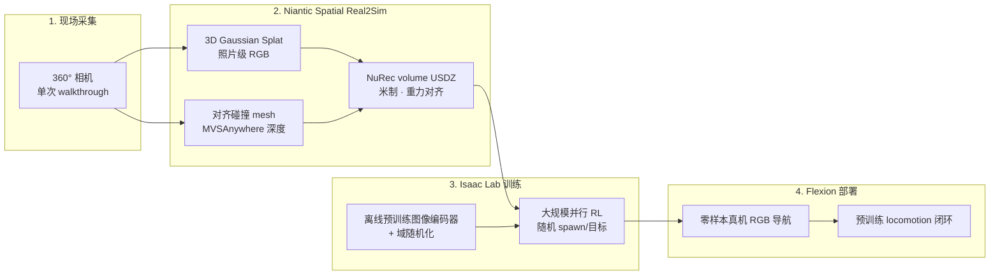

# Flexion × Niantic Spatial × NVIDIA：RGB 导航 Sim2Real 管线

| 字段 | 内容 |
|------|------|
| **机构** | 弗莱鑫机器人（Flexion Robotics）× 耐安提克空间智能（Niantic Spatial）× 英伟达（NVIDIA） |
| **类型** | 产业联合技术博客发布的 **Real2Sim + Sim2Real** 端到端管线（非单篇论文） |
| **发布** | 2026-07-20 |
| **演示任务** | 人形 **局部 RGB 导航**（机载相机 + 本体感知 + 机体系目标 → 速度指令 → 预训练 locomotion 闭环） |

**一句话定义：** 用 **一次 360° walkthrough** 把真实部署现场变成 **Isaac Lab 可训练的数字孪生**，在其中 **纯 RGB、大规模并行 RL** 学局部导航，并 **零样本** 回到同一真机环境——把「深度-only、无纹理合成场景」上的 sim2real 惯例推进到 **场地专用、语义可见的 RGB 策略**。

## 英文缩写速查

| 缩写 | 英文全称 | 简要说明 |
|------|----------|----------|
| Sim2Real | Simulation to Real | 仿真训练策略迁移到真机部署 |
| Real2Sim | Real to Simulation | 把真实场景重建为可仿真数字孪生 |
| 3DGS | 3D Gaussian Splatting | 照片级场景表示，用于仿真 RGB 观测 |
| RL | Reinforcement Learning | 通过试错与奖励信号学习导航策略 |
| RGB | Red-Green-Blue | 机载彩色相机观测（相对深度/高度图） |
| NuRec | NVIDIA Neural Reconstruction | NVIDIA 神经重建体积规范；本文导出为 USDZ |
| VPS | Visual Positioning System | Niantic Spatial 视觉定位能力（本文非主线） |
| DR | Domain Randomization | Flexion 训练侧仿真参数随机化以缩小 gap |

## 为什么重要

- **直击 RGB sim2real 开放问题：** 行业长期用 **无纹理合成场景 + 深度** 做人形 RL，因深度渲染 gap 小；本文给出 **重建真实现场 + RGB** 仍可达 **深度级可靠性** 的产业证据（两办公室场景、1024 rollouts 对照）。
- **Real2Sim 与 Sim2Real 分工清晰：** Niantic Spatial 解决 **「世界够不够真、碰撞是否与视觉对齐」**；Flexion 解决 **「像素策略如何迁出仿真」**；NVIDIA Isaac 栈提供 **规模化训练基础设施**——三者缺一都难闭环。
- **部署经济学：** 作者称新场地策略适配可从 **数月压缩到数日**（扫描→重建→训练→零样本部署），适合多工厂/多办公楼复制部署叙事。
- **与 Reflect 栈衔接：** 局部导航是 [Flexion Reflect v1.0](./flexion-reflect-v1.md) 长程 mission 的底层技能；联合文将 **全任务仿真评测** 指向 Reflect 方向。

## 流程总览

## 核心机制

### Real2Sim：同源视觉—物理对齐

- **视觉层：** 3DGS 保留真实 **光照、材质、杂乱**；比通用 synthetic asset 更贴近部署相机分布。
- **物理层：** 与 splat **同一重建** 导出碰撞 mesh，避免「看见可穿墙 / 避开不存在的障碍」——RGB 策略对此类错位尤其敏感。
- **工程交付：** 单文件 **USDZ** 直入 Isaac Sim/Lab；splat 走 **RTX** 渲染，mesh 作不可见碰撞体。

### Sim2Real：场地专用 RGB 导航

| 要素 | 设计 |
|------|------|
| **任务** | 短视界目标导航 + 避障；**无全局地图** |
| **观测** | RGB 相机 + proprioception + 机体系目标 |
| **执行** | 导航策略输出速度 → **冻结的 locomotion 策略** 跟踪 |
| **训练规模** | 单 GPU 百万级 rollout；并行环境数受 **3DGS 渲染吞吐** 支撑 |
| **迁移配方** | 仿真 **DR** + **大规模离线视觉编码器**（训练/机载共用） |

### 仿真对照结论（作者报告）

四策略：**深度@无纹理 mesh**（基线）、**RGB@无纹理 mesh**、**RGB@合成纹理办公室**、**RGB@真实场地 3DGS 重建**。

| 场景 | 深度基线 | 3DGS+RGB（本文） |
|------|----------|------------------|
| Flexion 苏黎世办公室（较易） | 93.8% 成功率 | **97.8%** |
| Niantic 伦敦办公室（较难） | 70.9% | **75.0%** |

两场景中 **仅 3DGS 重建训练的 RGB** 达到或超过深度；其余 RGB 训练环境均落后。

### RGB 相对深度的实证优势（真机难例）

深度来自 **ZED X neural**；RGB 策略在以下 **训练重建中未出现** 的实例上仍有效，作者归因于仿真中对 **语义相近物体**（如窗户 vs 玻璃门）的碰撞学习：

- **语义障碍：** 蓝垫在 RGB 明显、深度几乎无信号
- **细结构：** 三脚架、栏杆、线缆
- **透明表面：** 玻璃门/窗

**泛化边界（作者自述）：** 对 **语义相似** 障碍可外推；对 **分布外过大** 物体仍弱——长期路线是 **广域感知预训练 + 重建内微调**。

## 工程实践

| 步骤 | 操作要点 |
|------|----------|
| 1. 扫描 | 商用 360° 相机；覆盖待训练/部署区域；数分钟级 |
| 2. 重建 | Niantic Spatial 企业服务（或合作管线）；确认 **米制尺度** 与 **碰撞—视觉对齐** |
| 3. 导入 | USDZ → Isaac Lab **NuRec volume** stage |
| 4. 训练 | 并行 RL + DR + 共享视觉 backbone；监控碰撞/跌倒/超时率 |
| 5. 部署 | 同一 RGB 编码器上机；与 locomotion 策略接口对齐；先在重建覆盖区内评测 |

**开源状态（截至 2026-07-20）：**

| 组件 | 状态 |
|------|------|
| Isaac Sim / Isaac Lab / NuRec | **已开放** — NVIDIA 官方栈 |
| Niantic Spatial 重建导出管线 | **未开源** — SPZ 格式开源，完整管线为企业服务 |
| Flexion 导航策略权重/部署 | **未开源** — 产业演示栈 |

## 局限与风险

- **场地绑定：** 策略 specialization 于 **扫描现场**；新建筑需 **重新采集与重建**，非一次训练走遍天下。
- **静态世界假设：** 光照、物体摆放烘焙于捕获时刻；动态行人/其他机器人需在仿真中后加。
- **未覆盖区域：** walkthrough 未达区域重建质量下降，可能形成 blind spot。
- **产业博客口径：** 定量未经第三方复现；与学术导航 benchmark（如 Habitat）指标不可直接对比。
- **≠ 长程 mission：** 本文为 **局部导航**；开门、操作、乘梯等见 Reflect 栈，仿真全任务评测仍待扩展。

## 关联页面

- [Sim2Real](../concepts/sim2real.md) — Domain gap 与 Real2Sim 资产语境
- [Flexion Reflect v1.0](./flexion-reflect-v1.md) — 同公司长程自主平台；3DGS 全栈仿真与局部导航上层
- [Isaac Gym / Isaac Lab](./isaac-gym-isaac-lab.md) — 训练基础设施与 NuRec 导入
- [GS-Playground](./gs-playground.md) — 另一路 **批量 3DGS + 并行物理** 的高吞吐视觉 RL（学术 RSS 2026）
- [LEGS](./paper-legs-embodied-gaussian-splatting-vla.md) — 3DGS 缩小 **VLA 模仿学习** 视觉 gap（斯坦福，G1 loco-manip）
- [SimFoundry](./paper-simfoundry-real2sim-scene-generation.md) — NVIDIA GEAR 真机视频→数字孪生 + cousins（偏操作评测）
- [Reinforcement Learning](../methods/reinforcement-learning.md) — 大规模并行 RL 训练范式
- [Locomotion](../tasks/locomotion.md) — 导航与运动技能任务语境

## 推荐继续阅读

- Flexion 官方：[Closing the Sim2Real Gap for Humanoids](https://flexion.ai/news/niantic-spatial-flexion-and-nvidia-closing-the-sim2real-gap-for-humanoids)（2026-07-20）
- Niantic Spatial：[官网](https://nianticspatial.com) — Reconstruct / Localize / Understand 能力概览
- NVIDIA：[Isaac Lab 文档](https://isaac-sim.github.io/IsaacLab/) — 并行 RL 与场景导入
- Flexion：[Reflect v1.0](https://flexion.ai/news/flexion-reflect-v1.0) — 长程自主下一步方向

## 参考来源

- [flexion_niantic_nvidia_sim2real_rgb_2026-07-20.md](../../sources/blogs/flexion_niantic_nvidia_sim2real_rgb_2026-07-20.md)
- [niantic-spatial.md](../../sources/sites/niantic-spatial.md)
