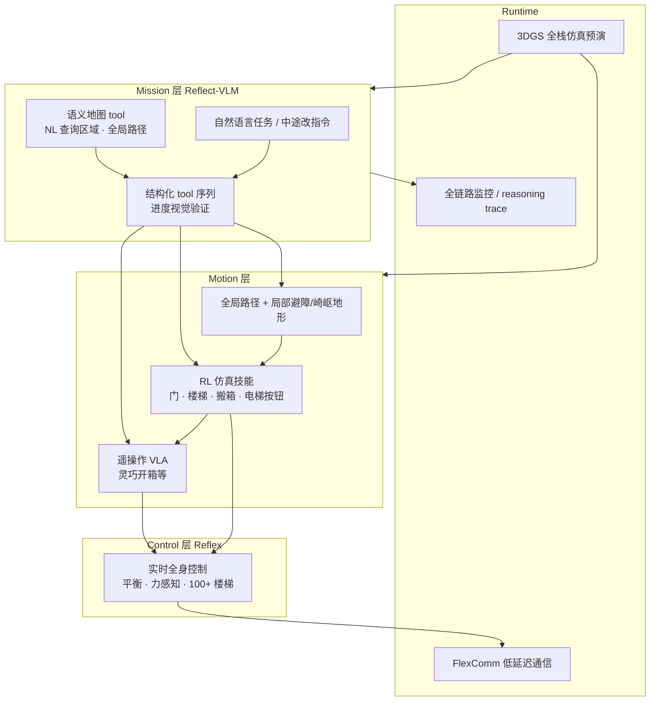

# Flexion Reflect v1.0（长程人形自主平台）

| 字段 | 内容 |
|------|------|
| **机构** | 弗莱鑫机器人 Flexion Robotics AG（苏黎世 / 旧金山） |
| **类型** | 产业博客发布的系统集成平台（非单篇论文） |
| **前序** | [Reflect v0](https://flexion.ai/news/flexion-reflect-v0)（2025-11）架构公开 |
| **发布** | 2026-06-29 |

**Reflect** 是 **Flexion** 面向「人类尺度建筑内长程家务式任务」的 **机器人智能平台**：把 **任务级 VLM 推理**、**VLA/RL 运动技能**、**实时全身控制** 与 **生产级运行时** 组合成可跨时间推进、可中途改指令、可局部恢复与重规划的 **mission-capable** 系统。

## 一句话定义

**以自研 Reflect-VLM 作自然语言 mission control，下层 VLA+RL 运动技能与 Reflex 全身控制闭环，配套 FlexComm 与 3DGS 全栈仿真，使人形在单条指令下完成跨楼层导航—乘梯—接触丰富操作的长程全程自主。**

## 英文缩写速查

| 缩写 | 英文全称 | 简要说明 |
|------|----------|----------|
| VLM | Vision-Language Model | 任务级 mission controller，结构化 tool 与视觉进度监控 |
| VLA | Vision-Language-Action | 运动层遥操作预训练策略，负责门/电梯/开箱等交互 |
| RL | Reinforcement Learning | v1.0 贯穿低层控制至高层 mission 决策的技能与可靠性来源 |
| WBC | Whole-Body Control | Reflex 模块：平衡、力感知交互与实时跟踪 |
| SFT | Supervised Fine-Tuning | VLM mission 起点；16 步评测 38% 完成率 |
| 3DGS | 3D Gaussian Splatting | 光度级仿真管道，部署前跑全 Reflect 栈 |

## 为什么重要

- **长程系统叙事而非单技能 clip：** 取件→楼梯/电梯→开箱→上架被作为 **端到端 mission** 评估，强调各层能力在时间上 **组合** 后的可靠性，直面「95%×90% 相乘失败」产业痛点。
- **Mission VLM + RL 的量化对照：** 在同一 16 步评测上公开 **base VLM ≈ 0 / SFT 38% / SFT+RL 90%**，为「现成 VLM 不够、RL 补长程」提供可引用的产业数据点（非第三方复现）。
- **分层但 RL 全栈化：** v1.0 相对 v0 的最大变化是 **RL 不局限于单运动技能**，与 [KinetIQ Ascend](./kinetiq-ascend.md)（操作 VLA 真机 RL）、[Curr-0](./current-robotics-curr0.md)（三系统单策略）同属 2026 人形 **部署级全栈** 叙事，但 Reflect 更突出 **建筑语义导航 + 任务改指令 + 乘梯/开门等符号—连续混合交互**。
- **运行时与仿真同等权重：** **FlexComm**（相对 ROS2 DDS 的作者自报延迟/CPU 增益）与 **3DGS 全管道仿真** 说明其把 **可观测性、通信与 sim-before-real** 当作长程自主的必要条件，而非纯算法 demo。

## 流程总览

## 核心结构

### 四层分工

| 层级 | 模块 | 输入/输出要点 |
|------|------|----------------|
| **Mission** | Reflect-VLM | 第一人称图像 + NL 指令 → tool 调用序列；语义地图支持区域查询与路径请求 |
| **Motion** | VLA + RL policies | 决策 → 导航/交互/操作命令；仿真域随机化 + 在线视觉反馈 |
| **Control** | Reflex | 全身力矩/参考跟踪；搬运/操纵/楼梯/扰动下的平衡 |
| **Runtime** | FlexComm + 监控 + Sim | 多设备（Jetson、传感器、电机、服务器）数据流；部署前全管道回放 |

### Mission 层：Reflect-VLM

- **现成 VLM 问题：** 倾向过早发出「逻辑下一步」tool，而不等待前置步骤视觉完成。
- **训练路线：** SFT 起步 → **RL 微调** 提升歧义、失败恢复与计划偏离时的持续推进。
- **任务灵活性：** 仅改 prompt 即可换 mission（不同取送路线、关灯、遵守标识、楼梯优先等）；支持执行中 **scratch that** 式改指令。

### 运动层要点

| 技能簇 | 机制 | 作者报告 |
|--------|------|----------|
| **搬箱** | RL 仿真 + 感知闭环 | 同策略 100 g–3.5 kg；O.O.D. 失败可重试 |
| **箱体重定位** | 全身协调 | 单臂持箱、另一臂释放，难遥操作 |
| **电梯** | 符号指令 + 厘米级 reach | 按钮识别 + 稳定交互姿态 |
| **开箱** | 遥操作 VLA + WBC | 自由移动人形上可靠性仍不足，下一代 RL |
| **局部导航** | 全局规划 + 连续适应 | 动态障碍、崎岖地形、持物避障 |

### Reflex 全身控制

- 上肢操作、 uneven 地形、快速任务变化下仍满足平衡与安全约束。
- **100+ 连续楼梯往返**；外力扰动下保持跟踪——为上层长程 mission 提供「低层很少掉链子」前提。

### 鲁棒性：局部恢复 + 重规划

1. **运动层：** RL 学到的 retry / 局部调整（箱子被推走、抓取失败）。
2. **Agent 层：** 相机检测 off-nominal → 重规划子目标。

### 软件与仿真

- **FlexComm：** 同主机 **数十–数百 μs** 级延迟；相对 ROS DDS **~40% 吞吐提升、~30% CPU 节省**（作者自测）；抗网络漫游。
- **可观测性：** reasoning → 内核/网卡日志统一采集，降低「每层 1% 失败率相乘」的排障成本。
- **3DGS 仿真：** 满足 VLM 逼真观测、策略可用几何、实时闭环与失败可回放四要件。

## 常见误区或局限

- **不是论文或开源基准：** 除 16 步 mission 曲线外，缺独立第三方复现与完整权重发布。
- **≠ 通用家庭机器人：** 作者明确 **有界任务分布**；部分物体、视觉假设与恢复模式仍有限。
- **VLA 开箱仍偏遥操作 BC：** 与 mission 层已 RL 化不同，最难灵巧段作者承认 **RL 化进行中**。
- **FlexComm vs ROS：** 对比数字来自厂商，工程选型应结合生态与实测。
- **与学术长程基准不同口径：** 演示为真实建筑 mission，不宜直接与 CALVIN/BEHAVIOR 步数指标混比。

## 关联页面

- [VLA](../methods/vla.md) — 运动层遥操作策略角色
- [Reinforcement Learning](../methods/reinforcement-learning.md) — 全栈 RL 与仿真技能训练
- [Whole-Body Control](../concepts/whole-body-control.md) — Reflex 控制层
- [Loco-Manipulation](../tasks/loco-manipulation.md) — 边走边操作的任务语境
- [Vision-Language Navigation](../tasks/vision-language-navigation.md) — 语义地图与 NL 路径规划
- [Sim2Real](../concepts/sim2real.md) — 仿真训练 + 域随机化 + 3DGS 预演
- [ROS2 vs LCM](../comparisons/ros2-vs-lcm.md) — FlexComm 对照的中间件选型背景
- [KinetIQ Ascend](./kinetiq-ascend.md) — 另一套 2026 真机 VLA+RL 产业栈（偏产线操作）
- [Curr-0](./current-robotics-curr0.md) — HumanEx + 三系统单策略 + 世界模型评测对照

## 推荐继续阅读

- Flexion 官方：[Reflect v1.0 发布文](https://flexion.ai/news/flexion-reflect-v1.0)
- 前序架构：[Reflect v0](https://flexion.ai/news/flexion-reflect-v0)（2025-11）
- Flexion：[The Hard Part of Robotics is Robotics](https://flexion.ai/news/the-hard-part-of-robotics-is-robotics)（公司技术宣言）

## 参考来源

- [flexion_reflect_v1_0.md](../../sources/blogs/flexion_reflect_v1_0.md)
