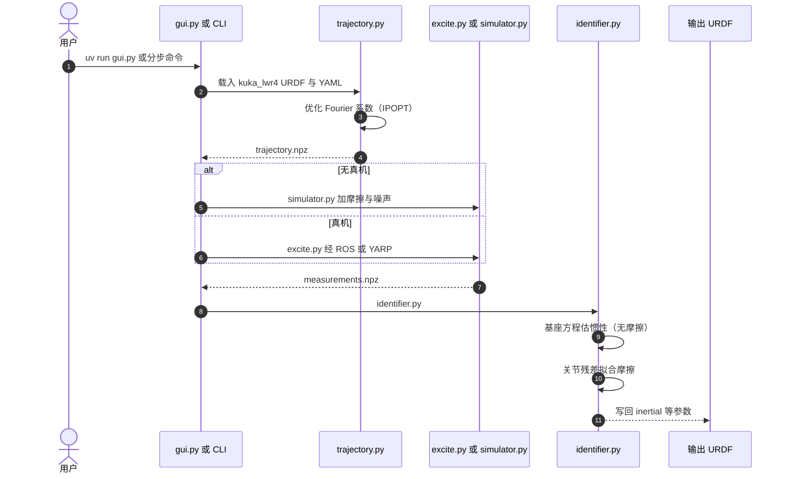

# FloBaRoID（浮动基动力学辨识工具箱）

**FloBaRoID**（*FLOating BAse RObot dynamical IDentification*，[kjyv/FloBaRoID](https://github.com/kjyv/FloBaRoID)）是面向 **固定基与浮动基树状机器人** 的 Python 辨识工具箱：从 URDF 出发，优化 **Fourier 周期激励**，用测量（或仿真合成数据）估计 **物理一致的惯性参数**，并用 **两步法** 把关节摩擦从惯性里拆出来。软件论文：Bethge, Malzahn, Tsagarakis, Caldwell，RAAD 2017（[DOI](https://doi.org/10.1007/978-3-319-61276-8_18)）。起源是 IIT 的 WALK-MAN 项目。

## 一句话定义

**命令行或 `gui.py` 走完「激励 → 测量 → 辨识 → 写回 URDF」；惯性走基座方程（尽量不受关节摩擦污染），摩擦再对关节残差拟合。**

## 英文缩写速查

| 缩写 | 英文全称 | 简要说明 |
|------|----------|----------|
| OLS | Ordinary Least Squares | 默认线性估计 |
| WLS | Weighted Least Squares | 按噪声加权 |
| SDP | Semidefinite Programming | Sousa 2014 式物理一致 LMI |
| CAD | Computer-Aided Design | 先验惯性；弱可观参数被拉回 CAD |
| DoF | Degrees of Freedom | 文档示例为 KUKA LWR 4+ 七轴 |
| IMU | Inertial Measurement Unit | 浮动基基座测量的常见来源 |

## 为什么重要

wiki 里 [BAM](./bam-better-actuator-models.md) / [PACE](./paper-pace-sim2real-legged-robots.md) 解决的是 **无力矩传感器、把仿真 $q(t)$ 对齐真机**。[本工具](https://github.com/kjyv/FloBaRoID) 走的是另一条经典线： **有力矩（或仿真力矩）时，把 Swevers/Gautier 线性辨识做成可复现流水线**，并且显式处理浮动基与摩擦耦合。算法选型见 [关节执行器参数辨识](../methods/joint-actuator-parameter-identification.md)。

## 开源状态

**已开源**（LGPL-3.0）。无独立项目页。运行入口：`uv run gui.py` 或分步 `trajectory.py` → `simulator.py`/`excite.py` → `identifier.py`。依赖 iDynTree + IPOPT；可选 ROS/MoveIt 或 YARP 真机激励。

## 核心机制 / 方法栈

1. **激励：** 每关节 Fourier 级数；D-最优（Ayusawa 2017 解析梯度）+ 碰撞/吊挂基座约束。
2. **预处理：** 位置差分得速度加速度、零相位低通；可按子回归质量挑数据段（Venture 2009）。
3. **惯性：** OLS / WLS / 相对 CAD 的误差估计 / essential parameters；SDP 保证惯性物理可行（Sousa 2014，数值组装 cvxpy，默认 CLARABEL）。
4. **摩擦（两步）：** 先用 **基座 wrench 方程** 做无摩擦惯性（Ayusawa 2014：关节摩擦不进入未驱动基座行），再用关节力矩残差逐关节拟合摩擦。
5. **输出：** 标准参数写回 URDF。

## 源码运行时序图

对齐 README 命令与 `configs/kuka_lwr4.yaml` 示例。

**复现路径：** 安装 `uv`、系统依赖 eigen/swig/ipopt → `uv run trajectory.py --config configs/kuka_lwr4.yaml --model model/kuka_lwr4.urdf` → `uv run simulator.py ...` → `uv run identifier.py ...`。教程见仓内 `documentation/TUTORIAL.md`。

## 工程实践

| 检查项 | 建议 |
|--------|------|
| 第一次跑 | 用 `simulator.py` 闭环自洽，再上真机 `excite.py` |
| 七轴示例 | `configs/kuka_lwr4.yaml` |
| 摩擦 | 打开 README 所述 two-step；不要指望单次 OLS 同时改质量和 Coulomb |
| 与 Pinocchio | 本仓 **不** 调用 Pinocchio；只要 $Y_{\mathrm{rb}}$ 可改用 `computeJointTorqueRegressor` 自写 LS |
| 吊挂浮动基 | 轨迹优化按球铰近似，**不是** 行走接触动力学 |

## 局限与风险

- 真机 YARP 位置激励非硬实时。
- 行走多接触辨识不在范围内。
- SDP 失败时退回先验，不会抛出「已经辨识成功」的 URDF。
- 许可 LGPL-3.0：链进闭源产品需遵守库许可，与 BAM/PACE 的 Apache-2.0 不同。

## 与其他工作对比

| 工作 | 关系 |
|------|------|
| Swevers 1997 | Fourier + MLE 的方法源头；本箱做成流水线 |
| Ayusawa 2014 | 两步摩擦的理论 |
| BAM | 无力矩、摆锤、扩展摩擦；互补不是替代 |
| PACE | 足式悬空 chirp、参数更少（$I_a,b,\tau_c$） |
| Pinocchio | 只提供回归矩阵核，不提供激励/SDP/写 URDF |

## 关联页面

- [关节执行器参数辨识](../methods/joint-actuator-parameter-identification.md)
- [System Identification](../concepts/system-identification.md)
- [Joint Friction Models](../concepts/joint-friction-models.md)
- [连杆与转子惯量](../concepts/robot-link-and-rotor-inertia.md)
- [Floating Base Dynamics](../concepts/floating-base-dynamics.md)
- [BAM](./bam-better-actuator-models.md)
- [PACE](./paper-pace-sim2real-legged-robots.md)
- [Pinocchio](./pinocchio.md)

## 参考来源

- [FloBaRoID 仓库归档](../../sources/repos/flobaroid.md)
- [关节执行器参数辨识论文簇](../../sources/papers/joint_actuator_parameter_identification.md)

## 推荐继续阅读

- GitHub README：<https://github.com/kjyv/FloBaRoID>
- Bethge et al., RAAD 2017：<https://doi.org/10.1007/978-3-319-61276-8_18>
