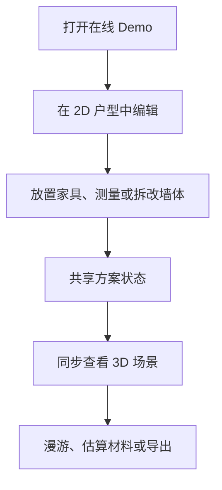

# floorplan-3d：浏览器里的 2D/3D 户型装修设计器

## 一句话定义

**floorplan-3d** 是无需构建步骤的纯前端户型设计器：用户在 2D 平面图里布置家具、测量或拆改墙体，并在同步的 Three.js 场景中查看与漫游；它不是自动识别任意上传户型图的 AI 建模工具。

## 英文缩写速查

| 缩写 | 英文全称 | 简要说明 |
|---|---|---|
| HTML | HyperText Markup Language | 项目以单个 HTML 文件直接运行 |
| CSS | Cascading Style Sheets | 页面与编辑器样式 |
| SVG | Scalable Vector Graphics | 2D 户型平面图的绘制格式 |
| CDN | Content Delivery Network | Three.js 首次加载所需的外部资源分发方式 |
| JSON | JavaScript Object Notation | 方案导入/导出格式 |
| Three.js | — | 浏览器中的 3D 图形库 |

## 为什么重要

- **即时试用：** 在线打开即可编辑，无需先安装前端框架或构建环境。
- **同一方案双视图：** 2D 布置与 3D 场景同步，便于从平面布局和空间效果两侧检查方案。
- **边界明确：** 内置户型可直接体验；自定义几何需编辑源码数据，不应误认为图像识别/AI 自动建模。

## 项目信息

| 项目 | 内容 |
|---|---|
| 在线体验 | [打开即用](https://wy51ai.github.io/floorplan-3d/) |
| 源码 | [wy51ai/floorplan-3d](https://github.com/wy51ai/floorplan-3d) |
| 许可 | [MIT](https://github.com/wy51ai/floorplan-3d/blob/master/LICENSE) |
| 技术栈 | 原生 HTML/CSS/JavaScript、SVG、Three.js r160 |
| 数据保存 | 浏览器 localStorage；方案可导入/导出 JSON |
| 部署形态 | 单个 `index.html`，无需框架、安装或构建 |

## 交互流程

## 功能与边界

- **2D 布局：** 按 1:60 或 1:100 比例展示，单位为毫米；从 60 余种家具/家电中拖放、移动、旋转或改尺寸，支持贴墙吸附。
- **墙体和测量：** 可测量距离、切换标注图层，并拆改非承重墙；承重墙单独标示。
- **3D 查看：** 鸟瞰、斜视、俯视与房间定位；桌面端支持 WASD + 鼠标漫游，触屏设备提供虚拟摇杆，也可点击门进行开关交互。
- **联动编辑：** 在 3D 场景中选中或拖动家具，修改会同步回 2D 方案。
- **材料与统计：** 自动统计房间及套内使用面积，可逐房间选择地面材料并按面积估算材料成本（含 5% 损耗）。
- **保存和交付：** 撤销/重做、浏览器本地自动保存、导出 PNG、导入/导出 JSON；界面支持中英文切换。
- **自定义户型：** README 指出户型几何、家具清单和材料配置定义在 `index.html` 的 `ROOMS`、`WALLS`、`WINS`、`MATS`、`LIB` 等数据中；要换成自己的户型，需要修改这些数据，并非通过上传平面图自动识别。
- **网络依赖：** 3D 使用 Three.js CDN，首次进入 3D 场景需要网络连接；其他核心交互在浏览器端运行。

## 快速体验

访问 [在线 Demo](https://wy51ai.github.io/floorplan-3d/) 即可开始使用。也可以克隆 [GitHub 仓库](https://github.com/wy51ai/floorplan-3d)，直接用浏览器打开 `index.html`，或运行 `python3 -m http.server 8000` 后访问本地静态服务。

## 常用快捷键

| 按键 | 作用 |
|---|---|
| `T` | 切换 2D / 3D |
| `V` / `M` / `X` | 选择 / 测量 / 拆改墙体 |
| `R` / `Shift+R` | 旋转选中家具 |
| `Ctrl/⌘ + Z`、`Ctrl/⌘ + Shift + Z` | 撤销 / 重做 |
| `F` | 适应窗口 |
| `Shift + F` | 全屏 |
| `Esc` | 取消当前操作 |
| 漫游：`WASD` / 方向键、`Shift`、`E` | 移动 / 快走 / 开关门 |

## 关联页面

- [sc-datav](./sc-datav.md) — 同属浏览器 Three.js 可视化项目；它做数据大屏，本项目侧重户型编辑与空间漫游。
- [Three.js Game Skills](./threejs-game-skills.md) — Three.js/WebGL 浏览器交互应用的开发与验证技能参考。

## 参考来源

- [项目 README](https://github.com/wy51ai/floorplan-3d/blob/master/README.md)
- [源码入口 `index.html`](https://github.com/wy51ai/floorplan-3d/blob/master/index.html)
- [MIT License](https://github.com/wy51ai/floorplan-3d/blob/master/LICENSE)
- [在线体验](https://wy51ai.github.io/floorplan-3d/)
