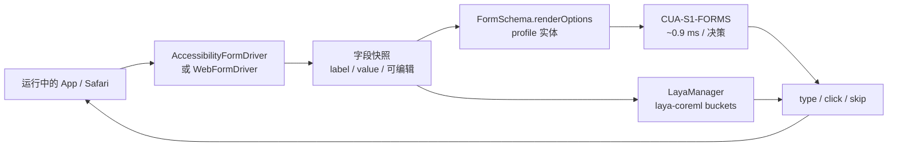
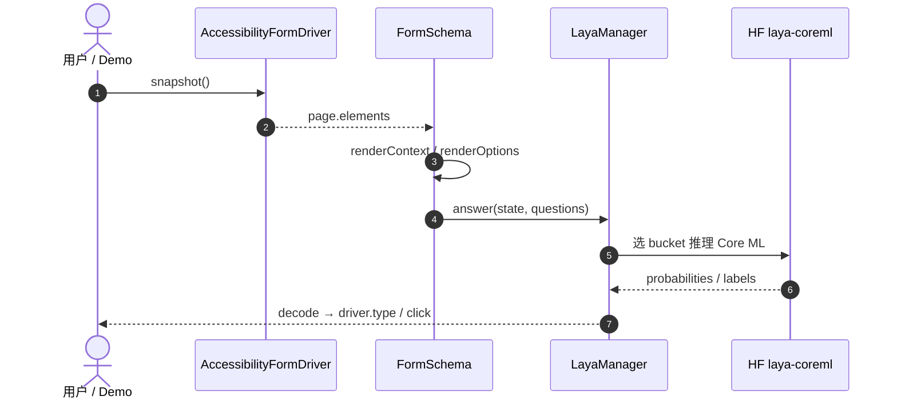

# FluidUse（Apple Silicon 本地计算机使用）

**FluidUse**（[GitHub](https://github.com/FluidInference/FluidUse)，SPM `0.3.0+`）是 **FluidInference** 发布的 **macOS 本地 computer-use 参考实现**：通过 **Accessibility API**（或 `WKWebView`）观察真实 App 中的表单字段，用 **设备端小模型** 在候选 profile 实体里做 **choice 匹配** 并键入/点击，**全程不上云**。除 **706K 表单专用 [CUA-S1-FORMS](https://huggingface.co/FluidInference/cua-s1-forms-coreml)** 外，同一 harness 集成 **[Laya](./laya.md) Core ML**（[`LayaManager`](https://github.com/FluidInference/FluidUse) + [HF `FluidInference/laya-coreml`](https://huggingface.co/FluidInference/laya-coreml)）做通用 **choice / score / noul** 门控与游戏 demo（Tetris / 2048）。

## 一句话定义

**把「Mac 上读屏 + 结构化选项 + Neural Engine 上的 System 1 决策」收成可复用的 Swift 包——表单填充与 Laya typed 路由共享同一本地观测/执行环。**

## 英文缩写速查

| 缩写 | 英文全称 | 简要说明 |
|------|----------|----------|
| CUA | Computer Use Agent | Cua 生态的计算机使用模型族 |
| ANE | Apple Neural Engine | Apple Silicon 神经网络加速单元 |
| API | Application Programming Interface | macOS Accessibility / Swift `FluidUse` 模块 |
| S1 | System One | 单次前向 typed 决策（Laya / 小表单模型） |
| SPM | Swift Package Manager | `FluidUse` 依赖引入方式 |
| HF | Hugging Face | Core ML 权重与 checksum 托管 |

## 为什么重要

- **隐私与延迟：** 工单 triage、垃圾邮件/钓鱼二值检测、表单字段对齐等可在 **1–4 ms 级** 完成（Neural Engine），适合 **桌面 agent** 与 **人机协作填表**，无需把屏幕内容送云端 VLM。
- **与 [Laya](./laya.md) 栈对齐：** 同一 **322M multilingual** 语义与 **calibrated probability**，但以 **Core ML bucket** 而非 PyTorch / [Laya-MLX](./laya-mlx.md) 运行；详见 [Laya-CoreML](./laya-coreml.md)。
- **与 [CLI-Anything](./cli-anything.md) 对照：** FluidUse 走 **原生 Accessibility + 结构化选项**，不是截图–点击 VLM；适合已有 **label:value profile** 或 **短列表 choice** 的场景。
- **机器人关联（弱）：** 非关节控制栈；可作为 **运维/调度终端、现场配置 UI、遥操作面板** 上的 **本地 guardrail / triage** 参考实现（见 [LLM 机器人控制接口](../concepts/llm-robotics-control-interfaces.md) 中 System 1 分层）。

## 核心信息

| 项 | 内容 |
|----|------|
| **机构** | 流体推理（FluidInference） |
| **维护** | FluidInference |
| **代码** | [FluidInference/FluidUse](https://github.com/FluidInference/FluidUse) |
| **Laya 权重** | [FluidInference/laya-coreml](https://huggingface.co/FluidInference/laya-coreml) |
| **表单模型** | [FluidInference/cua-s1-forms-coreml](https://huggingface.co/FluidInference/cua-s1-forms-coreml)（MIT，Cua 来源） |
| **上游 Laya** | [NandhaKishorM/laya](https://github.com/NandhaKishorM/laya) · [convaiinnovations/laya](https://huggingface.co/convaiinnovations/laya) |
| **许可** | Apache-2.0（CUA-S1-FORMS 组件 MIT） |
| **平台** | Apple Silicon，macOS 14+；Demo 需 Accessibility 授权 |
| **开源** | **已开源**（源码 + HF 资产 + benchmark 报告） |

## 流程总览

## 工程实践

| 主题 | 建议 |
|------|------|
| **依赖** | SwiftPM：`FluidAudio` + `FluidUse`；首次 `LayaManager.load()` 下载 **L128+L512** 与 tokenizer |
| **Laya 配置** | `LayaManager.Configuration` 选择 bucket、compute units（短句 → CPU+ANE）、`fp16` vs `e8` embedding |
| **表单 profile** | `DocumentEntities` 解析 `Label: value` 文本/PDF；复杂问句用 `PredeterminedAnswer` sheet |
| **CLI 验证** | `swift run -c release FluidUseLaya benchmark --suites …` 对齐 mobius reference rows |
| **权限** | Terminal / IDE 需 **辅助功能** 权限；Demo 快捷键 **9** 触发填表 |
| **Python Core ML 对照** | 终端 Snake / ANE 收据见 [Made with Laya 展示页](https://www.madewithlaya.com/builds/laya-coreml) 与 [Laya-CoreML](./laya-coreml.md) PyPI 路径 |

## 局限与风险

- **任务边界：** 只做 **给定实体集合内的匹配与点击**；不解析下拉全部语义、不撰写 essay、不默认提交表单。
- **平台锁定：** 仅 Apple Silicon macOS；Linux/机器人机载需回 [Laya](./laya.md) PyTorch 或 ONNX 等路径。
- **双 Core ML 生态：** Swift 用 **FluidInference/laya-coreml**；Python 用 **mizorewww/laya-coreml** + 不同 HF ID——**不可混用权重目录**。
- **Accessibility 脆弱性：** UI 改版、自定义控件可能导致快照字段缺失；需 harness 层回归测试。

## 源码运行时序图

## 关联页面

- [Laya-CoreML（Neural Engine 运行时）](./laya-coreml.md)
- [Laya（System 1 决策引擎）](./laya.md)
- [Laya-MLX（MLX 端口）](./laya-mlx.md)
- [Jev（TypeSafe System One）](./typesafe-jev.md)
- [CLI-Anything（agent-native CLI）](./cli-anything.md)

## 参考来源

- [fluiduse.md](../../sources/repos/fluiduse.md)
- [laya-coreml-fluidinference.md](../../sources/repos/laya-coreml-fluidinference.md)

## 推荐继续阅读

- [FluidUse README](https://github.com/FluidInference/FluidUse/blob/main/README.md)
- [Benchmarks.md](https://github.com/FluidInference/FluidUse/blob/main/Benchmarks.md)
- [HF laya-coreml model card](https://huggingface.co/FluidInference/laya-coreml)
- [mobius laya/coreml 转换树](https://github.com/FluidInference/mobius/tree/main/models/computer-use/laya/coreml)
