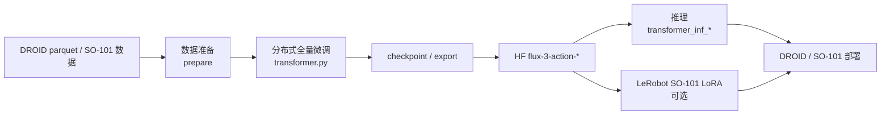
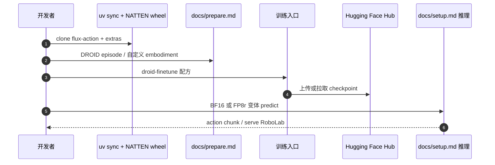

# FLUX 3 Action

**FLUX 3 Action** 是 [Black Forest Labs](https://github.com/black-forest-labs) 发布的 **world action model** 工程栈：在 FLUX 3 视觉生成骨干上做 **standalone 全量微调** 与 **动作预测**，覆盖数据准备、分布式训练、checkpoint/resume、export 与 **DROID / SO-101** 推理部署。SO-101 任务 LoRA 通过 **[LeRobot](./lerobot.md)** 集成路径发布。

## 一句话定义

BFL 把 video world model 迁到 robot action：独立训练/推理代码 + Hub 上 DROID/SO-101/base 权重族，SO-101 下游可接 LeRobot LoRA 工作流。

## 英文缩写速查

| 缩写 | 英文全称 | 简要说明 |
|------|----------|----------|
| WAM | World Action Model | 联合未来视觉与动作预测 |
| BF16 | Brain Float 16 | 默认全精度推理/训练 dtype |
| FP8r | FP8 reduced | 量化推理变体（Hub `variants/fp8r`） |
| GD / SD | Guidance / Step Distilled | 4-step 与 1-step 蒸馏配方 |
| DROID | Distributed Robot Interaction Dataset | 桌面臂大规模数据集 |

## 为什么重要

- **工业级 WAM tooling：** 相对论文-only WAM，提供 **可克隆仓库 + 公开 checkpoint 矩阵**（base / DROID / SO-101 × BF16/FP8r × GD/SD）。
- **训练/推理代码分离：** `transformer.py` vs `transformer_inf_bf16.py` / `transformer_inf_fp8r.py` — 便于 agent/工程师直读路径。
- **LeRobot 桥接：** SO-101 **task LoRA** 不在孤立脚本里，而挂在 LeRobot 生态 — 降低 sim2real 栈拼接成本。

## 核心信息

| 字段 | 内容 |
|------|------|
| GitHub | [black-forest-labs/flux-action](https://github.com/black-forest-labs/flux-action)（**已开源**） |
| HF Collection | [black-forest-labs/flux-3-action](https://huggingface.co/collections/black-forest-labs/flux-3-action)（权重 **公开**，gated: false） |
| 规模 | ~7B 级 world action model（项目命名 FLUX 3 Action） |
| 平台 | Linux + NVIDIA GPU；Python 3.12 / torch 2.10 cu128 示例 |

## 流程总览

## 源码运行时序图

节点对齐 [`sources/repos/flux-action.md`](../../sources/repos/flux-action.md) 与 `docs/setup.md`、`docs/droid-finetune.md`、`docs/so101-lora.md`。

## 工程实践

| 检查项 | 建议 |
|--------|------|
| Checkpoint 选型 | Base 4-step / GD / SD 与 BF16/FP8r 六组合 — 见 README 表与 [setup#choose-a-checkpoint](https://github.com/black-forest-labs/flux-action/blob/main/docs/setup.md) |
| Config 文件 | LeRobot 读 `config.json`；原生 FP8r 优先 `config.native.json` |
| NATTEN | 必须匹配 torch/CUDA 的 whl — 视频 VAE neighborhood attention 依赖 |
| SO-101 | 任务适配走 **LeRobot LoRA** 文档，勿与 standalone DROID 全量微调混环境 |
| 自定义 embodiment | 见 `docs/embodiments.md`（游戏示例作 worked example） |

## 与其他工作对比

| 对照 | 差异 |
|------|------|
| Cosmos / DreamZero 等 WAM | BFL 栈强调 **独立 repo + 多 variant checkpoint 矩阵** + LeRobot 下游 |
| [LeRobot](./lerobot.md) | LeRobot 是通用 IL/VLA 框架；FLUX Action 是 **专用 WAM 训练/推理** + 可选 LeRobot LoRA |
| [THAW-VLA](./paper-thaw-vla.md) | THAW 蒸馏 WAM 特征进小 VLA；FLUX Action 是 **全量 WAM 训练部署** |

## 结论

**FLUX 3 Action 是目前少数「仓库 + 公开权重 + 训练/推理/LoRA 文档齐全」的 WAM 工程发布，适合作为 DROID/SO-101 world-action 基线与自定义 embodiment 起点。**

1. **先选 checkpoint 配方** — GD/SD/FP8r 影响 latency 与质量，不是单一权重。
2. **SO-101 走 LeRobot** — 与 standalone DROID 全量微调环境分离。
3. **NATTEN + FFmpeg AV1** — 环境门禁，CI/云镜像需预装。
4. **Hub 权重已公开** — 无需 gated 申请（2026-09-24 API 核查）。
5. 与 [world-action-models](../concepts/world-action-models.md) 概念页对照读「生成式 world→action」位置。

## 关联页面

- [World Action Models](../concepts/world-action-models.md)
- [LeRobot](./lerobot.md)
- [VLA](../methods/vla.md)
- [Manipulation](../tasks/manipulation.md)

## 推荐继续阅读

- [flux-action GitHub](https://github.com/black-forest-labs/flux-action)
- [HF FLUX 3 Action collection](https://huggingface.co/collections/black-forest-labs/flux-3-action)

## 参考来源

- [FLUX 3 Action 仓库归档](../../sources/repos/flux-action.md)
