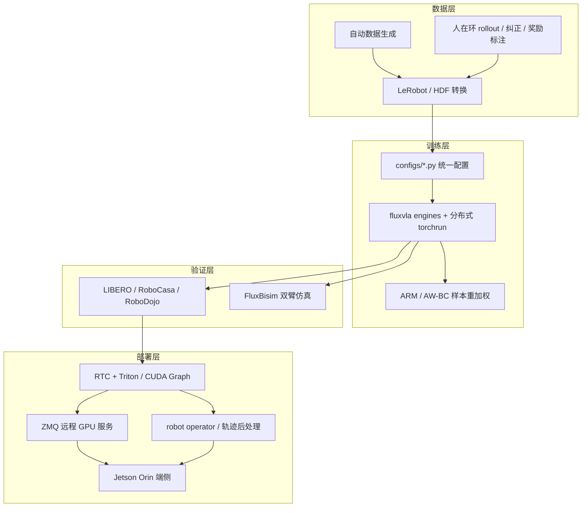
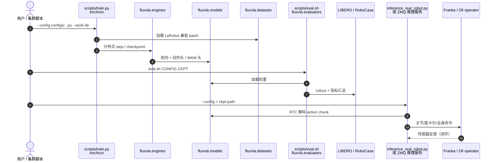

# FluxVLA Engine（arXiv:2609.17210）

**FluxVLA Engine**（*A One-Stop VLA Engineering Platform for Embodied Intelligence*，[arXiv:2609.17210](https://arxiv.org/abs/2609.17210)，[PDF](https://arxiv.org/pdf/2609.17210)，[代码](https://github.com/FluxVLA/FluxVLA)，[文档](https://fluxvla.limxdynamics.com/zh/)，[产品页](https://www.limxdynamics.com/zh/products/fluxvla)，**逐际动力 LimX Dynamics**）是 **配置驱动** 的开源 **VLA 工程平台**：**不提出新的策略架构**，而是用标准化接口把数据集、VLM/世界模型、动作头、优势加权学习、分布式训练、仿真评测、加速推理与 robot operator 收进 **可复现、可审计** 的数据→部署闭环。它与 [LimX COSA](./limx-cosa.md) 的分工是：**COSA = 闭源大脑 OS 与多技能调度；FluxVLA = 开源 S1 技能层的训练、评测、反馈与端侧推理底座**。

## 一句话定义

**把「能发论文的 VLA/WAM/离线 RL 组件」接到同一套配置与契约上，从 LeRobot 兼容数据一路跑到 LIBERO/RoboCasa 评测、RTC 推理与 Franka/Oli 真机——工程瓶颈优先于再训一个新 backbone。**

## 英文缩写速查

| 缩写 | 英文全称 | 简要说明 |
|------|----------|----------|
| VLA | Vision-Language-Action | 平台核心策略对象（多 backbone 可切换） |
| WAM | World-Action Model | 世界–动作模型；与 VLA 同属平台接入的策略族 |
| RTC | Real-Time Chunking | 跨 chunk 低延迟连续执行（π0.5/GR00T 等路径） |
| BC | Behavior Cloning | 模仿学习微调常见起点 |
| ARM | Advantage-weighted Reward Model | 平台内 RA-BC/AW-BC 奖励重加权管线 |
| HF | Hugging Face | 官方 checkpoint 组织 `limxdynamics/FluxVLAEngine` |

## 核心信息

| 字段 | 内容 |
|------|------|
| **机构** | 逐际动力（LimX Dynamics） |
| **arXiv** | [2609.17210](https://arxiv.org/abs/2609.17210)（2026-09-15） |
| **开源** | **已开源**（2026-09-28 复核）— [`FluxVLA/FluxVLA`](https://github.com/FluxVLA/FluxVLA)；HF [`limxdynamics/FluxVLAEngine`](https://huggingface.co/limxdynamics/FluxVLAEngine)；子项目 [FluxDAgger](https://github.com/FluxVLA/FluxDAgger)、[FluxBisim](https://github.com/FluxVLA/FluxBisim) |
| **安装** | `bash scripts/install_env.sh`（`sim-only` / `real-only` / `full`）；Python 3.10 |
| **真机** | Franka 单/双臂；Oli 人形全身 loco-manipulation 最小路径（ROS + WebSocket）；Jetson Orin Docker |

## 为什么重要

- **第三类 VLA 价值：** 相对「又一个刷榜模型」或 [Harness VLA](./paper-harness-vla.md) 式 **冻结策略 + Agent 编排**，FluxVLA 押 **训练栈、评测口径、推理运行时与本体接口** 的标准化——适合要 **切换 backbone、审计实验、推进部署** 的团队。
- **与 [LeRobot](./lerobot.md) 互补：** LeRobot 偏 **通用数据/策略格式**；FluxVLA 偏 **多 VLA/WAM 后端 + LimX 人形/双臂真机栈** 的统一 `configs/` 与 `scripts/`（二者可交叉，勿混为同一项目）。
- **部署证据链完整：** README 同时给出 **LIBERO 数字**、**RoboCasa GR1**、**RoboDojo 长程** 与 **真机 Demo GIF**；RTC + Triton + ZMQ 远程 GPU 对齐 [VLA 部署](../queries/vla-deployment-guide.md) 与 [Action Chunking](../methods/action-chunking.md) 主线。
- **国内开源地图锚点：** arXiv:2609.17210 在本库 **唯一详情节点即本页**（工程实体复用，不另建 `paper-fluxvla-*` 重复页）。

## 流程总览

## 源码运行时序图

对齐 [`FluxVLA/FluxVLA`](https://github.com/FluxVLA/FluxVLA) README：`scripts/train.py` / `eval.sh` / `inference_real_robot.py` 与 `fluxvla/` 包分层。

- **最短复现路径：** `install_env.sh sim-only` → 选 README Performance 表对应 `configs/` → `torchrun scripts/train.py` → `eval.sh` → HF checkpoint 可跳过自训。
- **真机路径：** `real-only` 或 `full` → `docs/franka.md` / `docs/oli_whole_body.md` → `inference_real_robot.py`；远程算力见 `docs/remote_inference_serving.md`。

## 支持的策略与评测（README 摘要）

| 策略族 | 平台角色 |
|--------|----------|
| **π0 / π0.5** | Flow-matching VLA；LIBERO π0.5 平均 **97.95%**；Triton RTC 后端 |
| **GR00T N1.5 / N1.7** | NVIDIA 人形 VLA；RTC **45 Hz**（5090）；Orin **7.4 Hz** 报道 |
| **Cosmos3 Nano/Super/Edge** | 纯视觉/post-train 路径；Edge LIBERO 平均 **94.4%** |
| **FastWAM / FastWAM-IDM/Joint** | 世界–动作模型族；LIBERO 最高 **98.35%** 量级 |
| **DiT4DiT** | LIBERO **98.65%**；RoboCasa GR1 **57.25%** |
| **DreamZero / SmolVLA / OpenVLA / LlavaVLA** | 文档与 `configs/` 接入；成熟度以 Feature 矩阵为准 |

**RoboDojo 提醒：** π0.5 平均 progress/success **13.61% / 8.83%** 仍显著低于 LIBERO  tabletop 分数——长程泛化是 **平台能测、模型仍难** 的显例。

## 工程实践

| 项 | 说明 |
|----|------|
| 数据 | `tools/convert_hdf_to_lerobot.py`；与 LeRobot schema 对齐 |
| 奖励 | `tools/arm_awbc`、`docs/arm.md` — RA-BC/AW-BC |
| 在线纠正 | [FluxDAgger](https://github.com/FluxVLA/FluxDAgger) 模型解耦 DAgger |
| 仿真 | [FluxBisim](https://github.com/FluxVLA/FluxBisim)；RoboCasa 资产 `download_robocasa_assets.py` |
| 推理 | `docs/rtc.md`、`docs/inference_acceleration.md`、ZMQ 远程服务 |
| 端侧 | `fluxvla/fluxvla-orin` Docker；`docs/orin_docker_runtime.md` |

## 复现要点（论文 + 工程读法）

1. **先选层：** 要对比 **backbone** → 用同一 `configs/` 与 HF 权重；要验证 **部署** → 优先 RTC + 远程推理文档，而非只刷 LIBERO 分。
2. **别把平台当 COSA：** 长程家庭 loco-manipulation Demo 依赖 **上层 OS**；FluxVLA 提供 **技能训练与推理**，不含 S2 认知调度。
3. **RoboDojo vs LIBERO：** 高 LIBERO 分 **不** 自动等于长程 kitchen/generalization；读 README 双指标。
4. **环境档：** 仿真-only 勿装全量真机依赖；Orin/ROS 路径单独跟文档，避免 `full` 安装失败误判「平台不可复现」。
5. **生态子仓：** DAgger 与 Bisim 版本独立迭代，issue 时注明主仓 vs 子仓。

## 常见误区或局限

- **误区：「支持列表 = LimX 官方维护全部上游权重」。** License 与 checkpoint 仍遵循 OpenPI、NVIDIA 等；平台提供 **接口与发布权重链接**。
- **误区：「装了 FluxVLA = 论文算法已 SOTA」。** 平台论文主张 **工程可复现**；各 backbone 数字是 **在统一栈上的对照**，不是单一模型 claim。
- **局限：** 策略族迭代快，README News 快于 arXiv v1 正文；**GPT-6 Astra LIBERO API 评测** 等条目属平台扩展，与论文核心主张（开源契约）正交。

## 与其他页面的关系

- [LimX COSA](./limx-cosa.md) — 调度 FluxVLA 训练出的 VLA 作为 S1 技能
- [VLA 方法页](../methods/vla.md) — 策略族总览
- [Harness VLA](./paper-harness-vla.md) — 另一类「用好已有 VLA」：Agent + 冻结原语 vs 本页 **全栈训练部署**
- [LingBot-VLA](./lingbot-vla.md) — 4B 双臂基座；可作 FluxVLA 接入 backend 对照
- [VLA 部署 12 篇地图](../overview/vla-deploy-12-papers-technology-map.md) — 本期 #01 入口

## 推荐继续阅读

- [FluxVLA 中文文档](https://fluxvla.limxdynamics.com/zh/)
- [π0.5 微调示例（FluxVLA）](https://fluxvla.limxdynamics.com/zh/md_source/examples/pi0.html)
- [Physical Intelligence OpenPI](https://github.com/Physical-Intelligence/openpi)

## 参考来源

- [FluxVLA Engine（arXiv:2609.17210 归档）](../../sources/papers/fluxvla_arxiv_2609_17210.md)
- [FluxVLA 源码归档](../../sources/repos/fluxvla.md)
- [LimX FluxVLA 产品页归档](../../sources/sites/limx-fluxvla-product.md)
- [COSA 0.5 发布：FluxVLA 同步开源](../../sources/blogs/limx_cosa_05_release_2026-07-15.md)
