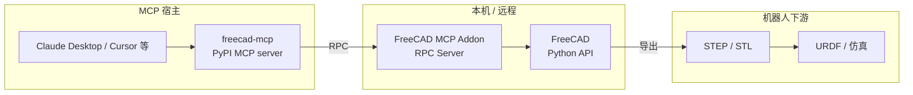

# FreeCAD MCP

**FreeCAD MCP** 是 [neka-nat/freecad-mcp](https://github.com/neka-nat/freecad-mcp) 开源的 **Model Context Protocol（MCP）桥接栈**：在已安装的 [FreeCAD](./freecad.md) 内加载 **MCP Addon 工作台** 并启动 **RPC 服务**，同时用 PyPI 包 **`freecad-mcp`**（`uvx freecad-mcp`）向 Claude Desktop 等 MCP 宿主注册工具，使编码代理能以自然语言 **创建/编辑 CAD 对象、执行 FreeCAD Python、截取视图、插入标准件、触发 CalculiX FEM**——无需另起 build123d 或商业 CAD 会话。

## 英文缩写速查

| 缩写 | 英文全称 | 简要说明 |
|------|----------|----------|
| MCP | Model Context Protocol | 代理与外部工具/数据源的开放互操作协议 |
| CAD | Computer-Aided Design | 计算机辅助设计，硬件结构建模 |
| RPC | Remote Procedure Call | 远程过程调用；Addon 在 FreeCAD 内暴露 Python API |
| FEM | Finite Element Method | 有限元法，结构应力/变形分析 |
| URDF | Unified Robot Description Format | ROS 生态统一的机器人连杆/关节描述格式 |
| STEP | Standard for the Exchange of Product model data | 工业 B-rep 零件/装配交换格式 |
| LLM | Large Language Model | 大语言模型，常作自然语言 CAD 接口 |

## 为什么对机器人栈重要

1. **复用桌面 CAD 真值：** 机器人夹具、法兰、支架常在 [FreeCAD](./freecad.md) 中参数化建模并导出 **STEP/STL**；本桥让代理直接操作 **同一 FreeCAD 会话**，而不是在 headless 脚本栈与 GUI 真值之间漂移。
2. **与 Text-to-CAD 路线互补：** [文字生成 CAD](../concepts/text-to-cad.md) 强调 **LLM + 参数化脚本**；FreeCAD MCP 走 **「已有专业 CAD + MCP 工具」**——适合工程师本机已装 FreeCAD、希望用 Claude/Cursor 等 **对话式改模型** 的场景（README 演示含法兰、玩具车、**2D 工程图转 3D**）。
3. **视觉审图闭环：** `get_view` 返回活动视图截图，代理可据图迭代——对齐 CAD Skills 的 **snapshot 校验** 思想，但宿主是 **FreeCAD 原生渲染**。
4. **结构初评入口：** `run_fem_analysis` 对接 **FEM 工作台 + CalculiX**，可粗评支架刚度；进入 RL/MPC 前仍须按 [仿真物理保真度](../queries/simulation-physics-fidelity.md) 核对 **惯量、碰撞简化与接触动力学**（FEM ≠ 仿真器）。
5. **下游 URDF 链不变：** 建模完成后仍可导出 STEP → [step2urdf](./step2urdf.md) / 社区 **CROSS/RobotCAD** 插件 → [URDF（统一机器人描述格式）](../concepts/urdf-robot-description.md)。

## 核心架构

| 组件 | 角色 |
|------|------|
| **FreeCAD Addon**（`addon/FreeCADMCP`） | 安装到各 OS 的 `Mod/`；工作台内 **Start RPC Server**；可选 **Auto-Start**、**Remote Connections** + IP 白名单 |
| **MCP Server**（`freecad-mcp` on PyPI） | `uvx freecad-mcp` 启动；在宿主 `mcpServers` 注册；将 MCP tool call 转为 RPC |
| **FreeCAD Python API** | `execute_code` 等工具的最终执行面；可调用 Part Design、Assembly、Robot 等工作台 |

## MCP 工具一览

| 工具 | 机器人相关用法 |
|------|----------------|
| `create_document` / `create_object` / `edit_object` / `delete_object` | 参数件、支架、法兰等迭代建模 |
| `execute_code` | 批量改尺寸、导出 STEP/STL、驱动装配约束 |
| `insert_part_from_library` / `get_parts_list` | 插入螺钉、轴承等 **FreeCAD-library** 标准件 |
| `get_view` | 代理视觉反馈与审图 |
| `get_objects` / `get_object` | 读取文档树，核对 link 划分前的几何 |
| `run_fem_analysis` | CalculiX 应力/位移摘要（悬臂等结构件粗评） |

## 流程总览

## 与相近方案的对照

| 方案 | 几何宿主 | 代理接口 | 强项 |
|------|----------|----------|------|
| **FreeCAD MCP** | 桌面 **FreeCAD** | MCP + RPC | 零脚本栈迁移、GUI 真值、FEM/Robot 插件生态 |
| [CAD Skills](./cad-skills.md) | **build123d**（OCP） | Agent Skills + CLI | 无头 CI、`gen_urdf()`、制造/打印 skill 链 |
| [文字生成 CAD](../concepts/text-to-cad.md) 商业路线 | Zoo / Fusion 等 | 厂商 API | 制造向 B-rep、企业工作流 |
| 纯 OpenSCAD/CadQuery + LLM | 脚本执行 | 终端/代码 | Git 友好、参数化极强 |

**推荐心智：** 本机已深度使用 FreeCAD 做硬件 → **FreeCAD MCP**；从零脚本化、要 URDF skill 与切片链 → **CAD Skills**；二者可 **串联**（MCP 出 STEP → step2urdf）。

## 部署要点

- **Addon 路径（因 OS/发行版而异）：** Linux `~/.FreeCAD/Mod/` 或 `~/.local/share/FreeCAD/v1-1/Mod/`；macOS `~/Library/Application Support/FreeCAD/v1-1/Mod/`；Windows `%APPDATA%\FreeCAD\Mod\`。
- **宿主依赖：** [uv](https://docs.astral.sh/uv/) / `uvx`；Python **≥3.12**。
- **远程：** Addon 侧开启 **Remote Connections** 并配置 **Allowed IPs**；MCP server 加 `--host <FreeCAD机器IP>`。
- **Token 节省：** `--only-text-feedback` 跳过图像类反馈。

## 常见误区或局限

- **不是 URDF 生成器：** 本体不导出 URDF；需依赖 FreeCAD **Robot/CROSS/RobotCAD** 插件或 **STEP → step2urdf** 下游。
- **需要 GUI FreeCAD 常驻：** 与 headless build123d 不同；不适合纯 CI 无人值守批量（除非远程桌面/容器化 GUI）。
- **`execute_code` 风险：** 任意 Python 等同本机 FreeCAD 权限；应对不可信 prompt 保持警惕。
- **FEM 结果≠仿真动力学：** CalculiX 摘要用于结构粗评，不能替代 MuJoCo/Isaac 接触丰富仿真。
- **远程 RPC 安全：** 绑定 `0.0.0.0` 时必须配置 **IP 白名单**，避免内网未授权操控。

## 关联页面

- [FreeCAD（开源参数化机械 CAD）](./freecad.md)
- [CAD Skills（LLM 驱动 CAD 技能）](./cad-skills.md)
- [step2urdf（STEP→URDF 浏览器转换）](./step2urdf.md)
- [URDF-Studio（URDF/MJCF 设计工作站）](./urdf-studio.md)
- [文字生成 CAD（Text-to-CAD）](../concepts/text-to-cad.md)
- [URDF（统一机器人描述格式）](../concepts/urdf-robot-description.md)
- [仿真物理保真度链路](../queries/simulation-physics-fidelity.md)

## 参考来源

- [freecad-mcp 仓库源归档](../../sources/repos/freecad-mcp.md)
- [FreeCAD MCP GitHub README](https://github.com/neka-nat/freecad-mcp)
- [FreeCAD 用户 Wiki](https://wiki.freecad.org)
- [Model Context Protocol](https://modelcontextprotocol.io)

## 推荐继续阅读

- [neka-nat/freecad-mcp](https://github.com/neka-nat/freecad-mcp) — 安装、Claude Desktop 配置与 demo GIF
- [FreeCAD-library](https://github.com/FreeCAD/FreeCAD-library) — `insert_part_from_library` 标准件来源
- [galou/freecad.cross](https://github.com/galou/freecad.cross) — FreeCAD 内 ROS URDF/xacro 工作台
