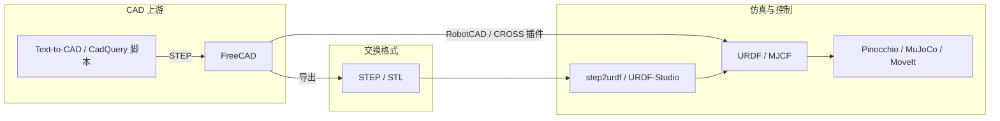

# FreeCAD（开源参数化机械 CAD）

**FreeCAD** 是由社区与 [FreeCAD 组织](https://github.com/FreeCAD) 维护的 **免费开源、跨平台参数化 3D CAD**，以 **OpenCASCADE** 为几何内核，覆盖 **约束草图、零件建模、装配、工程图、FEM、CAM** 与内置 **Robot 工作台**。在机器人研究与工程中，它 rarely 充当 RL 训练环境，却频繁出现在 **机械设计 → STEP/网格 → URDF/MJCF → 仿真/控制** 链路的 **CAD 上游**——与 [Blender](./blender.md) 的 DCC/动画层、[step2urdf](./step2urdf.md) 的浏览器端 STEP 转换形成互补。

## 英文缩写速查

| 缩写 | 英文全称 | 简要说明 |
|------|----------|----------|
| CAD | Computer-Aided Design | 计算机辅助设计，硬件结构建模 |
| B-rep | Boundary Representation | 边界表示实体模型，STEP 等交换格式的基础 |
| FEM | Finite Element Method | 有限元法，结构应力/变形分析 |
| CAM | Computer-Aided Manufacturing | 计算机辅助制造，刀路生成 |
| URDF | Unified Robot Description Format | ROS 生态统一的机器人连杆/关节描述格式 |
| STEP | Standard for the Exchange of Product model data | 工业 B-rep 零件/装配交换格式 |
| LGPL | GNU Lesser General Public License | FreeCAD 采用的弱 copyleft 开源许可 |
| ROS | Robot Operating System | 机器人中间件；社区插件可导出 URDF/xacro 包 |

## 为什么对机器人栈重要

1. **硬件与夹具 authoring**：开源整机、实验室夹具、传感器支架往往从 **参数化 CAD** 起步；FreeCAD 提供 **零许可成本** 的 B-rep 编辑，可导出 **STEP/STL/OBJ** 进入 [URDF（统一机器人描述格式）](../concepts/urdf-robot-description.md) 与 [仿真物理保真度](../queries/simulation-physics-fidelity.md) 所强调的 **几何/惯量第 ① 层**。
2. **CAD→仿真桥接**：官方 **Robot 工作台** 支持连杆-关节建模与运动学预览；社区 **CROSS**、**RobotCAD**、**RobotCreator** 等插件可从装配体生成 **URDF/xacro**、碰撞网格与 ROS2 启动文件——[ROS 2 文档](https://docs.ros.org/en/rolling/Tutorials/Intermediate/URDF/Exporting-an-URDF-File.html) 将 FreeCAD 生态列为常见 URDF 导出来源之一。
3. **与 STEP 工具链同族**：FreeCAD 与 [step2urdf](./step2urdf.md) 均基于 **OpenCASCADE** 语义处理 STEP；典型流程为 **FreeCAD 精修装配 → 导出 STEP → step2urdf / URDF-Studio 微调关节与惯量**。
4. **Python 脚本层**：宏与 **FreeCAD Python API** 可批量改尺寸、导出网格、驱动装配约束——适合 **夹具族系、参数化支架、数据集硬件变体** 的科研复现（与 [Text-to-CAD](../concepts/text-to-cad.md) 中的 **CadQuery/OpenSCAD 脚本 CAD** 路线可串联：LLM 生成脚本 → FreeCAD 审图 → STEP 下游）。
5. **MCP 代理桥接**：[FreeCAD MCP](./freecad-mcp.md) 通过 Addon RPC + PyPI MCP server 把上述 API 暴露给 Claude 等宿主，支持自然语言建模、`get_view` 审图与 CalculiX FEM——适合本机已装 FreeCAD、希望对话式改模型的硬件迭代。

## 核心工作台（与机器人管线的映射）

| 工作台 / 模块 | 机器人相关用法 |
|---------------|----------------|
| **Part Design / Sketcher** | 约束草图 + 拉伸/旋转；支架、法兰、连杆零件 |
| **Assembly** | 多零件装配、配合关系；导出 STEP 供 URDF 划分 link |
| **Robot** | 内置连杆-关节树、运动学预览；ROS 插件的上游几何 |
| **FEM** | 结构刚度/应力初评（不替代 SysID 或接触动力学） |
| **TechDraw** | 2D 工程图，加工与装配沟通 |
| **Python / Macro** | 批处理导出、尺寸驱动、与外部工具链 glue code |

## 在知识库生态中的位置

- **与 Blender 对照**：[Blender](./blender.md) 擅长 **网格、绑定、动画、渲染**；FreeCAD 擅长 **制造级 B-rep、约束参数与工程图**——动捕与场景可视化偏前者，机械零件与公差沟通偏后者。
- **与 Web URDF 工具对照**：[step2urdf](./step2urdf.md) 适合 **已有 STEP 快速转 URDF**；[URDF-Studio](./urdf-studio.md) 适合 **描述文件深度编辑**；FreeCAD 适合 **从零设计或修改装配体真值**——三者常 **串联** 而非互斥。
- **与控制实现对照**：[WBC 实现指南](../queries/wbc-implementation-guide.md) 第一步要求 **URDF/MJCF 与 CAD/实机一致**；FreeCAD 是开源团队完成该步的常见桌面工具。

## 常见误区或局限

- **不是高保真物理仿真器**：FreeCAD 内置 Robot 工作台与插件侧重 **运动学/描述包生成**，不能替代 [MuJoCo](./mujoco.md) / Isaac 的 **接触丰富、千赫兹级动力学**。
- **URDF 插件成熟度参差**：CROSS/RobotCAD 等由社区维护，版本与 ROS 发行版绑定需自行验证；复杂闭链、柔性体与执行器动力学仍需 **人工核对** 或转 [MoveIt 2](./moveit2.md) / 专用编辑器。
- **碰撞体与视觉网格**：默认导出网格未必适合仿真碰撞（过细或过简）；进入 RL 栈前应按 [仿真物理保真度](../queries/simulation-physics-fidelity.md) 做 **凸包/简化与惯量复核**。
- **许可边界**：FreeCAD 本体 LGPL；**第三方工作台** 与 **导出资产** 许可各自独立——集成进商业硬件或数据集时需逐件核对。

## 关联页面

- [Blender（开源 3D 创作套件）](./blender.md)
- [step2urdf（STEP→URDF 浏览器转换）](./step2urdf.md)
- [URDF-Studio（URDF/MJCF 设计工作站）](./urdf-studio.md)
- [CAD Skills（LLM 驱动 CAD 技能）](./cad-skills.md)
- [FreeCAD MCP（MCP 驱动桌面 CAD）](./freecad-mcp.md)
- [MoveIt 2（ROS 2 运动规划）](./moveit2.md)
- [URDF（统一机器人描述格式）](../concepts/urdf-robot-description.md)
- [文字生成 CAD（Text-to-CAD）](../concepts/text-to-cad.md)
- [WBC 实现指南](../queries/wbc-implementation-guide.md)
- [仿真物理保真度链路](../queries/simulation-physics-fidelity.md)

## 参考来源

- [FreeCAD 官方源码仓库归档](../../sources/repos/freecad.md)
- [freecad-mcp 仓库源归档](../../sources/repos/freecad-mcp.md)
- [FreeCAD 用户 Wiki](https://wiki.freecad.org)
- [FreeCAD 开发者手册](https://freecad.github.io/DevelopersHandbook/)
- [ROS 2 — Generating an URDF File（CAD 导出工具列表）](https://docs.ros.org/en/rolling/Tutorials/Intermediate/URDF/Exporting-an-URDF-File.html)

## 推荐继续阅读

- [FreeCAD 官网与下载](https://www.freecad.org)
- [FreeCAD Workbenches 列表](https://wiki.freecad.org/Workbenches)
- [galou/freecad.cross](https://github.com/galou/freecad.cross) — ROS URDF/xacro 图形化工作台
- [drfenixion/freecad.robotcad](https://github.com/drfenixion/freecad.robotcad) — ROS2 描述包与 Gazebo/RViz 启动生成
