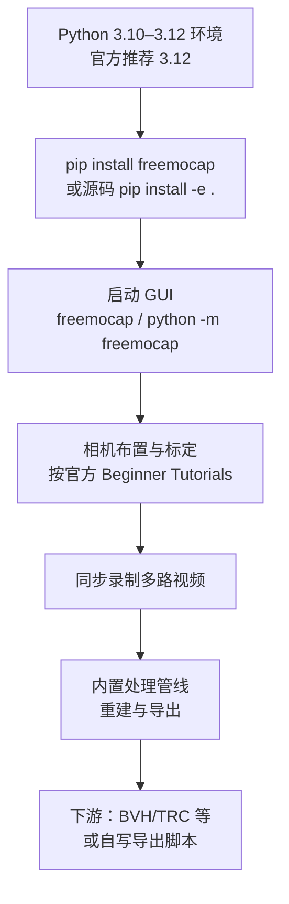

---

type: entity
tags: [repo, motion-capture, mocap, computer-vision, education, opensource, freemocap]
status: complete
updated: 2026-06-09
related:
  - ../concepts/motion-retargeting.md
  - ./paper-mamma-markerless-motion-capture.md
  - ./paper-opencap-monocular.md
  - ./mjlab-playground.md
  - ./mimickit.md
  - ../methods/imitation-learning.md
  - ../tasks/locomotion.md
sources:
  - ../../sources/repos/freemocap.md
summary: "FreeMoCap：面向科研与教学的开源多相机运动捕捉平台，强调低成本硬件、GUI 驱动采集与可复现处理管线；AGPL 授权需在集成进商业产品前单独评估合规路径。"
---

# FreeMoCap（开源多相机动捕平台）

**FreeMoCap**（仓库名 `freemocap`）是一套 **免费开源** 的运动捕捉 **软件与流程**：在 README 中自描述为 *hardware-and-software-agnostic, minimal-cost, research-grade*，目标是在教育与分散化科研场景下用较低成本完成多相机 3D 运动重建。

## 英文缩写速查

| 缩写 | 英文全称 | 简要说明 |
|------|----------|----------|
| MoCap | Motion Capture | 动作捕捉，参考动作与演示数据的主要来源 |
| Retargeting | Motion Retargeting | 将人体/动物动作映射到目标机器人骨架 |
| RL | Reinforcement Learning | 通过与环境交互最大化长期回报来学习策略的范式 |
| BC | Behavior Cloning | 将状态映射到动作的监督式模仿，易受分布偏移影响 |
| GPU | Graphics Processing Unit | 图形处理器，大规模并行仿真训练的算力基础 |
| MuJoCo | Multi-Joint dynamics with Contact | 接触丰富的刚体物理仿真引擎 |
| Locomotion | Robot Locomotion | 足式/人形等无轮移动能力的总称 |

## 为什么重要？

- **降低 MoCap 门槛**：相比光学动捕室或专用套装，USB 相机阵列 + 统一软件栈更易在实验室快速搭建。若需 **研究级 SMPL-X + 双人交互**，可对照 [MAMMA](./paper-mamma-markerless-motion-capture.md)（多视角 markerless，CVPR 2026）选型；若需 **单手机临床级运动学/动力学（OpenSim）**，见 [OpenCap Monocular](./paper-opencap-monocular.md)。
- **GUI 闭环**：`pip install freemocap` 后以 `freemocap` 命令启动图形界面，适合作为 **人体动作采集** 的第一站，再把数据交给重定向、仿真或模仿学习下游。
- **许可需显式评估**：项目采用 **AGPL**（README 与 LICENSE 说明）；若要将修改后的版本嵌入闭源产品或服务端，需要自行做法务评估或按 README 指引联系维护方讨论其他许可。

## 流程总览（软件侧）

下列示意图概括官方 README 所呈现的典型 **安装 → 启动 → 录制学习** 路径；内部算法模块以处理管线统称，细节以官方文档为准。

## 与机器人学习栈的衔接

| 衔接方向 | 说明 |
|---------|------|
| 几何重定向 | 人体骨架轨迹需经 [Motion Retargeting](../concepts/motion-retargeting.md) 才能对齐到机器人关节与腿长比例 |
| 仿真 RL | 处理后的参考运动可作为 tracking 奖励、BC 数据集或风格判别器输入；GPU 并行框架示例见 [mjlab](./mjlab.md)、任务示例见 [mjlab_playground](./mjlab-playground.md) |
| 模仿学习范式 | 与 [模仿学习](../methods/imitation-learning.md) 中「演示 → 策略」主线一致 |

## 关联页面

- [Motion Retargeting](../concepts/motion-retargeting.md) — 动捕到机器人执行空间的核心中间步骤
- [mjlab_playground](./mjlab-playground.md) — MuJoCo Warp 上足式技能训练示例，可与动捕数据在管线层组合
- [MimicKit](./mimickit.md) — 研究侧运动模仿算法集合，可与 MoCap 数据管线对照
- [Locomotion](../tasks/locomotion.md) — 足式运动学习中 MoCap 先验的常见用途

## 推荐继续阅读

- [FreeMoCap 官方文档（Installation）](https://freemocap.github.io/documentation/installation.html#detailed-pip-installation-instructions)
- [Your first recording（新手录制）](https://freemocap.github.io/documentation/your-first-recording.html)

## 参考来源

- [sources/repos/freemocap.md](../../sources/repos/freemocap.md)
- [freemocap/freemocap](https://github.com/freemocap/freemocap)
