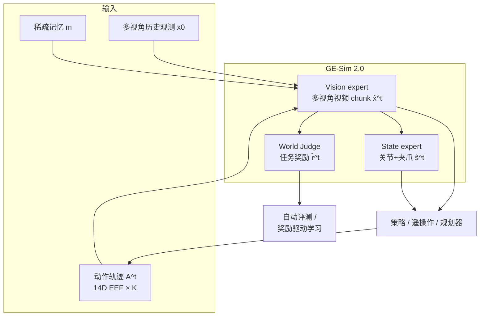

# GE-Sim 2.0（Genie Envisioner World Simulator 2.0）

**GE-Sim 2.0**（arXiv:2605.27491，AgiBot 等）是 **Genie Envisioner** 平台上的 **闭环视频世界模拟器**：在 [Genie Envisioner / GE-Sim 1.0](https://arxiv.org/abs/2508.05635) 所确立的 **动作条件、多视角、chunk 自回归** 视频生成骨架上，用 **千万级真机 episode**（遥操作、策略部署、丰富物体交互，含失败轨迹）重训 **视觉专家**，并新增 **本体状态专家**、**世界裁判（World Judge）** 与 **推理加速**，把「高保真动作跟随视频」推进为策略可 **闭环交互、自动评分、规模化 rollout** 的操纵仿真平台。

## 一句话定义

**动作驱动的多视角视频世界模型 + 从视频 latent 解码的本体状态 + 任务对齐的 VLM 奖励**，在单栈内同时服务 **未来观测合成、策略输入补全与机器可验证评测**。

## 英文缩写速查

| 缩写 | 英文全称 | 简要说明 |
|------|----------|----------|
| VLM | Vision-Language Model | 视觉-语言多模态理解模型，VLA 的上游 |
| VLA | Vision-Language-Action | 视觉-语言-动作多模态基础策略方向 |
| BC | Behavior Cloning | 将状态映射到动作的监督式模仿，易受分布偏移影响 |
| RL | Reinforcement Learning | 通过与环境交互最大化长期回报来学习策略的范式 |
| DiT | Diffusion Transformer | 以 Transformer 为骨干的扩散生成架构 |
| MuJoCo | Multi-Joint dynamics with Contact | 接触丰富的刚体物理仿真引擎 |
| Manipulation | Robot Manipulation | 抓取、移动、操作物体的任务总称 |
| WM | World Model | 学习环境动态以供想象/规划的世界模型 |

## 为什么重要

- **对准评测瓶颈**：真机 benchmark 慢且难复现；传统刚体仿真在接触、可变形体与执行器细节上仍有系统误差。GE-Sim 2.0 用 **数据驱动生成** 覆盖外观与交互长尾，并强调 **闭环策略结果与真机一致**（论文报告聚合与逐 episode 层面）。
- **超越「只看视频」**：仅动作条件视频即使 photoreal，也不等于策略可闭环的模拟器——现代 VLA/操纵策略仍依赖 **关节角与夹爪状态**；GE-Sim 2.0 的 **state expert** 从视觉专家中间特征解码 **16 维双臂关节空间状态**，与 \(\hat{\mathbf{x}}^t\) 一并回馈策略。
- **内置 critic**：**World Judge** 按自然语言任务指令对 rollout 评分，提供 **成功信号与稀疏奖励**，支撑 filtered BC、RL 与大规模自动评测，缓解纯人工 inspect rollout 的成本。
- **工程可扩展**：蒸馏加速后 **单 H100 约 2.3s 生成 25 帧**；训练侧 **随机 stride** 支持推理 **最高 4× 跳帧** 延长视界。公开 **WorldArena** 榜以 **2B 参数** 领先多种专用机器人世界模型与闭源通用视频生成器。

## 核心结构

| 模块 | 作用 |
|------|------|
| **Vision expert** | 继承 GE-Base：**头/左/右手** 三视角、稀疏记忆、Cosmos-Predict2-2B 级 DiT；条件为 **噪声 latent + 6 通道 raymap + 3 通道 EE pose map**；flow-matching 训练；记忆帧 **误差模拟** 缓解闭环分布偏移。 |
| **Proprioceptive state expert** | 轻量 Transformer：融合 vision 各层特征 \(\mathbf{H}_{\text{fuse}}\)，预测未来 **关节角 + 夹爪**（16 维）；与视觉专家 **共享 Pose2Image 动作条件**。 |
| **World Judge** | 独立 VLM 奖励模型：对齐 **任务指令** 与生成 rollout，输出 \(\hat{r}^t\)（评测 + 奖励学习）。 |
| **Acceleration** | 扩散步蒸馏；高吞吐 chunk rollout。 |
| **数据** | 大规模真机：**专家遥操作 + 自主执行 + 失败示范**；减轻抓取幻觉（项目页对比「仅专家数据」案例）。 |

### 动作条件（与 GE-Sim 1.0 连续）

双臂每步 **14 维 EEF**（左右各 7：位置、RPY、夹爪开合）。**Raymap** 显式编码动相机几何；**EE pose map** 在图像平面渲染位姿与夹爪开合（深度感知圆半径 + 轴向颜色 + 左右臂色系），与 latent **空间对齐拼接**。

## 流程总览（闭环 rollout）

## 与 EWMBench、通用视频模型的关系

| 维度 | [EWMBench](./ewmbench.md) | GE-Sim 2.0 |
|------|---------------------------|------------|
| 主要问题 | 开环：**生成视频** 在场景/运动/语义上是否像真机操纵 | 闭环：**动作条件 rollout** 能否驱动策略学习与 **任务成功判定** |
| 监督信号 | 对照 Agibot-World 子集的 Scene/Motion/Semantics 指标 | 内置 **World Judge** + 真机一致性实验 |
| 参数规模 | 评测多种候选生成器 | 自带 **2B** 模拟器在 WorldArena 领先 |

二者同属 **Agibot 生态**，宜 **组合阅读**：EWMBench 量化「生成质量」，GE-Sim 2.0 推进「模拟器即训练与评测平台」。

## 常见误区或局限

- **不是刚体物理引擎**：接触力、可微动力学与力控闭环仍不可直接替代 MuJoCo/Isaac；适合 **视觉–本体–语义层** 的策略评测与数据增广，而非高频力控辨识。
- **开源进度**：截至 2026-05-30，[GitHub 仓](https://github.com/AgibotTech/GE-Sim-V2) 仅技术报告；**代码、权重、评测工具链** 仍标记 TODO（以仓库 README 为准）。
- **许可**：仓内非上游适配部分为 **CC BY-NC-SA 4.0**，商业复现需单独核对。
- **开环指标仍不足够**：即便 WorldArena 领先，策略价值仍应以 **闭环成功率与真机迁移** 为最终判据（与 [robot-world-models-training-loop-taxonomy](../overview/robot-world-models-training-loop-taxonomy.md) 一致）。

## 关联页面

- [Generative World Models（生成式世界模型）](../methods/generative-world-models.md) — 像素级 rollout 工具箱；GE-Sim 2.0 为 **操纵闭环平台** 实例
- [Video-as-Simulation（视频即仿真）](../concepts/video-as-simulation.md) — 动作可控视频模拟 + 内置裁判
- [Manipulation（操作任务）](../tasks/manipulation.md) — 任务域与长程操纵评测语境
- [Model-Based RL](../methods/model-based-rl.md) — 想象 rollout 与奖励驱动学习接口
- [EWMBench](./ewmbench.md) — 同厂牌 EWM **开环** 三维评测
- [机器人世界模型：训练闭环 taxonomy](../overview/robot-world-models-training-loop-taxonomy.md) — ③ 视频世界模型 · 从想象到训练闭环
- [τ₀-World Model（τ0-WM）](./tau0-world-model.md) — 同 Agibot 系 **5B 统一视频–动作** 与测试时 propose–evaluate–revise（策略–仿真一体，非独立 Judge 栈）

## 参考来源

- [GE-Sim 2.0 论文摘录](../../sources/papers/ge_sim_2_arxiv_2605_27491.md)
- [GE-Sim-V2 仓库归档](../../sources/repos/ge_sim_v2.md)
- [GE-Sim 2.0 项目页归档](../../sources/sites/ge-sim-v2-project.md)
- Qiu et al., *GE-Sim 2.0: A Roadmap Towards Comprehensive Closed-loop Video World Simulators for Robotic Manipulation*, [arXiv:2605.27491](https://arxiv.org/abs/2605.27491)

## 推荐继续阅读

- Liao et al., *Genie Envisioner: A Unified World Foundation Platform for Robotic Manipulation*, [arXiv:2508.05635](https://arxiv.org/abs/2508.05635) — GE-Base / GE-Sim 1.0 / EWMBench 统一平台（GE-Sim 2.0 论文 §2 前身）
- [EWMBench（arXiv:2505.09694）](./ewmbench.md) — 操纵场景视频世界模型 **生成质量** 基准
- [AgibotTech/GE-Sim-V2](https://github.com/AgibotTech/GE-Sim-V2) — 代码与权重发布跟踪
- [GE-Sim 2.0 项目页](https://ge-sim-v2.github.io/) — 多视角一致性、World Judge 与长视频演示
