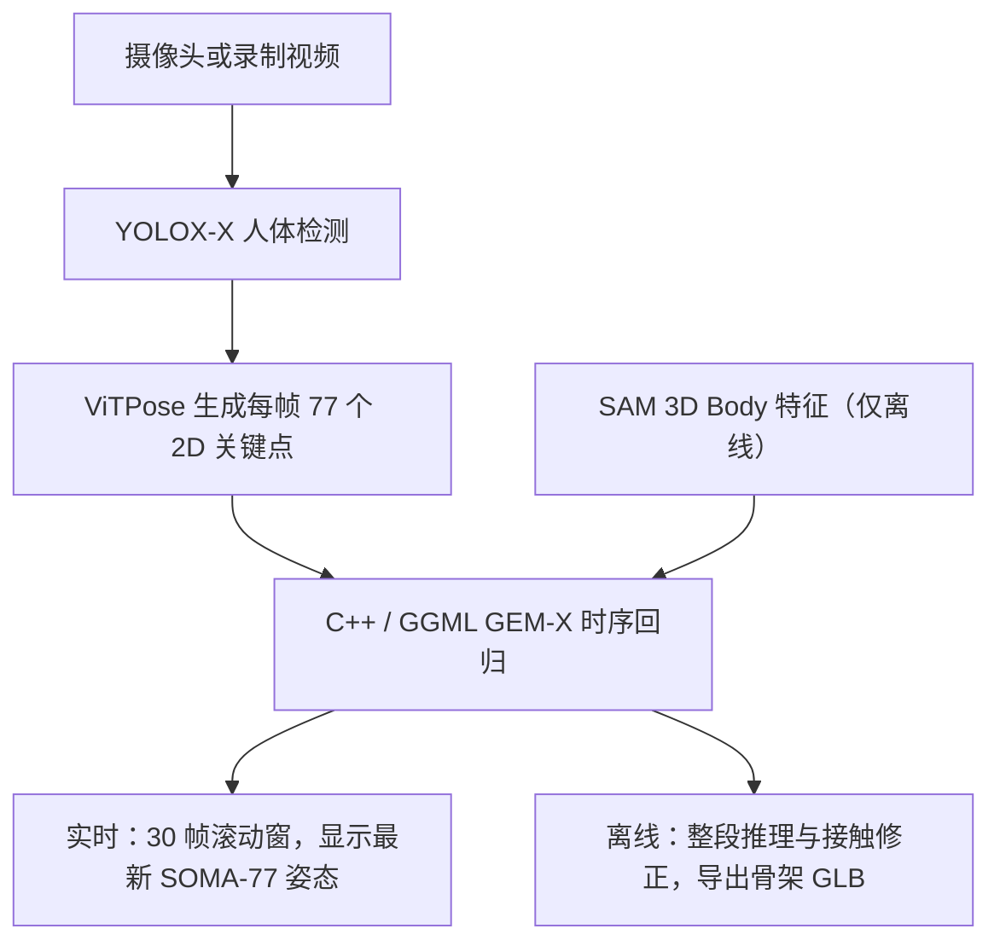

# gem-x.cpp（GEM-X 的 GGML/C++ 本地实现）

[LocalAI/gem-x.cpp](https://github.com/localai-org/gem-x.cpp) 将 NVIDIA Research 的 [GEM-X](https://github.com/NVlabs/GEM-X) 推理管线移植到 **C++23 + GGML**，提供本机浏览器 demo 和可集成的原生 API。它面向单目视频中的人体全身姿态估计：输入摄像头画面或录制视频，输出 77 关节 SOMA 骨架。它是独立社区实现，不是 NVIDIA 发布的 GEM-X 代码或新训练模型。

## 英文缩写速查

| 缩写 | 英文全称 | 简要说明 |
|------|----------|----------|
| GEM-X | Generalist Estimation Model X | NVIDIA 的单目视频全身人体姿态估计模型 |
| GGML | GGML tensor library | C/C++ 推理张量与算子运行时 |
| GGUF | GGML Universal File | 本项目转换模型文件使用的容器格式 |
| SOMA | Standardized Open Motion Avatar | GEM-X 输出使用的标准化人体骨架；这里为 77 个关节 |
| ViTPose | Vision Transformer for Pose Estimation | 从图像产生 2D 人体关节点热图的视觉模型 |
| GLB | Graphics Language Transmission Format Binary | 本项目离线 demo 的动画骨架导出格式 |
| MHR | Meta Human Rig | 离线 Body 分支使用的第三方人体身份/几何模型 |

## 为什么重要

- **降低运行时门槛**：上游 GEM-X 采用 Python / PyTorch / ONNX 生态；此仓库把观测模型和 GEM-X 主干转换为 GGUF，并以 C++ 管线执行，提供 CPU 与 Vulkan 构建入口。
- **覆盖实时与离线两种交互**：实时模式把最新姿态叠加在相机画面或 3D 视图中；离线模式处理完整短片、检查重建结果并导出骨架动画。
- **输出可供下游消费**：原生接口可读写带时间戳的 SOMA 或 SMPL pose 流，便于动作工具接入；但这是姿态输出接口，不代表已集成具体人形机器人控制器。

## 流程总览

实时和离线共享检测、关键点与 GEM-X 核心。实时分支按滚动窗口只输出新帧姿态，不运行 SAM 3D Body；离线分支用全片上下文，额外依赖 Body 特征，并执行接触修正、grounding 与 IK。导出的 GLB 是动画骨架，不包含完整人体网格。

## 模型与接口

| 阶段 | 输入 / 组件 | 输出与边界 |
|------|-------------|-------------|
| 人体检测 | YOLOX-X；离线还包括 ByteTrack 主体跟踪 | 人框；实时演示默认每 5 帧运行一次检测，可调为每帧 |
| 2D 观测 | ViTPose-H | 每帧 77 个关键点热图 / 置信度 |
| GEM-X 回归 | 12 个时序块，512 维嵌入、8 头注意力；GGUF F32 | 原生结果含 77 关节 SOMA 骨架及根姿态等参数 |
| 实时上下文 | 30 帧滚动窗，前 2 帧 warm-up，之后只显示最新帧 | 遵循上游 absent-image 摄像头路径；不调用 SAM 3D Body 或离线世界轨迹恢复 |
| 离线上下文 | SAM 3D Body pose feature + 完整视频片段 | 接触修正、grounding、IK；浏览器当前限制为最多 120 个采样帧 |

检测间隔大于 1 时，系统会复用上次人体 crop，ViTPose 和 GEM-X 仍对每个处理帧运行。因此人物大幅移动时应选每帧检测；较大的间隔是以减少检测工作量换取 crop 更新频率。

## 工程实践

- **本地构建**：README 将 Linux 列为经过测试的平台；需要 GCC 13+ 或 Clang 17+、CMake 3.24+、Ninja；浏览器 demo 还需要 Go 1.23+。vulkan preset 为 GPU 后端，release preset 可走 CPU。
- **运行 demo**：按仓库 README 初始化 submodules、构建模型后，在仓库根目录运行 ./demo/gemx-demo --threads 8，再打开 http://localhost:8098。CPU 模式需指定 CPU pipeline 与 module 路径。
- **实时相机**：摄像头访问需 localhost 或 HTTPS；固定相机并让全身处于画面内，摄像头权限由浏览器授予。
- **模型资产**：实时推理需要 gem-x-contact-f32.gguf、vitpose-f32.gguf、yolox-f32.gguf，可从 [LocalAI-io/GEM-X-GGUF](https://huggingface.co/LocalAI-io/GEM-X-GGUF) 下载。离线模式还需初始化 sam3d.cpp submodule 并准备 Body backbone、pose branch 与 MHR GGUF；这些资产不包含在 GEM-X 权重包中。
- **原生接口**：include/gemx.h / include/gemx_stream.h 与 [Motion Streaming 文档](https://github.com/localai-org/gem-x.cpp/blob/main/docs/MOTION-STREAMING.md) 描述 SOMA / SMPL pose 与时间戳接口。SONIC 发布和 LocalAI 网络流 adapter 是独立集成，目前 demo 未连接。
- **验证证据**：仓库的 strict-F32 parity 报告在单个 72 帧 football 视频上比较上游和本地输出，结果接近但非 bit-identical：离线相机坐标关节均值距离 0.877 mm、最大 4.628 mm；包含轨迹的世界坐标均值 3.496 mm、最大 9.968 mm；实时重力对齐关节均值 0.984 mm、最大 19.051 mm。这是实现一致性回归，不是多视频准确率基准，也不验证摄像头到机器人的端到端延迟。
- **条款分层**：原生代码贡献采用 Apache-2.0；转换模型采用 NVIDIA Open Model License；DINOv3、MHR、可选 SAM 3D Body 及其他第三方组件有各自条款。使用或再分发前分别查阅仓库的 LICENSE、NOTICE、LICENSES 与 [模型卡许可说明](https://huggingface.co/LocalAI-io/GEM-X-GGUF/blob/main/docs/LICENSING.md)。

## 局限与风险

- **并非机器人控制器**：项目把视觉输入变成骨架序列；仓库声明 robot control 是独立集成。仅有 pose streaming API 不能推断它会直接驱动某台机器人。
- **相机与视频能力有差异**：摄像头不需要 SAM 3D Body，但没有离线分支的接触修正和世界轨迹重建；离线模式会增加模型资产和构建依赖。
- **时长边界**：demo 对离线片段最多采样 120 帧。原生 API 可接受更长序列，但仓库说明 120 帧以上连续窗口策略与上游长序列局部注意力的等价性尚未建立。
- **部署边界**：Linux 是 README 明确测试的平台；不能仅凭 C++ 或 Vulkan 推断 Jetson、某个摄像头或指定 GPU 已完成验证。Web server 默认无认证，应只在 localhost 或可信认证代理后使用。
- **模型与实现不可混称**：GGUF 是文件格式，不决定许可；转换权重不是新训练或低比特量化。HF 模型卡标注 NVIDIA Open Model License，模型文件也不是可直接交给通用 llama.cpp LLM runtime 的普通文本模型。
- **一致性证据有限**：仓库公开的端到端对照集中在一段 72 帧视频；它不能替代跨场景姿态质量、遮挡鲁棒性或真机延迟评测。

## 与 GEM-X / GENMO 的关系

- [GEM-X](https://github.com/NVlabs/GEM-X) 是 NVIDIA 上游模型和参考实现；LocalAI 仓库提供其独立 GGML/C++ runtime、GGUF 转换资产与浏览器 demo。
- [GENMO / GEM](../methods/genmo.md) 是 ICCV 2025 的人体运动估计与生成研究线，提供 NVIDIA 人形动作栈上下文。GEM-X 是有关联的全身姿态估计模型；这份 LocalAI 移植不应记作另一篇 GENMO 论文，也不应与上游实现合并成同一个代码项目节点。
- [SOMA-X](./soma-x.md) 解释输出骨架的标准化表示；[SOMA Retargeter](./soma-retargeter.md) 与 [SONIC](../methods/sonic-motion-tracking.md) 可帮助理解骨架的后处理与下游跟踪关系，但此仓库 demo 没有自动串接它们。

## 推荐继续阅读

- [LocalAI/gem-x.cpp README](https://github.com/localai-org/gem-x.cpp)
- [上游 NVlabs/GEM-X](https://github.com/NVlabs/GEM-X)
- [LocalAI-io/GEM-X-GGUF 模型卡](https://huggingface.co/LocalAI-io/GEM-X-GGUF)
- [NVIDIA GEM-X 模型总览](https://github.com/NVlabs/GEM-X/blob/main/docs/MODEL_OVERVIEW.md)
- [GEM-X parity 报告](https://github.com/localai-org/gem-x.cpp/blob/main/docs/LIVE-OFFLINE-PARITY.md)

## 参考来源

- [LocalAI gem-x.cpp 仓库归档](../../sources/repos/localai-gem-x-cpp.md)
- [NVIDIA GEM-X 上游代码](https://github.com/NVlabs/GEM-X)
- [LocalAI-io GGUF 模型卡与许可说明](https://huggingface.co/LocalAI-io/GEM-X-GGUF)

## 关联页面

- [GENMO（统一人体运动估计与生成）](../methods/genmo.md)
- [SOMA-X（统一参数化人体模型）](./soma-x.md)
- [SOMA Retargeter](./soma-retargeter.md)
- [SONIC（规模化运动跟踪人形控制）](../methods/sonic-motion-tracking.md)
- [机器人视觉感知栈选型闭环](../queries/robot-perception-stack-selection-loop.md) — 单目全身姿态估计属该链 ③ 2D→3D 提升层的人体分支；输出骨架供下游重定向 / 运动跟踪（④ 消费层）使用时需另行核对帧率与延迟
