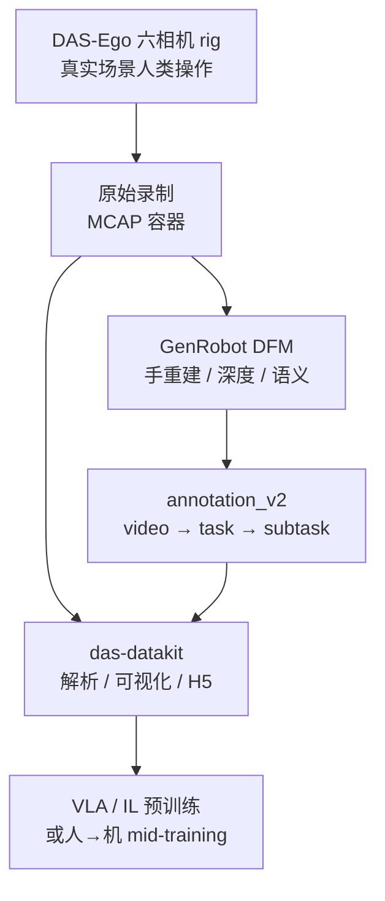

# Gen-HumanEgo（DAS-Ego 开放人类第一视角数据集）

**Gen-HumanEgo**（[HF](https://huggingface.co/datasets/genrobot2025/Gen-HumanEgo) · [开放数据门户](https://www.genrobot.ai/data/open-dataset)）是 [简智机器人（GenRobot）](https://github.com/genrobot-ai) **RealOmni-Open** 计划中的 **人类 egocentric** 主线：用统一 **六相机 DAS-Ego** rig 采集真实世界操作，经官方 **Data Foundation Model（DFM）** 离线处理，把原始录制变成带 **双手几何、深度与层次语义** 的结构化 MCAP episode。

## 一句话定义

**约 1,848 小时、4.4 万条 MCAP episode 的多域人类第一视角语料——六路同步 RGB、双手 21 关键点/MANO/mesh、Ego-Depth 与 video→task→subtask 三级标注同包发布，HF ungated（CC BY-SA 4.0），读取与转换走 das-datakit。**

## 英文缩写速查

| 缩写 | 英文全称 | 简要说明 |
|------|----------|----------|
| DAS | Data Acquisition System | GenRobot 采集硬件族（Ego / Gripper / Controller） |
| DFM | Data Foundation Model | 官方离线数据处理管线，生成手/深度/语义监督 |
| Ego | Egocentric Vision | 第一人称可穿戴视角 |
| MANO | Mesh-based Anthropomorphic Hand Model | 参数化手部模型 |
| MCAP | MCAP ROS bag format | 本集 episode 容器格式 |
| VLA | Vision-Language-Action | 视觉–语言–动作统一策略；Hub 标签含 vla |
| HF | Hugging Face | 数据集托管与下载平台 |
| SA | ShareAlike | CC BY-SA 4.0 的再分发义务 |

## 为什么重要

- **「采集 + 标注」一体，而非纯 ego 视频：** 相对 [RekaDaily-10k](./rekadaily-10k-dataset.md) 等 **仅 RGB + caption** 路线，本集在同 episode 内提供 **度量双手重建、Ego-Depth 与带时间边界的 task/subtask 标注**——更接近 VLA / 模仿学习的 **多模态监督** 形态。
- **国内 DAS-Ego 硬件栈的可复现数据出口：** 与 [das-datakit](./cn-os-das-datakit.md) 同生态；MCAP topic、坐标系与 URDF（`egov4_urdf.zip`）有官方文档，降低「只有视频、自己重跑 WiLoR/HaWoR」的试错成本。
- **规模与任务多样性：** **10,257** 唯一任务、**home / business / industry / agriculture** 四域，适合作为 **人类视频预训练** 或 **人→机 mid-training** 语料（对照 [VLA 方法页](../methods/vla.md) 中 HuRo / EgoScale / PhysBrain 等路线）。
- **RealOmni 开放叙事的第一块落地：** 官网 **10Kh / 1M+ clips** 为全栈 RealOmni-Open；入库日可 **直接下载** 的是 **Gen-HumanEgo** 人类 ego 子集，机器人侧 clips 仍待后续批次。

## 核心信息

| 字段 | 内容 |
|------|------|
| 机构 | 简智机器人（GenRobot） |
| 规模 | **1,847.7 h** · **44,632** episodes · **10,257** tasks |
| 采集 rig | **DAS-Ego** 六相机同步（1600×1300 @ 30 FPS） |
| 模态 | Multi-view RGB、双手 3D/MANO/mesh、Ego-Depth、三级 NL 标注 |
| 格式 | 每 episode 一个 **`.mcap`**，按 scenario/skill 层级目录 |
| HF | <https://huggingface.co/datasets/genrobot2025/Gen-HumanEgo> |
| 门户 | <https://www.genrobot.ai/data/open-dataset> |
| 许可 | **CC BY-SA 4.0** |
| 访问 | **ungated** |
| 工具 | [das-datakit](https://github.com/genrobot-ai/das-datakit) · [MCAP 可视化](https://monitor.genrobot.click/#/index) |
| 文档 | [DAS-Ego Data Introduction](https://docs.genrobot.ai/guides/das-ego-data-introduction) |

### 数据集速查

| 维度 | 内容 |
|------|------|
| **规模** | 1,848 h / 44k episodes / 10k+ 任务 |
| **模态** | 6× RGB + hand 3D/MANO + depth + hierarchical NL |
| **许可证** | **CC BY-SA 4.0**（ShareAlike；商用需合规审查） |
| **重定向就绪度** | **中高（人类侧）**：有 MANO/21 关键点与 depth；**无** 机器人关节轨迹，上 G1 等需 [重定向](../concepts/motion-retargeting.md) 或 VLA latent 对齐 |

## 流程总览

## MCAP 内数据（episode 级）

| 数据 | 提供内容 | Topic |
|------|----------|-------|
| Multi-view RGB | 第一人称多视角观测 | `/robot0/sensor/camera[0-6]/compressed` |
| Hand reconstruction | 3D 关键点、MANO、mesh、质量字段 | `/robot0/handtracking/left`, `/robot0/handtracking/right` |
| Ego-Depth | 大 FOV 工作空间深度 | `/robot0/sensor/camera2/depth` |
| Hierarchical annotations | 整段 / 任务段 / 子任务 caption + 时间边界 | `/robot0/annotation_v2/` |

**Subtask** 层含 `is_success` 与物体、属性、空间关系描述——可用于 **语言条件片段采样** 或 **成功/失败对比**。

## 工程实践

| 项 | 建议 |
|----|------|
| **下载** | `huggingface-cli download genrobot2025/Gen-HumanEgo --repo-type dataset`；按 `data/<domain>/...` 增量拉单 episode |
| **读取** | 优先 [das-datakit](./cn-os-das-datakit.md) 解析 MCAP；对照 [DAS-Ego 文档](https://docs.genrobot.ai/guides/das-ego-data-introduction) 核对坐标系与时间戳 |
| **可视化** | [monitor.genrobot.click](https://monitor.genrobot.click/#/index) 浏览器检视；或 datakit 本地可视化 |
| **传感器外参** | Hub 内 `egov4_urdf.zip` 定义 DAS-Ego link 与相机 frame |
| **片段训练** | 用 `annotation_v2` 的 task/subtask 时间边界切 clip，避免整段 30 FPS 六路 RGB 全量加载 |
| **与 Macrodata 配方分工** | 本集 **已带官方手/深度/语义**；若只有裸 RGB 再考虑 [Macrodata 手轨迹配方](../methods/macrodata-egocentric-hand-action.md) |
| **许可** | CC BY-SA 4.0 → 衍生数据集/权重再分发须遵守 SA；企业训练前走法务 |

## 源码运行时序图

**不适用** — 无官方 VLA/IL 训练仓库。典型消费路径：**HF 下载 MCAP → das-datakit 解析 / 转 H5 → 按 annotation 切片段 → 预训练或 mid-training**。DFM 为 **离线批处理**，非运行时服务。

## 与相邻语料对比

| 对照 | Gen-HumanEgo 的定位 |
|------|---------------------|
| **[HumanPlus-1000](./humanplus-1000-dataset.md)** | 同步 **SMPL-H 全身 + SLAM + IMU**；本集强调 **六 RGB + 官方 DFM 手/深度/三级语义**，无全身 mocap 叙事 |
| **[RekaDaily-10k](./rekadaily-10k-dataset.md)** | **10k+ h 纯 RGB** 家务；本集 **模态更齐、时长较小**，任务域含工业/农业 |
| **[PhysBrain 1.5](./paper-sa-2512-16793-physbrain-human-egocentric-data-as-a-bridge-from.md)** | 方法 + EvalKit；本集是 **可下载原始 MCAP 语料** |
| **[das-datakit](./cn-os-das-datakit.md)** | 本集 **推荐消费工具**；RealOmni 机器人侧 MCAP 亦走同一 kit |

## 局限与风险

- **体量大：** Hub 标 `n>1T`；需按 domain/skill 增量下载与存储规划。
- **ShareAlike：** CC BY-SA 4.0 对 **再分发衍生数据** 有义务，商用产品化前须法务评估。
- **无官方训练栈：** 仅有 datakit + 可视化；复现 SOTA VLA 需自建 dataloader 与对齐策略。
- **RealOmni 全栈未齐：** 门户 10Kh/1M clips 含机器人侧；入库日公开下载以 **Gen-HumanEgo** 为主。
- **DFM 黑盒边界：** 手重建/深度/语义为官方离线产物；质量审计需抽样 + 与自建重建对照。
- **机器人距离：** 人类 MCAP **无** 真机关节轨迹；进 sim/real 仍需 embodiment 对齐或重定向。

## 关联页面

- [das-datakit（简智 MCAP 工具链）](./cn-os-das-datakit.md)
- [HumanPlus-1000](./humanplus-1000-dataset.md)
- [RekaDaily-10k](./rekadaily-10k-dataset.md)
- [Ego 分类 01：数据采集](../overview/ego-category-01-data-collection.md)
- [VLA](../methods/vla.md)
- [Macrodata Egocentric Hand-Action](../methods/macrodata-egocentric-hand-action.md)

## 参考来源

- [`sources/datasets/gen-human-ego-genrobot.md`](../../sources/datasets/gen-human-ego-genrobot.md)
- [`sources/sites/genrobot-open-dataset.md`](../../sources/sites/genrobot-open-dataset.md)
- [`sources/repos/das-datakit.md`](../../sources/repos/das-datakit.md)

## 推荐继续阅读

- [Gen-HumanEgo README（HF）](https://huggingface.co/datasets/genrobot2025/Gen-HumanEgo)
- [GenRobot 开放数据门户](https://www.genrobot.ai/data/open-dataset)
- [DAS-Ego Data Introduction](https://docs.genrobot.ai/guides/das-ego-data-introduction)
- [das-datakit（GitHub）](https://github.com/genrobot-ai/das-datakit)
