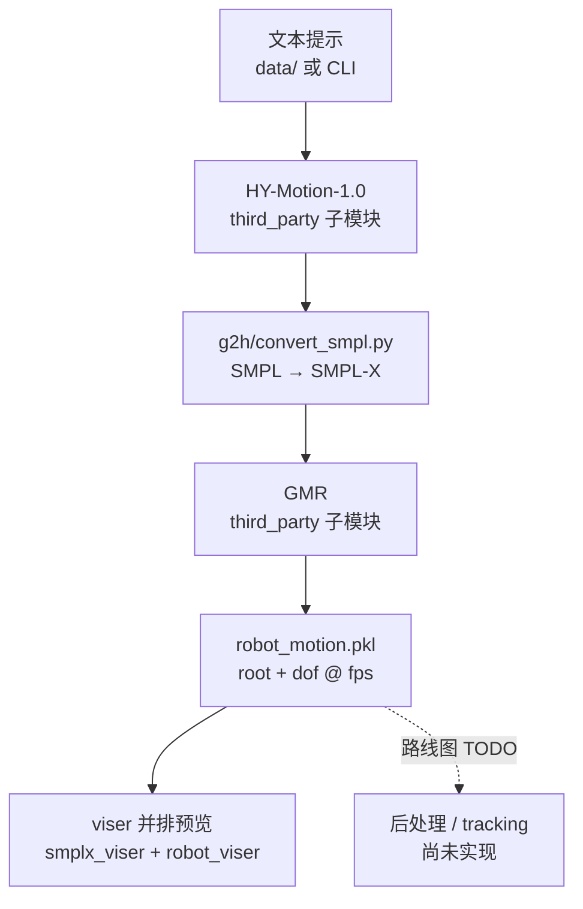

---

type: entity
tags: [repo, humanoid, text-to-motion, motion-retargeting, pipeline, hy-motion, gmr, viser, baai]
status: complete
updated: 2026-06-15
summary: "Gen2Humanoid：把 HY-Motion-1.0 文本→人体运动与 GMR 人形重定向串成一条 CLI 管线，输出 pickle 关节轨迹并支持 viser 人机并排预览；面向「语言描述→人形参考动作」快速原型，不含物理后处理与 tracking 训练。"
related:
  - ../methods/hy-motion-1.md
  - ../methods/motion-retargeting-gmr.md
  - ../concepts/motion-retargeting-pipeline.md
  - ./unitree-g1.md
  - ./awesome-text-to-motion-zilize.md
sources:
  - ../../sources/repos/gen2humanoid.md
---

# Gen2Humanoid（文本→人形运动端到端管线）

**Gen2Humanoid**（[RavenLeeANU/Gen2Humanoid](https://github.com/RavenLeeANU/Gen2Humanoid)）把两条成熟开源能力——腾讯 **[HY-Motion-1.0](../methods/hy-motion-1.md)** 的 **文本→SMPL 系人体运动** 与 **[GMR](../methods/motion-retargeting-gmr.md)** 的 **人体→人形关节几何重定向**——封装成可一键运行的 **Python 管线**。它解决的是「**语言描述如何最快变成某台人形的关节参考轨迹**」，而不是重新发明生成或重定向算法；可视化层用 **viser** 做人机并排对比，便于定性检查重定向伪影。

## 一句话定义

**HY-Motion 生成 + SMPL→SMPL-X 桥接 + GMR 重定向 + viser 预览** 的轻量胶水仓库，把文本提示端到端映射为 `robot_motion.pkl` 关节序列。

## 英文缩写速查

| 缩写 | 英文全称 | 简要说明 |
|------|----------|----------|
| T2M | Text-to-Motion | 文本描述驱动的人体/机器人运动生成 |
| GMR | General Motion Retargeting | 人体参考→机器人关节的几何重定向 |
| SMPL-X | SMPL eXpressive | 带手/脸的 SMPL 扩展人体参数化 |
| DoF | Degrees of Freedom | 机器人关节自由度数量 |
| IK | Inverse Kinematics | 满足末端/关键点约束的关节角求解 |
| WBT | Whole-Body Tracking | 重定向产物用于下游全身跟踪训练 |

## 为什么重要

- **低门槛串联两条 SOTA 栈**：不必分别配置 HY-Motion 推理环境与 GMR 数据接口；`git submodule` 拉齐依赖，`commands/run_pipeline.sh` 即可跑通 **Text → Robot Motion**。
- **显式暴露「生成→重定向」接缝**：HY 输出经 `convert_smpl.py` 统一到 **SMPL-X**，再进 GMR——与 [Motion Retargeting Pipeline](../concepts/motion-retargeting-pipeline.md) 中「生成式上游 + 运动学前端」的分工一致，便于讨论 **脚滑、全局漂移** 等伪影是否在重定向阶段被放大。
- **多机型开箱**：README 默认列出 **Unitree G1 / H1**、**Booster T1**；完整机型表以 GMR 子模块为准，适合与 [Unitree G1](./unitree-g1.md) 等实体页对照硬件 DoF。
- **诚实边界**：README **TODO** 标明尚缺 **后处理（脚滑/自碰）**、**条件生成**、**动作混合** 与 **motion tracking**——产物应视为 **运动学参考初稿**，不宜直接上真机 PD 或当作 WBT 终态数据。

## 流程总览

## 工程要点

| 维度 | 说明 |
|------|------|
| **安装** | Conda `python==3.10`；递归克隆子模块；分别 `pip install` GMR 与 HY 依赖；`download_hy_model.sh` / `download_smplx.sh` 拉权重与人体模型 |
| **入口** | `scripts/pipeline.py`；`commands/run_visualise.sh` 回放结果 |
| **输出** | `robot_motion.pkl`：`fps`、`robot_type`、`num_frames`、`root_pos`、`root_rot`（四元数 xyzw）、`dof_pos` |
| **许可** | 核心代码 MIT；**端到端**使用继承 HY-Motion **非商用科研** 条款——商用须单独取得腾讯授权 |
| **数据集** | Hugging Face [Gen2Humanoid-HY-Motion-1.0](https://huggingface.co/datasets/RavenLeeANU/Gen2Humanoid-HY-Motion-1.0) 与管线配套 |

## 在知识库中的位置

- 相对 **[HY-Motion 1.0](../methods/hy-motion-1.md)**：本仓是 **消费方/集成方**，不替代官方训练与对齐叙事。
- 相对 **[GMR](../methods/motion-retargeting-gmr.md)**：本仓把 GMR 固定在「**生成式人体轨迹**」上游，与 MoCap / 视频估计源并列；须牢记 GMR **非物理** 局限与 [ExoActor](../methods/exoactor.md) 类「跳过重定向」消融语境。
- 相对 **[ProtoMotions](./protomotions.md)** 等仿真学习框架：Gen2Humanoid **止于运动学 pickle**，不包含并行仿真、RL tracking 或 Sim2Real 导出。

## 关联页面

- [HY-Motion 1.0](../methods/hy-motion-1.md) — 上游文本→人体运动生成
- [GMR（通用动作重定向）](../methods/motion-retargeting-gmr.md) — 中游几何重定向
- [Motion Retargeting Pipeline](../concepts/motion-retargeting-pipeline.md) — 端到端工程链路语境
- [Unitree G1](./unitree-g1.md) — 默认支持机型之一
- [Awesome Text-to-Motion（Zilize）](./awesome-text-to-motion-zilize.md) — T2M 文献与工具索引

## 参考来源

- [Gen2Humanoid 仓库归档](../../sources/repos/gen2humanoid.md)
- [Tencent HY-Motion-1.0 仓库归档](../../sources/repos/tencent_hunyuan_hy_motion_1_0.md)

## 推荐继续阅读

- 项目 README：<https://github.com/RavenLeeANU/Gen2Humanoid/blob/master/README.md>
- HY-Motion 官方仓：<https://github.com/Tencent-Hunyuan/HY-Motion-1.0>
- GMR 源码：<https://github.com/YanjieZe/GMR>
