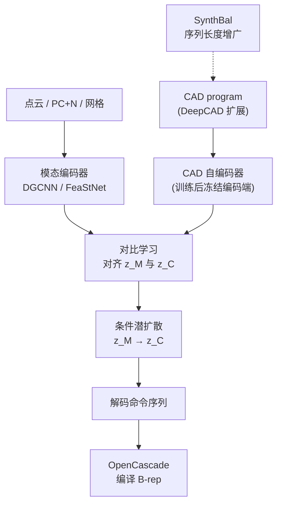

# GenCAD-3D（Multimodal Geometry → CAD Program）

**GenCAD-3D** 是 MIT **Nomi Yu、Md Ferdous Alam、A John Hart、Faez Ahmed** 的工作（arXiv:2509.15246，[JMD](https://doi.org/10.1115/1.4069276)，[项目页](https://gencad3d.github.io/)，[代码](https://github.com/yunomi-git/GenCAD-3D)）：从 **点云、点云+法向或网格** 自动生成 **参数化 CAD 命令序列**，服务 **逆向工程**（扫描件 → 可编辑 CAD）与 **设计自动化**。方法在 [GenCAD](./gencad.md) 的 **「冻结 CAD 自编码器 + 对比对齐 + 条件潜扩散」** 框架上，引入 **3D 几何编码器** 与 **SynthBal** 合成数据策略，并发布 **GenCAD3D** 多模态数据集与 **51** 件 **3D 打印+激光扫描** 真实部件子集。

## 一句话定义

**把几何观测与 CAD program 压到同一潜空间，用扩散先验完成「扫描/网格 → 命令序列」，并用 SynthBal 让模型在长尾高复杂度样本上也能收敛。**

## 英文缩写速查

| 缩写 | 英文全称 | 简要说明 |
|------|----------|----------|
| Sim2Real | Simulation to Real | 把仿真中学到的策略迁移落地真机的工程主线 |
| CAD | Computer-Aided Design | 计算机辅助设计，硬件结构建模 |
| LLM | Large Language Model | 大语言模型，常作高层任务/语言接口 |
| STL | Stereolithography (3D model file) | 3D 打印常用的三角网格模型文件格式 |
| API | Application Programming Interface | 应用程序编程接口 |
| URDF | Unified Robot Description Format | 统一机器人描述格式 |

## 为什么重要

- **逆向工程自动化：** 备件断供、老设备翻新等场景常只有 **扫描点云** 而无历史 CAD；可编辑 **CAD program** 比纯 mesh 更利于 **改公差、改特征、下 CAM**。
- **数据瓶颈显性化：** DeepCAD 等库 **简单形状占主导**，平均指标掩盖 **长序列** 失败；**SynthBal** 针对 **序列长度分布** 增广，论文报告 **无效 CAD 率** 与 **高复杂度 Chamfer** 显著改善。
- **机器人硬件链：** 自定义夹具/支架常经历 **扫描或网格 → CAD → STEP → 加工/仿真**；本工作与 [文字生成 CAD](../concepts/text-to-cad.md) 的 **LLM+脚本** 路线互补，偏 **学习式几何反演**。

## 核心结构

| 模块 | 作用 |
|------|------|
| **CAD 自编码器** | 因果 Transformer；训练一次后 **对比阶段冻结** CAD 编码器，便于扩展大数据集。 |
| **几何编码器** | **DGCNN**（点云）；**DGCNN+法向**（PC+N）；**FeaStNet**（网格，密度加权池化）。 |
| **对比对齐** | CLIP 式损失对齐 \( \mathbf{z}_{\mathcal{C}} \) 与 \( \mathbf{z}_{\mathcal{M}} \)，支持 **跨模态检索**。 |
| **条件潜扩散** | \( p(\mathbf{z}_{\mathcal{C}} \mid \mathbf{z}_{\mathcal{M}}) \) + 已训练 decoder；每模态独立 prior。 |
| **SynthBal** | 对欠表示 **命令序列长度** 合成 CAD program，合并训练划分（含 **SynthBal_1M** 轻量子集）。 |

### 流程总览

## 数据与复现要点

- **Hugging Face：** 数据集与权重见 [`yu-nomi/GenCAD_3D`](https://huggingface.co/datasets/yu-nomi/GenCAD_3D)；主包 **GenCAD3D** 体量约 **127 GB**（含 CAD、点云、网格、STL、STEP），须配置 `paths.py` 中 `DATA_PATH`。
- **真实扫描：** **GenCAD3D_Scans**（约 **700 MB**）含 **51** 件打印件的 **原始/净扫** 与配对 CAD，用于评估 **物理扫描噪声**。
- **推理示例：** 可对自定义 **STL** 跑 `visualize_diffusion_inference`；生成 **h5** 程序后可用 **Onshape API** 推送到 Part Studio（需用户密钥，见仓库 README）。
- **环境：** `pythonocc-core`（README 示例 **7.9.0**）+ PyTorch；Chamfer/IoU 评测需按 README 准备点云采样（与 DeepCAD 评测脚本衔接）。

## 数据与就绪度速查

- **重定向就绪度（资产层面）：** 输出参数化 CAD 命令序列，可导出 STEP/STL 等网格，便于下游 CAD 编辑与仿真导入适配；非机器人动作数据，无运动重定向语境。

## 常见误区或局限

- **误区：** 认为 **SynthBal** 可替代 **真实扫描域适应**；论文仍强调 **GenCAD3D_Scans** 对 **激光扫描伪影** 的必要性。
- **误区：** 把 **sketch-and-extrude** 实验覆盖等同于 **全工业特征库**；fillet/revolve 等需扩展命令词表与数据。
- **局限：** 训练与数据体量对大；mesh 编码器收益依赖 **网格质量**；下游 **Onshape** 导出绑定特定 SaaS 工作流。

## 关联页面

- [GenCAD](./gencad.md) — **图像条件** 前序工作与共享架构族。
- [文字生成 CAD（Text-to-CAD）](../concepts/text-to-cad.md) — 自然语言/脚本 CAD 与 **几何→program 学习** 对照。
- [URDF-Studio](./urdf-studio.md) — CAD/网格进入机器人描述的工作流参照。
- [Sim2Real](../concepts/sim2real.md) — 扫描/CAD/仿真网格一致性提醒。

## 推荐继续阅读

- [GenCAD-3D 项目页](https://gencad3d.github.io/)
- [arXiv:2509.15246](https://arxiv.org/abs/2509.15246)
- [GenCAD-3D GitHub](https://github.com/yunomi-git/GenCAD-3D) · [HF 数据集](https://huggingface.co/datasets/yu-nomi/GenCAD_3D)

## 参考来源

- [GenCAD-3D 论文摘录（arXiv:2509.15246）](../../sources/papers/gencad3d_arxiv_2509_15246.md)
- [GenCAD-3D 项目主页（原始资料）](../../sources/sites/gencad3d-github-io.md)
- [yunomi-git/GenCAD-3D 仓库（原始资料）](../../sources/repos/yunomi-git-gencad-3d.md)
