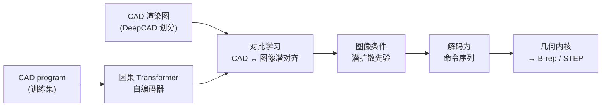

# GenCAD（Image-Conditioned CAD Program Generation）

**GenCAD** 是 MIT **Md Ferdous Alam** 与 **Faez Ahmed** 的工作（arXiv:2409.16294，[项目页](https://gencad.github.io/)，[代码](https://github.com/ferdous-alam/GenCAD)）：从 **CAD 零件的渲染图** 条件生成 **完整参数化命令序列（CAD program）**，而非仅输出三角网格或体素。生成序列可在 **OpenCascade** 等内核上 **编译为 B-rep 实体**，从而保留 **工程可编辑性**——与 [文字生成 CAD](../concepts/text-to-cad.md) 所强调的 **制造/设计真值** 取向一致。

## 一句话定义

**用「图像 ↔ CAD 潜空间」对比对齐 + 图像条件潜扩散，把 2D 外观观测还原成可编译的 CAD 命令历史。**

## 为什么重要

- **表示选择：** 机器人夹具与结构件研发仍依赖 **STEP / 特征树**；GenCAD 把生成目标定在 **CAD program** 层，避免 mesh 路线在 **公差、特征编辑、设计空间探索** 上的断层。
- **可检索：** 除生成外，同一框架支持 **图像条件 CAD 检索**（项目 Demo 在约 **7k** 级程序库上做 top-k），适合 **零件库复用** 与 **相似件查找** 场景。
- **与 3D 扩展的关系：** 后续 **GenCAD-3D** 将同一 **「对比对齐 + 条件扩散 + 冻结 CAD 解码器」** 骨架推广到 **点云/网格**（见 [GenCAD-3D](./gencad-3d.md)），形成 **2D 渲染 → 3D 扫描** 的逆向工程谱系。

## 核心结构

| 阶段 | 作用 |
|------|------|
| **CAD 自编码** | 因果 Transformer 将 DeepCAD 式 **命令–参数矩阵** 压入连续潜空间 \( \mathbf{z}_{\mathcal{C}} \)。 |
| **对比对齐** | 对齐 **CAD 潜向量** 与 **等轴测渲染图** 潜向量，建立跨模态检索与条件生成接口。 |
| **条件潜扩散** | 以图像潜为条件，在 CAD 潜空间训练 **denoising prior**（ResNet-MLP 去噪器）。 |
| **解码与编译** | 采样 \( \mathbf{z}_{\mathcal{C}} \) 后解码为命令序列，再经几何内核得到 **B-rep**。 |

### 流程总览

## 常见误区或局限

- **误区：** 把 **渲染图条件** 等同于 **任意真实照片** 开箱可用；论文管线以 **数据集渲染** 为条件域，域外照片需额外标定或微调。
- **误区：** 认为输出 **无需人工审图** 即可投产；复杂装配、公差链与 DFM 仍须专业 CAD 复审（参见 [Text-to-CAD](../concepts/text-to-cad.md) 边界讨论）。
- **局限：** 实验命令集与 DeepCAD 一致，侧重 **sketch-and-extrude**；工业 **fillet / loft / revolve** 等需架构扩展（GenCAD-3D 论文声明可扩展但本研究未全量覆盖）。

## 关联页面

- [GenCAD-3D](./gencad-3d.md) — **点云/网格→CAD** 与 **SynthBal** 数据平衡扩展。
- [文字生成 CAD（Text-to-CAD）](../concepts/text-to-cad.md) — 自然语言/对话式 CAD 与 **学习式 CAD program** 路线对照。
- [URDF-Studio](./urdf-studio.md) — CAD/STEP 下游到机器人描述与仿真的常见衔接点。
- [Sim2Real](../concepts/sim2real.md) — 若用生成 CAD 作仿真碰撞源，仍需 **网格简化与惯性校验**。

## 推荐继续阅读

- [GenCAD 项目页](https://gencad.github.io/)（交互 Demo）
- [arXiv:2409.16294](https://arxiv.org/abs/2409.16294)
- [DeepCAD（ICCV 2021）](https://arxiv.org/abs/2105.09492) — 数据集与无条件 CAD 生成基线语境

## 参考来源

- [GenCAD 论文摘录（arXiv:2409.16294）](../../sources/papers/gencad_arxiv_2409_16294.md)
- [GenCAD 项目主页（原始资料）](../../sources/sites/gencad-github-io.md)
- [ferdous-alam/GenCAD 仓库（原始资料）](../../sources/repos/ferdous-alam-gencad.md)
