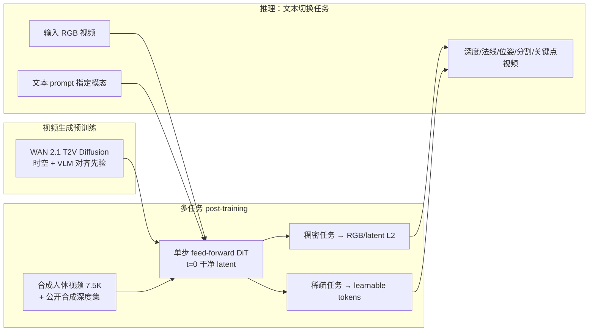

# GenCeption

**GenCeption**（*Video Generation Models are General-Purpose Vision Learners*，arXiv:2607.09024，**ECCV 2026**，[项目页](https://genception.github.io/)）由 **Google DeepMind** 牵头（多伦多大学、UCL、牛津、MIT、隆德大学等合作）提出：将预训练 **text-to-video 扩散模型（WAN 2.1）** **改造成单步 feed-forward 感知器**，在 **共享 DiT 权重** 下以 **文本 prompt** 统一服务 **稠密与稀疏视频任务**——深度、表面法线、相机位姿、前景/指代分割、DensePose、2D/3D 人体关键点等，并在多项 benchmark **达到或超越专用 SOTA**（Depth Anything 3、SAM3、D4RT、VGGT-Ω、Sapiens、ReferEverything 等）。

> **发布状态：** 代码 **TBA（即将开源）**；截至 ingest 仅论文与项目页可用。

## 核心信息

| 字段 | 内容 |
|------|------|
| 机构 | 谷歌 DeepMind（Google DeepMind）；多伦多大学；伦敦大学学院；牛津大学；麻省理工；隆德大学 |
| 会议 | ECCV 2026 |
| 基座 | WAN 2.1 text-to-video diffusion（1.3B / 14B） |
| 训练数据 | 主：**7,500** 条 Blender 合成人视频；指代分割混入 MeViS / Ref-COCO / YouTube-VOS |
| 评测设定 | 除指代分割外，**未使用各 benchmark 训练集**；主训练 **纯合成** |

## 一句话定义

用 **「视频生成预训练 + 最小改动的 feed-forward 后训练 + RGB/ token 统一输出格式」** 证明：**text-to-video 扩散骨干** 已内嵌 **4D 时空与视觉–语言先验**，经 **文本指令对齐** 即可成为 **跨任务统一视频感知基础模型**，且具备 **极高数据效率** 与 **合成→真实/OOD** 涌现泛化。

## 英文缩写速查

| 缩写 | 英文全称 | 简要说明 |
|------|----------|----------|
| DiT | Diffusion Transformer | 视频扩散主干；GenCeption 将其改为单步感知器 |
| FVM | Foundation Vision Model | 统一理解与生成的视觉基础模型方向 |
| T2V | Text-to-Video | 文本到视频生成，本文预训练任务 |
| MPJPE | Mean Per Joint Position Error | 3D 人体关键点平均关节位置误差 |
| J&F | Jaccard and F-measure | 视频指代分割常用指标（IoU 与轮廓精度均值） |
| ATE | Absolute Trajectory Error | 相机轨迹绝对平移误差 |
| OOD | Out-of-Distribution | 训练分布外类别或场景（如动物、机器人） |
| ZS | Zero-Shot Transfer | 未在目标域训练集上微调的泛化评测 |

## 为什么重要

- **范式延伸：** 在 [Vision Banana](./vision-banana.md) 论证 **图像生成预训练** 之后，本文将同一逻辑推进到 **原生视频域**——**时序一致性、4D 几何、运动理解** 成为生成预训练的副产品。
- **统一架构证据：** 单 **WAN 2.1 DiT + 文本 prompt** 覆盖 **几何（深度/法线/位姿）+ 分割 + 3D 人体**，任务规格从 **改架构** 转为 **改数据格式**（类比 LLM 的 text completion）。
- **数据效率：** 14B 模型仅用 **~0.9M–1.23M 合成帧** 即可在深度任务逼近 **D4RT / VGGT-Ω**（后者用 **数十至数百倍** 帧数）；对 **机器人数据稀缺** 场景有启示。
- **涌现世界模型：** 纯合成人视频训练 → **真实视频、多实例、动物/机器人** 零样本泛化，支持「生成骨干内嵌 **物理世界模型**」假说。
- **机器人/AR 上游：** **4D 人体关键点**（遮挡、ego、多视角）、**grounded 4D 重建**、**语言指代分割** 可直接服务 **遥操作、导航、操作规划** 的多模态感知栈（见 [视觉表征作为策略输入](../concepts/visual-representation-for-policy.md)）。

## 核心机制

### 1. 扩散 → 单步 feed-forward

| 步骤 | 设计 |
|------|------|
| 输入 | **干净** 输入视频 VAE latent（非噪声） |
| Timestep | 固定 **t=0**（Rectified Flow 终止态） |
| 前向 | **单次** DiT 前向，取 **最后一层** 特征 |
| 输出对齐 | 对 velocity 预测 **取负**（$-v \approx x_0 - \epsilon$）再解码 |
| 效率 | 消除 WAN 默认 **50 步** 采样；14B：**10.03 s / 81 帧**（v6e TPU） |

### 2. 稠密任务：RGB ambient 空间

深度、法线、分割、DensePose、**Rothko raymap**（6 通道相机射线压进 3 通道 RGB）均在 **[0,1] RGB** 表示；**统一 L2 loss**（稠密任务在 latent 空间）。深度经 **场景中值归一化 + $\alpha\log(d+1)$** 消除尺度歧义。

### 3. 稀疏任务：可学习 token

每帧追加 **learnable token** + MLP 回归 **2D/3D 关键点**；用 **3D RoPE** 与时间位置插值贴合 DiT 预训练分布。**联合多任务训练时 3D 关键点易退化**——token 路径与生成预训练注意力机制冲突（论文重要教训）。

## 流程总览

## 主要结果（Generalist-L，14B，节选）

| 任务 | 基准 | GenCeption Generalist-L | 对照（论文 Table 1） |
|------|------|-------------------------|----------------------|
| 法线 | Hi4D mAE ↓ | **11.47** | Sapiens：12.14 |
| 深度 | Sintel AbsRel ↓ | **0.156** | Depth Anything 3：0.201 |
| 深度 | KITTI AbsRel ↓ | **0.048** | D4RT：0.051；VGGT-Ω：0.041 |
| 相机位姿 | Sintel ATE ↓ | **0.062** | VGGT：0.168 |
| 前景分割 | VideoMatte MSE ↓ | **0.0010** | MODNet：0.0054 |
| 指代分割 | Ref-DAVIS J&F ↑ | **75.8** | ReferEverything：75.0 |
| 指代分割 | MeViS J&F ↑ | **69.0** | SAM3+Gemini：57.5 |
| 数据效率 | 深度平均 AbsRel ↓ | **0.071**（1.23M 帧） | VGGT-Ω：**0.067**（~600M 帧） |

**预训练对照（同 7.5K 合成视频）：** WAN 2.1 14B 深度平均 AbsRel **0.093** >> VideoMAE V2 1B **0.154** >> V-JEPA 0.6B **0.281**。

## 涌现行为

- **Sim-to-real：** 合成 Blender 训练 → 真实视频细节（毛发、胡须）可 **优于训练渲染**。
- **多实例：** 单物体合成 → 真实场景 **多目标** 分割/深度。
- **OOD 类别：** 仅人类训练 → **动物、机器人、火箭** 等 **语言指代分割**。
- **Grounded 4D：** 单视频预测几何 + 位姿 → **4D 点云** + 语言接地 fly-through（项目页演示）。

## 常见误区或局限

- **误区：「任意视频扩散模型 zero-shot 就能统一感知。」** 需 **feed-forward 改造 + RGB/token 格式对齐 + 合成数据管线**；raw 多步生成 **太慢且难定量**。
- **误区：「Generalist 全面优于 Specialist。」** 联合训练在 **深度/位姿** 上可能略逊于单任务 Specialist-L；**3D 关键点** 联合训练 **明显退化**。
- **局限：** 推理仍需 **14B 级 DiT + 81 帧视频**，真机 **实时闭环** 未验证；权重 **尚未公开**。
- **局限：** 稀疏 token 路径与生成预训练 **架构张力** 提示：未来或需 **原生支持结构化输出** 的预训练目标。

## 与其他页面的关系

- [生成式视觉预训练](../concepts/generative-vision-pretraining.md) — 范式：从图像到 **视频 feed-forward 统一感知**
- [Vision Banana](./vision-banana.md) — **图像域** 姊妹工作（NBP + instruction-tuning）；本文扩展至 **视频 + 单步推理**
- [视觉骨干](../concepts/vision-backbones.md) — 判别式 ViT/DINO 传统主线对照
- [视觉表征作为策略输入](../concepts/visual-representation-for-policy.md) — 机器人如何选择上游 **4D/分割/深度** 表征
- [目标检测](../methods/object-detection.md) — 2D/视频感知任务谱系
- [VLA](../methods/vla.md) — 语言条件机器人；GenCeption 提供 **原生 VLM 对齐的视频感知** 上游可能

## 推荐继续阅读

- arXiv 全文：<https://arxiv.org/abs/2607.09024>
- 交互演示：<https://genception.github.io/>
- Gabeur et al., *Image Generators are Generalist Vision Learners* — [Vision Banana](./vision-banana.md)
- Depth Anything 3 / D4RT / VGGT-Ω — 本文主要几何对照专家

## 参考来源

- [Video Generation Models are General-Purpose Vision Learners（arXiv:2607.09024）](../../sources/papers/genception_arxiv_2607_09024.md)
- [GenCeption 项目页](../../sources/sites/genception-project.md)
