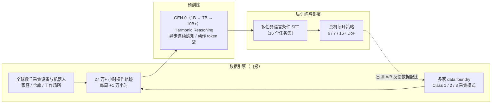

# GEN-0：随物理交互规模化的具身基础模型

| 字段 | 内容 |
|------|------|
| **机构** | 通用人工智能（Generalist AI） |
| **类型** | 产业官方博客（非 peer-reviewed 论文；无 arXiv 技术报告） |
| **模型** | GEN-0（后续 [GEN-1](./generalist-gen1.md) / [GEN-1.5](./generalist-gen15-one-shot.md)） |
| **发布** | 2025-11-04；GTC 现场演示博文 2026-03-24 |
| **规模** | 自报相变点约 7B，已扩展至 10B+ |
| **开源** | **未见公开**代码 / 权重 / 数据（2026-10-09 核查博文与 Hugging Face；GitHub 组织页本环境无法访问） |

## 一句话定义

**GEN-0** 是 Generalist AI 的首代具身基础模型系列：不再以视觉-语言预训练为主要跳板，而是 **直接在 27 万+ 小时真实世界物理交互数据上做多模态预训练**，并据此宣称机器人侧也出现了 **可预测的 scaling law** 与 **约 7B 的"智能阈值"相变**。

## 英文缩写速查

| 缩写 | 英文全称 | 简要说明 |
|------|----------|----------|
| GEN-0 | GEN-0（Generalist AI） | 公司 2025-11 发布的首代具身基础模型系列 |
| EFM | Embodied Foundation Model | 具身基础模型 |
| SFT | Supervised Fine-Tuning | 监督微调；GEN-0 后训练主要形式 |
| KL | Kullback–Leibler Divergence | KL 散度；博文用 reverse KL 衡量 mode-seeking |
| MSE | Mean Squared Error | 均方误差；此处为下一动作预测误差 |
| DoF | Degrees of Freedom | 自由度；博文称测试过 6 / 7 / 16+ DoF 本体 |
| GTC | GPU Technology Conference | NVIDIA 年度大会；2026-03 GEN-0 首次公开现场演示 |
| UR | Universal Robots | 协作机械臂厂商；GTC 演示平台提供方 |

## 为什么重要

- **把"scaling law"叙事搬到机器人本域：** 不是借 VLM 的语义泛化，而是在 **机器人自身数据** 上测"数据 / 算力 → 下游表现"的幂律（对照 [Embodied Scaling Laws](../concepts/embodied-scaling-laws.md)）。
- **模型规模存在下限：** 自报 1B 在海量物理数据下出现 **ossification**（权重"骨化"、不再吸收新信息），7B+ 才能持续受益——若成立，意味着小模型 + 大数据在具身侧可能是错配。
- **数据运营即护城河：** 27 万+ 小时、每周 +1 万小时、多家 data foundry 并行 A/B，把 [数据飞轮](../concepts/data-flywheel.md) 推到工业规模，并给出"数据质量 / 多样性 > 数量"的经验。
- **不走双系统路线：** Harmonic Reasoning 主张在单一连续流中"边想边做"，与 Figure Helix 一类 **System1-System2** 架构形成路线对照（见 [Figure AI](./figure-ai.md)）。
- **GEN 系列起点：** 后续 [GEN-1](./generalist-gen1.md)、[千手多末端](./generalist-gen1-thousand-hands.md)、[GEN-1.5 one-shot](./generalist-gen15-one-shot.md) 都建立在"足够大的物理交互预训练"这一前提上。

## 流程总览

## 核心原理

### 1. 智能阈值：7B 附近的相变（自报，Figure 1）

| 规模 | 博文描述 |
|------|----------|
| 1B | 难以吸收复杂多样的 sensorimotor 数据，早期即出现 ossification |
| 6B | 开始从预训练获益，展现较强多任务能力 |
| 7B+ | 内化大规模预训练数据，**仅几千步后训练** 即迁移到下游 |

- 指标：完全 held-out 的 **零样本长程任务** 上 next-action 验证误差；横轴为以 7B 归一化的预训练算力。
- 作者称这是机器人中 **首次观察到 ossification**；LLM 文献中类似现象出现在 O(10M) 参数，而此处在 O(1B)，并借 **Moravec 悖论** 解释：物理常识的算力"激活阈值"更高（作者立场）。
- 注意：作者脚注承认 LLM 文献中的 ossification 指 **预训练→微调** 设定，GEN-0 是在 **纯预训练阶段** 观察到"类似"行为——概念借用并不严格对应。

### 2. 预训练数据 → 下游后训练的幂律（自报，Figure 2–4）

- 用不同预训练数据量的 checkpoint，在 **16 个任务集** 上做多任务语言条件 SFT：预训练越多，所有任务的验证损失与 next-action 误差越低（含搭 Lego、快餐打包、"_ anything" 类泛化任务）。
- 下游误差拟合为：

$$
L(D) = \left(\frac{D_c}{D}\right)^{\alpha_D}
$$

  其中 \(D\) 为预训练集大小（动作轨迹条数），\(D_c, \alpha_D\) 为拟合常数（博文 **未公布数值**）。
- 用途（作者称）：估算"达到目标误差需多少预训练数据""更多预训练能替代多少任务数据"；例如对 **Clothes Handling**（分拣、理顺、扣扣子、挂衣）预测 10 亿条轨迹下的表现。
- **真机盲测 A/B：** 仅 **5.6 小时（1%）** 任务数据后训练时，预训练越多闭环成功率越高；**完整预训练 + 550+ 小时** 任务数据时部分任务峰值可达 **99%**。作者称预训练与后训练数据由不同人员在完全不同环境采集、无重叠。

### 3. Harmonic Reasoning：边想边做

- 问题：语言模型可以先"想"再答，但物理世界不会暂停等模型思考。
- 做法（仅概念披露）：让 **异步、连续时间** 的感知 token 流与动作 token 流"和声式"交织训练，使模型同时思考与行动。
- 作者主张因此可扩到很大模型，**不依赖 System1-System2 双系统**，也 **不依赖推理时引导**（博文引 Black et al. 2025 的实时 action chunking 作对照，见 [Action Chunking](../methods/action-chunking.md)）。
- 演示：**Build a camera kit** 长程灵巧任务（放布、折纸托、从塑料袋取出相机、装盒、插小折舌合盖、丢袋），模型 **无显式子任务划分**。
- 推测：架构、tokenization 与训练目标均未公开，"harmonic"具体如何实现目前无法从公开材料判断。

### 4. 数据引擎与预训练科学（自报）

- **规模：** 27 万小时真实操作轨迹，采自全球数千个家庭、仓库与工作场所；每周 10,000+ 小时新增且在加速；训练时每天可吸收 **6.85 年** 的操作经验；数据压缩后为 **数十 PB**，处理用 O(10K) CPU 核。
- **数据配比消融（Table 1）：** 8 种预训练数据（不同 foundry 合作方 × Class 1 特定任务 / Class 2 中间 / Class 3 do-anything），微调到 10 个长程任务集，比较验证 MSE 与 **reverse KL**。
- **经验规则（作者结论）：** 低误差 + 低 reverse KL → 更适合 SFT；高误差 + 低 reverse KL → 分布更多峰，可能更利于后训练 RL；"数据质量与多样性比数量更重要"。
- Table 1 数值差异很小（误差约 0.0030–0.0034），无误差棒，排序结论应谨慎引用。

### 5. 跨本体

- 作者称架构 **按设计跨本体**，已在 **6DoF、7DoF 与 16+DoF 半人形** 机器人上测试（未给各本体的定量结果）。GTC 演示（下节）是这一主张的公开现场佐证。

## GTC 2026 现场演示：泛化速度的阶跃

> 来源：*The Real Breakthrough Behind Our GTC Demo*（2026-03-24，Story 类博文，无定量指标）

- **事件：** NVIDIA GTC 2026（博文发布前一周）上，Generalist 应 **Universal Robots** 邀请在其展台现场演示 GEN-0，作者称这是公司 **首次公开现场演示**，展会全部开放时段不间断运行。
- **全新本体：** UR 新移动操作平台——**UR7e 机械臂 + MiR 移动底盘 + Vention 框架**，作者称该组合"此前不存在"。
- **时间线（自报）：**

| 节点 | 内容 |
|------|------|
| 会前约 1 个月 | 未见过实机即答应演示 |
| 波士顿办公室 | 机器人到达两天后跑通演示任务 |
| 旧金山办公室 | 到达一天内打包出第一箱；再用三个完整工作日做最终准备 |
| GTC 现场 | 开箱启动后性能与办公室"一致"；**未使用任何展厅内数据** |

- **任务：** 多步骤装盒，强调 **运动精度**（盒件公差紧）与 **力精度**（不压皱纸张与纸板）；现场用曲棍球杆施加干扰展示恢复能力。
- **作者主张：** 重点不是演示本身，而是 GEN-0 带来的"**泛化速度阶跃**"——对新机器人、新环境足够快的适配，"几个月前还不可能"。
- **边界：** 博文未说明这几天里是否在新平台上采集任务数据并做后训练、用了多少数据或步数，也无成功率统计。推测：较合理的读法是"预训练基座 + 新平台少量后训练"，而非零样本跨本体，但无法从公开材料确认。

## 工程实践

| 项 | 实践要点 |
|----|----------|
| **规模选型** | 若自建大规模物理数据预训练，留意小模型"骨化"风险：监控 held-out 长程任务误差是否随算力早早饱和 |
| **评估协议** | 借鉴其"预训练 / 后训练数据由不同人员、不同环境采集"的隔离做法，避免泄漏抬高 scaling 曲线 |
| **数据配比** | 同时看预测误差与 reverse KL：前者服务 SFT，后者（多峰性）可能影响后续 RL |
| **预算规划** | 幂律 \(L(D)\) 可用来权衡"多采预训练数据"与"多采任务数据"；需先在自有数据上拟合 \(D_c, \alpha_D\) |
| **开源状态** | 无公开代码 / 权重，**不适用源码运行时序图**；可复现的规模化对照见 [Foundation Policy](../concepts/foundation-policy.md) 中的开源基座 |

## 局限与风险

- **全部自报、不可复现：** 曲线无原始数值、无第三方基准；"首次观察到 ossification""数据多数个数量级"为作者立场。
- **指标以离线误差为主：** 相变与幂律大多基于 next-action 预测误差 / 验证损失，真机成功率只在 Figure 3 给出且未列具体任务数值（"峰值 99%"仅指部分情况）。
- **Harmonic Reasoning 黑箱：** 只有概念描述，无法与 [Action Chunking](../methods/action-chunking.md)、双系统 VLA 做机制级比较。
- **GTC 叙事无数据：** "几天适配新本体"缺少数据量、微调步数、成功率等关键信息。
- **概念借用需谨慎：** ossification 在 LLM 文献中的原定义与本文观察场景不同（作者已脚注说明）。

## 关联页面

- [Generalist AI（公司入口）](./generalist-ai-robotics.md)
- [GEN-1（后续代际）](./generalist-gen1.md)
- [GEN-1 千手：跨末端执行器泛化](./generalist-gen1-thousand-hands.md)
- [GEN-1.5 一次示范学习](./generalist-gen15-one-shot.md)
- [物理常识（Generalist 叙事）](./physical-commonsense-generalist.md)
- [Embodied Scaling Laws](../concepts/embodied-scaling-laws.md)
- [Foundation Policy](../concepts/foundation-policy.md)
- [Data Flywheel](../concepts/data-flywheel.md)
- [跨具身知识链](../overview/hub-cross-embodiment.md)
- [Manipulation](../tasks/manipulation.md)
- [Action Chunking](../methods/action-chunking.md)
- [Figure AI](./figure-ai.md) — Helix 双系统路线对照

## 参考来源

- [GEN-0 / Embodied Foundation Models That Scale with Physical Interaction（来源归档）](../../sources/blogs/generalist_gen0.md)
- [The Real Breakthrough Behind Our GTC Demo（来源归档）](../../sources/blogs/generalist_gtc_demo_2026.md)
- 原文：<https://generalistai.com/blog/gen-0>
- 原文：<https://generalistai.com/blog/the-real-breakthrough-behind-our-gtc-demo>

## 推荐继续阅读

- Kaplan, J., McCandlish, S., et al. (2020). *Scaling Laws for Neural Language Models* — 博文对标的 LLM scaling law
- Hernandez, D., et al. (2021). *Scaling Laws for Transfer* — ossification 与预训练→微调迁移 scaling
- Springer, J., et al. (2025). *Overtrained Language Models Are Harder to Fine-Tune* — LLM 侧 ossification 证据
- Black, K., et al. (2025). *Real-Time Execution of Action Chunking Flow Policies* — 推理时引导路线对照
