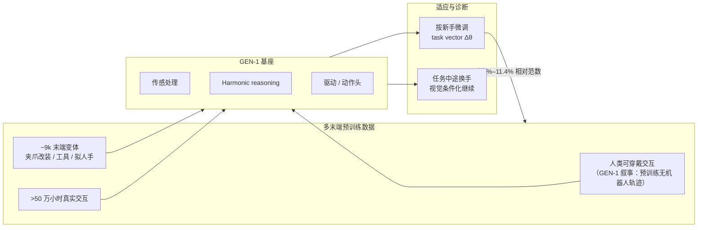

# GEN-1 千手：跨末端执行器泛化

| 字段 | 内容 |
|------|------|
| **机构** | 通用人工智能（Generalist AI） |
| **类型** | 产业官方博客（非 peer-reviewed 论文） |
| **模型** | GEN-1（前序 GEN-0） |
| **发布** | 2026-07 |
| **开源** | **确认未开源**（无公开代码 / 权重 / 数据集；截至 2026-07-24） |

## 一句话定义

**Generalist GEN-1「千手」叙事：把末端执行器当作可互换的 sensorimotor 接口，用数千手形态混合预训练同一基础模型，使其在换手、甚至任务中途换手时仍能条件化适应接触策略。**

## 英文缩写速查

| 缩写 | 英文全称 | 简要说明 |
|------|----------|----------|
| GEN-1 | GEN-1（Generalist AI） | 公司最新具身基础模型；本篇讨论其多末端扩展 |
| EE | End Effector | 末端执行器 / 「手」；夹爪、工具头与拟人手等 |
| EFM | Embodied Foundation Model | 具身基础模型；跨任务/跨接口预训练的策略母类 |
| VLA | Vision-Language-Action | 通才操作策略常见形态；本篇未公开具体架构细节 |
| ATC | Automatic Tool Changer | 工业自动换刀/换手机构；形态学爆炸的硬件前提 |

## 为什么重要

- **跨具身的细粒度轴：** 多数「跨具身」讨论骨架/自由度差异；本篇把问题收窄为 **同一臂身、不同手/工具接口**——对产线 tool changer 与家用工具箱叙事更直接。
- **可操作的诊断思想：** 用 **微调权重相对范数（task vector）** 量化新手「新颖度」，并分解到传感 / 推理 / 驱动子系统，把「该补什么数据」从直觉变成可对照的干预信号。
- **在线条件化，而非每手一策略：** 任务中途物理换手仍用同一 checkpoint 继续 rollout，强调 **按所见末端条件化** 的混合训练先验，而非死记固定操纵套路。
- **与开源跨具身路线对照：** [Open X-Embodiment](../concepts/open-x-embodiment.md) / [Octo](../methods/octo-model.md) 强调多机型公开数据；本篇是 **闭源、超大规模 in-house 数据** 上的商业对照样本——引用须标明来源边界。

## 流程总览

## 核心原理

### 1. 手是接口，物理是共享表征

博客核心口号：**Hands can change, physics does not.**  
每个末端是不同的 sensorimotor interface（几何、摩擦、力、驱动带宽不同），但跨数千接口预训练被解释为学习可迁移的 **physical commonsense representations**——抓、推、拉、拧等交互的共性先验。

### 2. 「多语言」类比

- 动力螺丝刀转速超出手指可匹配范围；胶带座需同时管张力和落点；夹钳引入弹簧柔顺；刮铲面对 **分布式接触** 而非点接触；刀具需沿约束路径控力。
- 类比多语言 LM：跨「手语」学习有助于把 **工具特异** 与 **世界共通** 分开；选对工具被表述为一种 **physical reasoning**（对照 multilingual CoT）。

### 3. Task vector 度量「新手」新颖度

| 观察 | 含义（博客） |
|------|----------------|
| 相对参数范数 **2.5%–11.4%** | 不同末端微调「再教育」幅度差异大 |
| 螺丝刀 ≫ 夹钳 | 新驱动模式可能比外形变化更贵 |
| 打蛋器显著动传感权重 | 细、稀疏视觉几何更吃感知子系统 → 应针对性补数据 |

这把「数据该加在哪」从经验口号落到 **子系统级权重移动**——对闭源系统外部读者仍可借鉴为评测/消融设计思路。

### 4. 任务中途换手

混合多手数据迫使策略 **条件化于当前所见末端**；演示中模型在换手后改轨迹与接触策略完成同一目标。工程读法：部署侧若搭配 tool changer，策略需把「我现在是什么手」当作可观测条件，而非隐式写死在 checkpoint 身份里。

## 工程实践

| 项 | 实践要点 |
|----|----------|
| **数据多样性轴** | 不只换机型，还系统化换 **接触物理**（宽指、薄丝、旋转工具、柔顺夹钳等） |
| **主导手偏差** | 承认两指夹爪等会像「英语」一样主导；扩展数据需刻意，并在真实基准上测是否伤害主形态 |
| **诊断闭环** | 新手微调 → 看 Δθ 落在传感还是驱动 → 决定补视觉稀疏工具还是新驱动示教 |
| **在线换手评测** | 除 zero-shot 新手外，增加 **mid-episode tool swap** 协议，检验条件化而非记忆 |
| **开源状态** | **不适用源码运行时序图**——确认未开源；外部无法复现权重或数据配方 |
| **选型对照** | 需要可复现跨机训练时优先 [OXE](../concepts/open-x-embodiment.md) / 开源 VLA；本页供理解产业 scaling 叙事与评测设计 |

## 与其他工作对比

| 维度 | GEN-1 千手（本页） | Open X / Octo 等开源跨具身 | Any2Any 等 WBT 跨机 |
|------|-------------------|---------------------------|---------------------|
| 主要变化轴 | **末端 / 工具接口** | 多臂身、多机型、多实验室 | 人形全身跟踪跨骨架 |
| 数据 | 闭源 in-house 海量小时 | 公开异构演示聚合 | 仿真/真机运动跟踪数据 |
| 适应手段 | 多手预训练 + 微调；演示中途换手 | 多形态联合训练 + fine-tune | 运动学对齐 + LoRA 等 |
| 可复现性 | **不可**（无代码权重） | 高（开源栈） | 依具体论文 |

## 局限与风险

- **证据等级：** 公司博客自报数字与精选视频；无第三方基准表、无公开失败分布。
- **数据与配方黑箱：** 「半百万小时」「9000 变体」无法独立审计；预训练「无机器人数据、后训练约 1 小时机器人数据」等主张见 GEN-1 博文，亦属自报。
- **主导形态偏见：** 作者自承非每只手都有益；过度堆稀有工具可能稀释主流夹爪性能——需显式 trade-off 实验（文中称在做，未给全表）。
- **勿与「人形全身跨具身」混读：** 本页不替代 [跨具身迁移选型](../queries/cross-embodiment-transfer-strategy.md) 中的骨架迁移决策树；它是 **末端接口多样性** 补充轴。
- **对齐与涌现副作用：** GEN-1 主博文强调涌现即兴行为可能有害；换手/多工具会放大「不该做」的动作空间，部署需任务级约束。

## 关联页面

- [Generalist AI（公司入口）](./generalist-ai-robotics.md)
- [跨具身迁移（专题）](../overview/topic-cross-embodiment.md)
- [跨具身策略迁移选型指南](../queries/cross-embodiment-transfer-strategy.md)
- [Foundation Policy](../concepts/foundation-policy.md)
- [Embodied Scaling Laws](../concepts/embodied-scaling-laws.md)
- [Open X-Embodiment](../concepts/open-x-embodiment.md)
- [Manipulation](../tasks/manipulation.md)

## 参考来源

- [Towards Machines with a Thousand Hands（来源归档）](../../sources/blogs/generalist_thousand_hands.md)
- 原文：<https://generalistai.com/blog/towards-machines-with-a-thousand-hands>

## 推荐继续阅读

- [GEN-1: Scaling Embodied Foundation Models to Mastery](https://generalistai.com/blog/gen-1) — 主模型发布与 mastery 叙事
- [Physical Commonsense（Generalist）](https://generalistai.com/blog/physical-commonsense) — 「物理常识」姊妹博文
- [Editing Models with Task Arithmetic（Ilharco et al., 2023）](https://arxiv.org/abs/2212.04089) — 本篇权重更新分析所引方法
- [The Beetle Roboticists: A Parable（Mason, 2024）](https://mtmason.com/the-beetle-roboticists-a-parable/) — 博客 Postscript 推荐阅读
