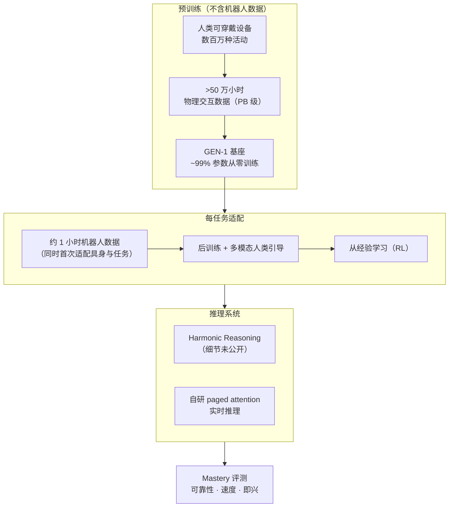
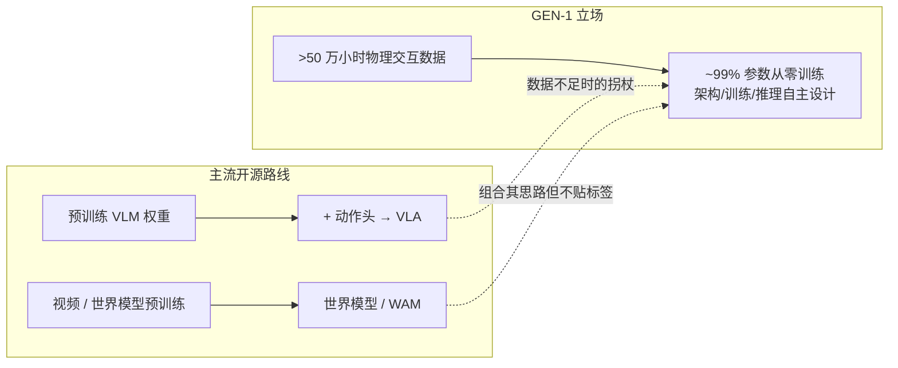

# GEN-1：把具身基础模型扩展到 Mastery（Generalist AI）

| 字段 | 内容 |
|------|------|
| **机构** | 通用人工智能（Generalist AI） |
| **类型** | 产业官方博客 ×2（非 peer-reviewed，无技术报告 / arXiv） |
| **模型** | GEN-1（前序 GEN-0，后继 GEN-1.5） |
| **发布** | 2026-04-02（主博文）；2026-04-07（配套观点文 *Going Beyond World Models & VLAs*） |
| **获取方式** | 发布当日向 early access partners 开放，需邮件申请合作 |
| **开源** | **确认未开源**（无公开代码 / 权重 / 数据集；2026-10-09 核查官方博客与 Hugging Face） |

> **区分：** 本页是 **GEN-1 发布（launch）** 页——mastery、可靠性 / 速度数字、从零训练立场。2026-07 的多末端执行器后续博文见 [GEN-1 千手](./generalist-gen1-thousand-hands.md)；2026-08 的 one-shot 后继模型见 [GEN-1.5](./generalist-gen15-one-shot.md)。

## 一句话定义

**GEN-1** 是 Generalist AI 在 GEN-0 之上继续扩大数据与算力、并在预训练 / 后训练 / RL / 推理期多处改进后 **从零训练** 的具身基础模型系统；公司把「**可靠性 + 速度 + 即兴智能**」合称 **mastery**，并自报在若干简单灵巧任务上以 **约 1 小时机器人数据** 达到 **99%** 成功率、约 **3×** 于此前 SOTA 的完成速度。

## 英文缩写速查

| 缩写 | 英文全称 | 简要说明 |
|------|----------|----------|
| GEN-1 | GEN-1（Generalist AI） | 2026-04 发布的具身基础模型代际；本页主体 |
| EFM | Embodied Foundation Model | 具身基础模型；博客标题即 *Scaling EFMs to Mastery* |
| VLA | Vision-Language-Action | 视觉-语言-动作模型；配套文明确称 GEN-1 **不是**「VLM + 动作头」式 VLA |
| VLM | Vision-Language Model | 视觉语言模型；主流 VLA 的初始化来源，GEN-1 不依赖 |
| RL | Reinforcement Learning | 博客称「learning from experience」是速度提升来源之一 |
| SOTA | State of the Art | 速度对比基线：GEN-0、π0（相同纸盒）与 π\*0.6（相近纸盒） |
| AGI | Artificial General Intelligence | 公司目标表述为 physical AGI |

## 为什么重要

- **把评测从「成功率」扩成三维：** mastery = 可靠性（连续数百次无干预）+ 速度（任务完成时间而非电机速度）+ 即兴（意外恢复），并要求同时报告 **达到该性能所需任务数据量**——这是比单一成功率更接近部署的评价框架（对照 [Foundation Policy](../concepts/foundation-policy.md)）。
- **「预训练无机器人数据」的存在性主张：** 基座只用人类可穿戴设备数据（>50 万小时），每任务约 1 小时机器人数据后训练即达 99%（自报）。若成立，意味着 **大规模遥操作不是高成功率的必要条件**（对照 [Embodied Scaling Laws](../concepts/embodied-scaling-laws.md)、[数据飞轮](../concepts/data-flywheel.md)）。
- **预训练贡献的直接对照：** 同一三项任务上「无预训练 19% → GEN-0 64% → GEN-1 99%」（自报均值）是少见的 **预训练消融式** 公开对照，虽不可复现但给出了量级参照。
- **反 VLA 初始化的产业立场：** 配套文主张数据足够时 **从零训练** 优于继承 VLM 权重，把视觉-语言预训练称为数据不足时的「拐杖」——与当前开源主流 [VLA](../methods/vla.md)（VLM 骨干 + 动作头）形成鲜明对立。

## 流程总览

## 核心原理

### 1. Mastery 的三要素

| 要素 | 博客口径 | 本库读法 |
|------|----------|----------|
| **可靠性** | 跨任务 / 系统 / 环境稳健重复，而非偶尔成功 | 用「连续无干预次数」而非单批成功率展示 |
| **速度** | 计 **任务完成时间**；高速下速度项、摩擦、运动模糊使世界不再准静态 | 速度提升同时考验感知延迟与反应性 |
| **即兴智能** | 意外情境的创造性恢复；作者认为这是机器人过去最缺的一项 | 依赖 [Physical Commonsense](./physical-commonsense-generalist.md) 叙事 |
| 数据量 | 评估 mastery 必须同时看达到性能所需的任务数据 | 本文统一口径：约 1 小时机器人数据 |

### 2. 可靠性结果（自报）

| 任务 | GEN-1 | GEN-0（2025-11 版微调） | 同架构无预训练 | 连续无干预展示 |
|------|-------|--------------------------|----------------|----------------|
| 扫地机器人维护 | 99% | 50% | 2% | 200+ 次 |
| 折盒 | 99% | 81% | 13% | 200 次 |
| 手机装盒 | 99% | 62% | 42% | 100 次 |
| **三任务平均** | **99%** | **64%** | **19%** | — |

另有三项仅以视频展示连续运行：汽车零件配套 **1 小时以上**、叠 T 恤 **连续 86 次**、积木装箱 **连续 1,800+ 次**（无对照成功率）。博客未公布每项试次数与置信区间。

### 3. 速度结果（自报，1× 实时、全自主）

- **折盒 12.1 s**：GEN-0 与 [π0](./paper-pi0.md) 在 **相同纸盒** 上约 34 s，π\*0.6 在 **相近但不同** 纸盒上相近 → **2.8×**；只计「为折叠而触碰」到「折叠完成」段。
- **手机装壳 15.5 s**：GEN-0 的 **2.8×**。
- 作者称 GEN-1 可 **快于人类示范**，并在高速下对新物体物理作出反应。
- 作者给出的三个速度来源：① RL 从经验学习；② 推理方式 **Harmonic Reasoning**（GEN-1 引入，机制未公开）；③ 可穿戴采集天然含大量 **高速完成任务** 的数据，而遥操作因缺力反馈、延迟、视野问题产出更慢、更不流畅的数据。

### 4. 即兴智能（定性）

- 汽车零件配套中垫圈被碰歪：模型会 **放下重抓**、**半插入缝隙借外部灵巧重抓**，或 **换另一只手双手手内重抓**。
- 大型可变形物体进入意外构型时自行恢复。
- 作者称这些行为「远在训练分布之外」——无定量统计，属展示性证据。

### 5. 「模型即系统」与数据效率

- GEN-1 被称为 **系统** 而非一组权重：预训练改进（改善算力效率曲线）+ 后训练 + RL + **多模态人类引导** + 新推理期技术 + 推理 harness。
- **数据效率（自报）：** 部分测试中用 **1/10 的任务数据与微调步数** 达到 GEN-0 相当性能。
- **预训练不含机器人数据** → 适配新任务时 **同时首次适配机器人具身与任务**；这让「1 小时机器人数据」同时承担了跨具身（人→机）对齐的职责。
- **基础设施（定性）：** 分布式训练改为以 PB 级物理交互数据为一等公民；训练稳定性、自定义 kernel、为实时推理设计的新 paged attention；新采集硬件与在新地区发运 **数千只机器人手**。

### 6. GEN-0 → GEN-1 的 GPT-2 → GPT-3 类比

作者把 GEN-0（约 GEN-1 前五个月，首次展示机器人 scaling law）类比 GPT-2（证明可扩展多任务路径但难商用），把 GEN-1 类比 GPT-3（部分任务跨过经济可用门槛）。更关键的推论是 **每代模型会解锁一批更复杂的可 mastery 任务**——这是预测而非已验证结论。

## 从零训练：超越 VLA 与世界模型（配套文 2026-04-07）

*Going Beyond World Models & VLAs*（Pete Florence and the Generalist Team）解释 GEN-1 的建模立场：

- **事实陈述：** GEN-1 **约 99% 参数从零训练**；不是「在 VLM 上外挂动作」的微调模型，也不只是世界模型，而是 **物理交互原生** 的基础模型。剩余约 1% 参数的来源未说明。
- **核心论断（作者立场）：** 数据与算力足够时「从零训练总会赢」；仅引用一篇视觉蒸馏论文（Beyer & Zhai et al. 2022）作旁证，**并非机器人领域的直接证据**。
- **不贴标签的三条理由：**
  1. **目标重于工具标签**——引 Schulman 的 idea-driven vs goal-driven 研究；世界模型热（2026 年初）与 VLA 热（2023–2025）被视为 idea-driven 的潮流。
  2. **把「A 或 B」改问「能走多远」**——团队一年多来组合 VLA、世界模型等思路，组合越多越难归类；以 Chinchilla 式「约束下最优」为范例。
  3. **约束会变化**——「机器人数据少」不是长期约束；有了 >50 万小时数据后，视觉-语言预训练只是数据不足期的 **拐杖**。
- **目标驱动路线图：** 终极目标是完全零样本机器人（零任务数据、整类未见任务、高成功率高速度）；中间里程碑是「每任务 X 小时机器人数据 → 高性能」，并持续压低 X。**「约 1 小时 → 99%+」** 正是 GEN-1 主博文的结果口径——两篇文章互为目标与交付。
- **团队背景（自述）：** 成员共同参与 VLA 起源工作 [RT-2](./paper-rt-2.md)、多模态模型 [PaLM-E](./paper-palm-e-embodied-language-model.md)，2023 年起发表机器人世界模型相关工作（Video Language Planning）。

与本库概念页的关系：[VLA](../methods/vla.md) 页描述的「VLM 初始化 + 动作专家」是 GEN-1 刻意回避的路径；[World Action Models](../concepts/world-action-models.md) 页的「预测 + 动作耦合」被作者视为可吸收的思路之一，而非模型类别。

## 工程实践

| 项 | 实践要点 |
|----|----------|
| **评测协议借鉴** | 报告 **连续无干预次数** + **任务完成时间**（明确计时起止点）+ **任务数据小时数**，三者缺一不可 |
| **消融设计借鉴** | 同任务并列「无预训练 / 上一代微调 / 当前代」，直接量化预训练贡献 |
| **速度对比口径** | 跨团队比较须同物体、同计时段；GEN-1 自己也标注 π\*0.6 为「相近但不同」纸盒 |
| **数据采集取舍** | 作者归因：可穿戴采集比遥操作更快更流畅；自建数据时可评估采集接口对 **示范速度上限** 的影响 |
| **对齐 / 安全** | 涌现即兴（摇袋、整理错放物、接下落物）可能违背流程要求——部署需任务级约束与推理期策略引导 |
| **选型** | **不可下载**；需 early access 合作。可复现研究请改用开源 VLA（如 [π0](./paper-pi0.md) 系 openpi） |
| **源码运行时序图** | **不适用**（确认未开源，无代码 / 权重 / 技术报告） |

## 与其他工作对比

| 维度 | GEN-0 | **GEN-1（本页）** | GEN-1 千手（2026-07） | GEN-1.5（2026-08） | π0 / 开源 VLA |
|------|-------|-------------------|------------------------|---------------------|---------------|
| 主叙事 | 机器人 scaling law | **mastery：可靠 + 快 + 即兴** | 多末端执行器泛化 | one-shot physical prompting | 通用操作策略 |
| 数据 | 自建可穿戴数据 | **>50 万小时**，预训练无机器人数据 | 约 9k 末端变体 | 与 GEN-1 并行持续预训练 8+ 月 | 遥操作为主 + VLM 初始化 |
| 每任务适配 | 微调 | **约 1 小时机器人数据** | 按新手微调 | 3–12 s 示范或 1–10 步 | 微调 |
| 关键数字（自报） | 三任务均值 64% | **99%**；折盒 12.1 s | 2.5%–11.4% 相对权重范数 | 59% / 83% | 折盒约 34 s（博客引） |
| 初始化 | 未披露 | **~99% 从零** | 未单独披露 | 未单独披露 | VLM 预训练权重 |
| 可复现 | 否 | **否** | 否 | 否 | 是（openpi） |

## 局限与风险

- **证据等级：** 两篇均为公司博客；99%、2.8×、>50 万小时、1 小时等全部 **自报**，无技术报告、无试次数 / 置信区间、无第三方复核。
- **任务范围窄：** 作者自承并非所有尝试过的任务都达 99%+，只展示了「简单任务」的 mastery；勿外推到长程家务或人形全身。
- **速度对比口径：** 只计折叠段，跨团队视频比较；π\*0.6 为不同纸盒。
- **「从零训练总会赢」是论断：** 只有间接旁证；剩余约 1% 参数来源、架构细节均未公开。
- **时间线小疑点：** 图注称「March 2025 at GTC」展示过更新版 GEN-0，与「November 2025 版 GEN-0」时间线不符，**推测** 为 2026 年 3 月 GTC 的笔误。
- **对齐风险：** 作者明确指出涌现即兴是有真实后果的物理动作，可能成为隐患；目前未给出具体对齐方法。
- **闭源边界：** 不可下载、不可复现；与开源论文对照时应分栏标注「产业博客」与「可复现研究」。

## 关联页面

- [Generalist AI（公司入口）](./generalist-ai-robotics.md)
- [GEN-0（前代：机器人 scaling law）](./generalist-gen0.md)
- [GEN-1 千手：跨末端执行器泛化](./generalist-gen1-thousand-hands.md) — 2026-07 后续博文，多末端轴
- [GEN-1.5 一次示范学习](./generalist-gen15-one-shot.md) — 后继代际，one-shot physical prompting
- [Physical Commonsense（Generalist 产业观点）](./physical-commonsense-generalist.md) — 即兴智能的理论叙事
- [VLA](../methods/vla.md) — 配套文反对的「VLM + 动作头」主流路线
- [World Action Models](../concepts/world-action-models.md) — 世界模型 + 动作耦合路线对照
- [Foundation Policy](../concepts/foundation-policy.md)
- [Embodied Scaling Laws](../concepts/embodied-scaling-laws.md)
- [Manipulation](../tasks/manipulation.md)
- [π0](./paper-pi0.md) — 速度对比基线之一

## 参考来源

- [GEN-1: Scaling Embodied Foundation Models to Mastery（来源归档）](../../sources/blogs/generalist_gen1.md)
- [Going Beyond World Models & VLAs（来源归档）](../../sources/blogs/generalist_beyond_world_models.md)
- 原文：<https://generalistai.com/blog/gen-1>
- 原文：<https://generalistai.com/blog/beyond-world-models>

## 推荐继续阅读

- [Scaling Laws in Robotics with GEN-0](https://generalistai.com/blog/gen-0) — GEN-1 的前代与 scaling law 叙事
- [The Dark Matter of Robotics: Physical Commonsense](https://generalistai.com/blog/physical-commonsense) — mastery 中「即兴」一项的来源
- Schulman, J. *An Opinionated Guide to ML Research* — 配套文引用的 goal-driven 研究观
- Wang, Y., et al. (2025). *Inference-Time Policy Steering through Human Interactions* — GEN-1 对齐讨论所引
