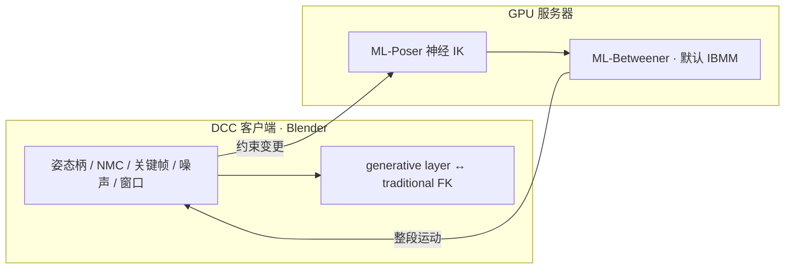

# Generative Motion Rig（Disney）：艺术家驱动的生成式运动绑定

**Generative Motion Rig（GMR）**（*A Generative Motion Rig for Artist-Driven Motion Authoring*，SIGGRAPH Talks 2026，DisneyResearch\|Studios / ETH Zürich）把 **通用生成式运动模型** 嵌进动画软件（展示为 **Blender 插件**）：艺术家用稀疏姿态、**Neural Motion Curves (NMC)**、生成窗口与噪声采样做 **generative keyframing**，并可编辑/延长 MoCap、与传统 FK 层混合。

## 英文缩写速查

| 缩写 | 英文全称 | 简要说明 |
|------|----------|----------|
| GMR | Generative Motion Rig | **本文**方法/插件名（≠ 仓库内 General Motion Retargeting） |
| NMC | Neural Motion Curves | 可点击拖拽的神经运动曲线控制柄 |
| IBMM | Implicit Bézier Motion Model | 默认 ML-Betweener；Bézier 表示保证时域稀疏与平滑 |
| DCC | Digital Content Creation | Blender / Maya 等数字内容创作软件 |
| MoCap | Motion Capture | 可用同一套控件做生成式编辑/延长 |
| IK | Inverse Kinematics | ML-Poser 由稀疏关节补全全身姿态 |

## 为什么重要

- **模型→制片工作流的缺口**：稀疏约束生成整段运动已成熟，缺的是与关键帧、图层、FK/IK 切换共存的 **DCC 产品形态**；本文给的是集成经验与艺术家测试，而非新 backbone。
- **对机器人知识库的锚点**：说明「生成式运动」在 **角色动画端** 如何被操控；与 [机器人关键帧编辑工具](./robot-motion-keyframe-editors.md)（URDF/MJCF/CSV）形成对照——前者服务表演意图，后者服务策略数据后处理。
- **缩写碰撞预警**：本页 **GMR = Generative Motion Rig**。仓库另有 [GMR = General Motion Retargeting](../methods/motion-retargeting-gmr.md)。亦勿与 Snap 的 [RigMo](./rigmo.md)（无标注 mesh→Gaussian bones）混淆。

## 流程总览

## 核心结构 / 机制

### 1）Client–server 集成

- 模型跑在专用 GPU 服务器；DCC 开发环境受限时可换客户端（Blender / Maya）。
- 用户改关键帧或柄 → 上行约束 → 下行整段运动可视化。

### 2）默认模型栈（可替换）

| 模块 | 作用 |
|------|------|
| ML-Poser | ProtoRes 系神经 IK：稀疏关节 → 全身姿态 |
| ML-Betweener | 默认 **IBMM**；可换成其他 generative betweener |
| NMC | 曲线控制点可关键帧化，支持视口/曲线编辑器直接操纵 |

### 3）生成式创作能力

- **Direct control**：稀疏脚约束改步态；稀疏髋旋转可把走改成转/倒地类动力学。
- **Noise manipulation**：全区间或单时刻重采样；位置 vs 朝向分量效果不同。
- **Temporal control**：时间轴滑动约束以改变速度（走→冲刺）。
- **Extension / editing**：窗外推运动；对 base MoCap **inpainting** 式局部改写。
- **Rig switching**：传统 FK ↔ GMR；synchronize 模式用传统 armature 摆姿、立刻变成 GMR 全身约束。

### 4）用户测试（文内）

- Freestyle：专业艺术家约两天完成 ~22s 双角色追逐（含学习工具）。
- Guided：艺术家偏 ML-Poser 全身关键帧；非艺术家更依赖全 NMC + 混合稀疏约束。
- Motion editing：改跳跃距离并加后退步，对接 Synth2Track 等 MoCap 工具链。

## 工程实践（速览）

| 项 | 说明 |
|----|------|
| 形态 | Blender 插件 + 远程推理服务（论文描述） |
| 开源 | **未开源** — Disney 页仅提供 PDF；无 add-on 仓库 |
| 源码运行时序图 | **不适用**（无可运行官方实现） |
| 选型 | 需要 **艺术家 DCC 集成叙事 / 工作流启发** → 本页；需要 **可训练无标注 rig** → [RigMo](./rigmo.md)；需要 **机器人轨迹修整** → [关键帧工具选型](./robot-motion-keyframe-editors.md) |

## 局限与风险

- **分布外风格 / 非物理动作**仍受训练数据束缚；分层混合是权宜，非完美风格–物理一致解。
- **加约束稳定性**：新关键帧导致整段运动突变，是 UX 核心痛点；synchronize 可能出现 motion **pop**。
- **复杂形态学 / 多角色 rig** 仍开放。
- **闭源**：无法本地复现插件；知识以论文与配套视频为准。

## 关联页面

- [RigMo](./rigmo.md) — 无标注 mesh 联合学 rig+motion（研究资产线；名称勿混）
- [Blender](./blender.md) — 本文展示宿主 DCC
- [机器人关键帧与运动编辑工具](./robot-motion-keyframe-editors.md) — 机器人侧后处理对照
- [Character Animation vs Robotics](../concepts/character-animation-vs-robotics.md) — 表演意图 vs 物理可控
- [Diffusion-based Motion Generation](../methods/diffusion-motion-generation.md) — 生成式运动方法总览
- [ARDY](./ardy.md) — 交互式约束生成（研究 Demo 档，非制片 DCC）
- [General Motion Retargeting（GMR）](../methods/motion-retargeting-gmr.md) — **同缩写不同概念**：人→机器人重定向

## 参考来源

- [sources/papers/generative_motion_rig_siggraph_talks_2026.md](../../sources/papers/generative_motion_rig_siggraph_talks_2026.md)
- [sources/sites/disney-generative-motion-rig.md](../../sources/sites/disney-generative-motion-rig.md)

## 推荐继续阅读

- [Disney Research 项目页](https://studios.disneyresearch.com/2026/07/16/a-generative-motion-rig-for-artist-driven-motion-authoring/) — 摘要与 PDF
- [DOI 10.1145/3799818.3812088](https://doi.org/10.1145/3799818.3812088)
- [SKEL-Betweener / NMC 相关工作](https://studios.disneyresearch.com/) — 同组 Neural Motion Rig 谱系（见论文参考文献）
