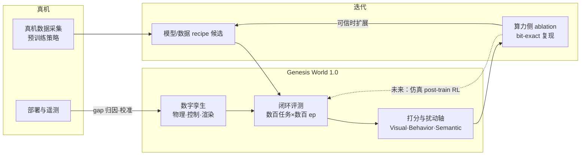

# Genesis World 1.0（Genesis AI 仿真基础设施）

**Genesis World 1.0** 是 **Genesis AI**（机器人全栈公司，博客域名 genesis.ai）对外阐述的**仿真基础设施**版本：在初版开源 **Genesis** 仿真之上，过去一年做全栈重构，目标是在**不依赖仿真预训练数据**的前提下，让 **real-to-sim 闭环评测**与真机 rollout 强相关，并把模型开发瓶颈从墙钟转为算力。

## 为什么重要？

- **范式：** 将仿真从「数据生成器」提升为**评测与迭代引擎**——与仅强调 sim 数据增广的路线形成对照，适合理解产业侧如何支撑**机器人基础模型**开发。
- **工程栈完整性：** 同时覆盖 **GPU 编译器（Quadrants）**、**多物理统一求解**、**机器人专用光追（Nyx）** 与 **资产/场景管线**，代表「数字孪生 + 大规模并行 rollout」的一体化思路。
- **名称辨析：** 与开源 **[Genesis (仿真器)](genesis-sim.md)**（Genesis-Embodied-AI）及 **[GENE-26.5](gene-26-5-genesis-ai.md)** 操作模型品牌**同名不同物**；选型与引用须核对主体。

## 流程总览：开发环中的位置

## 核心组件（提炼）

| 组件 | 功能 | 设计要点 |
|------|------|----------|
| **Nyx** | 实时光追渲染 | 路径追踪基线；面向策略的视觉信号而非「游戏观感」；HDRI/扫描资产/3DGS；与批处理物理耦合以支撑海量并行 rollout |
| **Genesis World 物理** | 刚体 + 可变形统一仿真 | MJCF/URDF/USD；FEM/MPM/SPH/PBD；可切换 coupler（通用 / SAP 风格 / IPC）；**External Articulation Constraint** 将关节动力学并入 IPC 优化；**barrier-free elastodynamics** 缓解 IPC 接触场景速度 |
| **Quadrants** | Python→多后端 GPU 编译 | 源自 Taichi fork；kernel graph、流重叠、与 PyTorch DLPack 共享显存；宣称 manipulation/locomotion 上相对 fork 前 **~4.6×** |
| **Simulation interface** | 应用层 API | 降低评测与数据管线接入成本 |
| **资产管线** | 场景与物体 | Photogrammetry（自研 iOS 等）→ mesh + 3DGS；程序化生成 layout、任务与成功指标 |

## 可信度工作流（公司叙事）

- **Zero-shot real-to-sim：** 仅用真机数据训练的策略在仿真中评测；训练与评测分布刻意分离，避免「只会过仿真器」的虚假指标。
- **并排 rig：** 仿真与真机同初始化并行；观测可按层混合（sim / real），用于归因 **物理 / 渲染 / 控制 / 通信** gap。
- **自报相关性（需独立验证）：** 14 任务、200 ep/task、三档模型规模下，与真机 **Pearson ~0.90**、**MMRV ~0.017**（参考 SimplerEnv 排名指标）；open-loop action 误差在模型相近时**不足以**区分真机排序。

## 系统化评测

沿 **Visual / Behavioral / Semantic** 正交扰动轴做单参数扫描，定义各轴 **robustness**（相对 nominal 的性能保持），用于发现失败模式并指导数据采集——依赖仿真才可高频、大规模执行。

## 未来方向（博客 2026-05）

1. **规模化仿真 post-training RL**（评测环境兼作探索引擎）。
2. **Hybrid simulator：** 经典可解释仿真 + 学习型世界模型，用多模态真机数据融合。
3. **Self-evolving physical AI：** 仿真内 agent 自演化环境/课程/奖励；真机边缘案例回灌校准仿真。

## 常见误区

- 将 **World 1.0** 等同于开源 **Genesis-Embodied-AI** 仓库的当前 main，或假设 arXiv:2412.12919 中的全部基准数字自动适用于公司栈。
- 在尚未验证数字孪生的任务上，直接采用其 **Pearson/MMRV** 自报数字替代真机验收。
- 忽略 **评测优先于仿真训练数据** 的产品策略，误以为该公司当前主路径是「纯 sim 数据预训练」。

## 关联页面

- [Genesis (仿真器)](genesis-sim.md) — 开源学术/社区物理引擎与论文
- [GENE-26.5（Genesis AI）](gene-26-5-genesis-ai.md) — 同公司操作基础模型
- [仿真评测基础设施](../concepts/simulation-evaluation-infrastructure.md) — 跨平台概念归纳
- [Sim2Real](../concepts/sim2real.md) — real-to-sim / sim-to-real 方法论
- [数据飞轮](../concepts/data-flywheel.md) — 数据–仿真–部署闭环语境
- [Isaac Gym / Isaac Lab](isaac-gym-isaac-lab.md) — 同类高并行仿真与评测栈参照

## 推荐继续阅读

- Genesis AI 博客原文：<https://www.genesis.ai/blog/the-role-of-simulation-in-scalable-robotics-genesis-world-10-and-the-path-forward>
- 开源 Genesis 论文：<https://arxiv.org/abs/2412.12919>
- SimplerEnv（real-to-sim 评测与 MMRV 指标语境）：<https://simpler-env.github.io/>

## 参考来源

- [genesis_ai_simulation_world_10_blog（原始资料）](../../sources/blogs/genesis_ai_simulation_world_10_blog.md)
- [genesis_gene_ecosystem（Genesis / GENE 资料总档）](../../sources/papers/genesis_gene_ecosystem.md)
