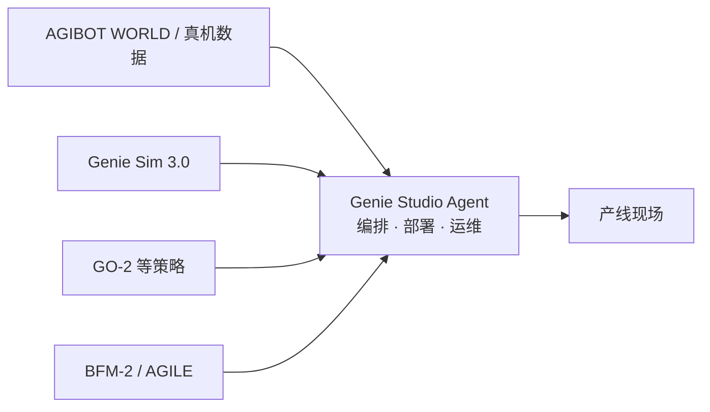

# Genie Studio Agent

**Genie Studio Agent** 是智元在 [2026-06 发布地图](../overview/agibot-june-2026-release-technology-map.md) 中 **最偏产业化** 的段落：把机器人能力封装为 **可编排、可部署、可维护** 的企业流程（发布文：<https://mp.weixin.qq.com/s/Ha9_0TLyVtec-cL4WqFAbA>）。

## 一句话定义

**零/低代码机器人作业编排与交付平台**——回答「demo 能跑之后，如何复制到第二个工位、第二种料架、另一种节拍」。

## 英文缩写速查

| 缩写 | 英文全称 | 简要说明 |
|------|----------|----------|
| VLA | Vision-Language-Action | 视觉-语言-动作多模态策略 |
| RL | Reinforcement Learning | 通过与环境交互最大化长期回报来学习策略 |
| Sim2Real | Simulation to Real | 仿真策略迁移真机 |

## 为什么重要

- **交付层闭合：** 数据、仿真、模型、运控底座若不能进入 **可复用流程**，现场仍高度依赖定制项目。
- **模块封装：** 视觉感知、运动控制、导航规划、VLA、强化学习工具链等以模块接入编排。
- **工程能力：** 文内强调任务编排、仿真验证、上线监控、异常恢复、集群监管。
- **案例：** 半导体封测 Tray 盘上下料、汽车零部件安全带卷收器上料等。

## 与底层模块关系

## 关联页面

- [应用交付分类 hub](../overview/agibot-release-category-06-application-delivery.md)
- [Sim2Real](../concepts/sim2real.md)

## 参考来源

- [wechat_embodied_ai_lab_agibot_june_2026_release.md](../../sources/blogs/wechat_embodied_ai_lab_agibot_june_2026_release.md)

## 推荐继续阅读

- [Genie Studio Agent 发布文](https://mp.weixin.qq.com/s/Ha9_0TLyVtec-cL4WqFAbA)
