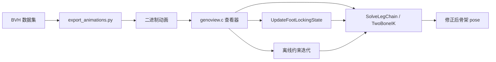
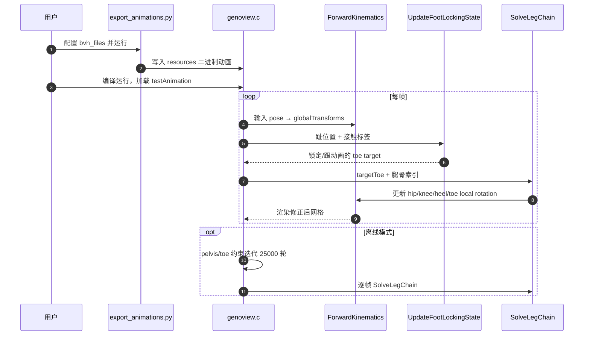

# GenoView-InverseKinematics

[GenoView-InverseKinematics](https://github.com/orangeduck/GenoView-InverseKinematics) 是 Andrew McDonald（The Orange Duck）为博文 [Inverse Kinematics and Foot Locking](https://theorangeduck.com/page/inverse-kinematics-foot-locking) 发布的 **可运行 C/raylib 工程**：在 Geno 骨架上演示腿链 IK、运行时足锁与离线脚滑移除，并用简易 deferred 渲染 + 网格地面突出脚滑伪影。

| 字段 | 内容 |
|------|------|
| 维护者 | 独立维护者 Andrew McDonald（The Orange Duck） |
| 许可证 | MIT |
| 官方入口 | https://github.com/orangeduck/GenoView-InverseKinematics |

## 一句话定义

MIT 许可的 raylib 动画查看与 **足锁 IK 实验台**：把 BVH 导出为二进制后加载，对照文内 `SolveLegChain`、惯性化足锁与 PBD 式离线约束的完整实现。

## 英文缩写速查

| 缩写 | 英文全称 | 简要说明 |
|------|----------|----------|
| IK | Inverse Kinematics | 两骨链 + look-at 修正趾位 |
| BVH | Biovision Hierarchy | 动捕/动画常见骨架交换格式 |
| PBD | Position Based Dynamics | 离线约束迭代思路 |
| FK | Forward Kinematics | 每步 IK 后更新全局变换 |
| SSAO | Screen Space Ambient Occlusion | GenoView 渲染辅助看穿透 |

## 为什么重要

- **博文可复现**：页内代码片段的完整上下文（构建、数据导出、开关）集中在单仓，降低「只读伪代码」成本。
- **动画质检工具**： procedural 网格 + 阴影/SSAO，低配置也能肉眼查脚滑与穿地（相对完整 DCC/引擎更轻）。
- **与机器人 wiki 互补**：侧重 **skinned 动画 runtime**；机器人侧脚滑修补见 [足锁 IK 方法页](../methods/foot-locking-ik-orangeduck.md) 与 [CoRe](../entities/core-retarget.md) 对照表。

## 核心原理

### 开源状态

| 项 | 结论 |
|----|------|
| 许可证 | MIT |
| 代码 | **已开源**（截至 2026-09-13 项目页与 GitHub 均有可克隆仓库） |
| 权重/数据 | 需自行下载 LaFAN1、ZeroEGGS 等 BVH，经 `resources/export_animations.py` 转换 |

### 模块边界

| 模块 | 对应博文章节 |
|------|-------------|
| `TwoBoneInverseKinematics` | §1 腿链 IK |
| `UpdateFootLockingState` + cubic inertialization | §2 运行时足锁 |
| 趾速/高度阈值 + median | §3 接触标注 |
| pelvis/toe 粒子约束循环 | §4 离线脚滑移除 |

纯 Python 对照：[GenoViewPython](https://github.com/orangeduck/GenoViewPython/)（本仓为 C/raylib 版）。

## 源码运行时序图

关键复现路径：下载 BVH → 编辑 `resources/export_animations.py` → 运行导出 → 修改 `genoview.c` 中 `testAnimation` 加载路径 → `make`/CMake 构建运行。

## 工程实践

1. **克隆与依赖**：安装 raylib；按 README 将目标 BVH 放入 `resources/`。
2. **导出动画**：编辑 `bvh_files` 列表后运行 `export_animations.py`。
3. **切换 clip**：改 `genoview.c` 里加载的动画名。
4. **调试足锁**：对比 `enableInverseKinematics`、接触阈值、`lockBlendTime`；用网格地面观察脚滑。
5. **机器人读者**：本仓 **不** 输出关节力矩或接触力；若用于人形重定向后处理，需另接 [GMR](../methods/motion-retargeting-gmr.md) / 仿真验证栈。

## 局限与风险

- **Geno 骨架专用脚本**——其他角色需改 bone index 或导出脚本。
- **平面地面 / y=0 clamp**——复杂地形需自行扩展。
- **离线迭代耗 CPU**——不适合嵌入 60fps 游戏主循环。
- **动画向而非 WBC**——不可直接替代 [Pink](../entities/pink-ik.md)/[Mink](../entities/mink-ik.md) 真机 IK。

## 关联页面

- [足锁 IK（Orange Duck 配方）](../methods/foot-locking-ik-orangeduck.md)
- [逆运动学](../formalizations/inverse-kinematics.md)
- [Motion Retargeting](../concepts/motion-retargeting.md)

## 参考来源

- [GenoView-InverseKinematics 仓库归档](../../sources/repos/genoview-inverse-kinematics.md)
- [Orange Duck 博文归档](../../sources/blogs/orangeduck_inverse_kinematics_foot_locking.md)
- [theorangeduck 项目页归档](../../sources/sites/theorangeduck-ik-foot-locking.md)

## 推荐继续阅读

- 官方仓库：<https://github.com/orangeduck/GenoView-InverseKinematics>
- 原文：<https://theorangeduck.com/page/inverse-kinematics-foot-locking>
