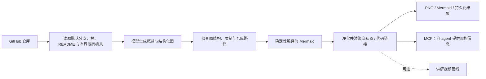

# GitDiagram（AI 辅助代码库架构图）

**GitDiagram**（[官网](https://gitdiagram.com/) · [GitHub](https://github.com/ahmedkhaleel2004/gitdiagram)）把 GitHub 仓库转换为可交互的架构示意图和文字解释，并提供 MCP 入口与仓库讲解视频。

## 一句话定义

**GitDiagram 是模型辅助的代码库理解工具：从仓库结构和有限源码证据生成架构图，再校验图结构并渲染为可浏览、可跳转的 Mermaid 视图。**

## 英文缩写速查

| 缩写 | 英文全称 | 简要说明 |
|------|----------|----------|
| MCP | Model Context Protocol | GitDiagram 远程服务用于向 agent 提供仓库架构信息 |
| AST | Abstract Syntax Tree | 架构文档描述的结构化图表示，编译器据此产出 Mermaid |
| API | Application Programming Interface | 服务通过 GitHub API 读取仓库元数据和源码片段 |
| SVG | Scalable Vector Graphics | 浏览器渲染 Mermaid 图后净化的矢量图形格式 |

## 为什么重要

- **降低理解陌生代码库的启动成本。** 把文件/目录组织关系压缩成可点击图示，并附带流式架构解释，适合仓库初筛、代码导览和 agent 预读。
- **图可回到证据。** 组件可链接到 GitHub 文件或目录；服务会校验链接路径，降低图节点脱离实际仓库的风险。
- **同时面向人和 agent。** 网页适合交互探索，MCP 暴露架构说明、组件、连接和 Mermaid；可把它放在代码问答或开发 agent 的前置理解环节。
- **与 Gitingest 的侧重点不同。** Gitingest 打包文本上下文；GitDiagram 推导架构关系和讲解视图。GitDiagram README 将 Gitingest 列为灵感来源，但二者不是同一项目。

## 核心原理

### 流程总览

根据仓库架构文档，生成步骤会获取默认分支与递归文件树，选择有界源码摘录；模型返回概览与图结构；服务端校验节点、连通性、边界和路径后确定性编译为 Mermaid。浏览器再净化 Mermaid 输入与 SVG 输出，并将链接限制到 GitHub。结果持久化后可再次打开。

## 工程实践

| 场景 | 用法 / 检查点 |
|------|---------------|
| 快速浏览公开仓库 | 将 GitHub URL 的 hub 改为 diagram，或提交仓库地址 |
| 使用 agent 获取架构摘要 | 配置远程 MCP https://gitdiagram.com/mcp；README 列出 Codex、Claude、Gemini CLI、Copilot 等接入示例 |
| 审查输出准确性 | 从图节点跳转源码，核对关键模块、数据流与边界；不要把图当成静态分析真值 |
| 导出或复用 | 导出 PNG、复制 Mermaid；文档集成前在目标 Mermaid 版本验证渲染 |
| 本地运行 | 需要 Bun、R2、Redis 与模型提供方配置；按官方 dev-setup 指南设置密钥和服务 |

仓库采用 MIT 许可。官方 README 介绍约一分钟的旁白视频；视频生成在入库快照时标注 early access。主站 README 声明服务部署于 Vercel；架构文档记录 R2 图存储与 Upstash Redis 协调，并说明 Railway/Docker 是灾备配方而非常驻线上实例。

## 局限与风险

- **模型解释不是完整静态分析。** 图来自模型对有限文件树和源码摘录的综合；隐含调用、动态装载、配置注入或大型仓库中的遗漏可能改变真实架构。
- **有界输入带来覆盖率取舍。** 大仓库树与文件片段受到预算限制；README 过大或相关文件未被选中时，图可能不完整。
- **私有仓库涉及代码外传。** 网站支持 GitHub token；使用前需确认服务处理政策与组织授权，不要把令牌写入提示或日志。
- **MCP 输出仍需审查。** agent 获取的是派生解释和图结构，不是经过验证的运行时行为；涉及安全、部署或依赖决策时回到源码和测试证据。
- **渲染安全依赖净化。** 仓库采用 Mermaid 与 SVG 净化及 GitHub 链接 allowlist；自建 fork 或其他集成应维持类似边界。

## 关联页面

- [Mermaid.js](./mermaid-js.md) — GitDiagram 将已校验图结构编译为 Mermaid 并在浏览器渲染
- [Archify](./archify.md) — 以类型化 JSON IR 和确定性校验/编译生成系统图；可比较自动推导与作者提供结构
- [Model Context Protocol（MCP）](../concepts/model-context-protocol.md) — GitDiagram 作为远程 MCP 服务的接入协议

## 参考来源

- [GitDiagram 仓库归档](../../sources/repos/ahmedkhaleel2004-gitdiagram.md)
- [GitDiagram 在线应用归档](../../sources/sites/gitdiagram-com.md)

## 推荐继续阅读

- [GitDiagram README](https://github.com/ahmedkhaleel2004/gitdiagram) — 功能、Agent/MCP 接入与本地启动
- [架构文档](https://github.com/ahmedkhaleel2004/gitdiagram/blob/main/docs/architecture.md) — 仓库读取、生成、校验、Mermaid 编译与持久化
- [Mermaid.js 实体页](./mermaid-js.md)