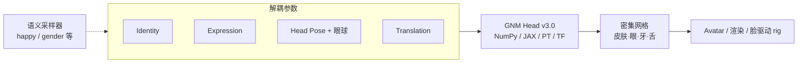

# GNM Head（GNM 生态）

**GNM**（**G**enerative a**N**thropometric **M**odel，读音类比 genome）是 Google 推进的 **参数化人体统计模型生态**；截至 2026-07-20，公开仓库 [google/GNM](https://github.com/google/GNM) 的首个完整子包是 **GNM Head**（`gnm/shape`）——从大规模 3D 扫描学习的 **高保真头部 3DMM**，在身份、表情、颈/眼头姿与全局平移上 **解耦控制**，并内置眼球、牙齿、舌头等内部几何。许可为 **Apache 2.0**，面向研究与商业集成。

## 英文缩写速查

| 缩写 | 英文全称 | 简要说明 |
|------|----------|----------|
| GNM | Generative aNthropometric Model | Google 参数化人体统计模型族（生态名） |
| 3DMM | 3D Morphable Model | 用 PCA/统计形状空间表示人脸/人体几何 |
| JAX | Just After eXecution | Google 数值计算框架，GNM 可选后端之一 |
| HMR | Human Mesh Recovery | 从图像恢复参数化人体网格 |
| IK | Inverse Kinematics | 由姿态/形状参数驱动网格或 rig 的下游步骤 |

## 为什么重要

- **头脸几何的「生成式基因组」：** 相比仅外表面 SMPL-X/FLAME 拼装，GNM Head 强调 **统计形状空间 + 内部解剖** 与 **语义可控采样**（如按 "happy" 表情或人口统计属性生成身份），适合 avatar、数字人、AR/VR 与 **机器人社交头** 原型。
- **多框架后端：** 同一套 v3.0 资产可在 **NumPy / JAX / PyTorch / TensorFlow** 下加载，降低与现有训练栈（扩散、NeRF、单目重建）的胶水成本。
- **开放许可与可复现资产：** 模型 `.npz`、纹理与语义采样器 `.h5` 随仓发布，CI 覆盖 Linux / macOS / Windows；与「仅论文描述、权重申请制」的 HMR 模型形成对照。
- **与机器人感知链路的潜在接口：** 单目脸/头重建（如 [FaceAnything](../entities/paper-face-anything-4d-face-reconstruction.md)）或 telepresence 头可输出 GNM 参数，再驱动显示头或简化 rig；全身侧仍常用 [SAM 3D Body](./sam-3d-body.md) 等 HMR，二者粒度不同。

## 核心结构

| 模块 | 路径 / 类 | 作用 |
|------|-----------|------|
| **形状模型核心** | `gnm_numpy.py` 等 | 由 latent 生成密集头脸网格（皮肤 + 眼/牙/舌） |
| **解耦参数** | Identity / Expression / Head Pose / Translation | 分别控制身份、表情 blendshape、颈眼姿态、全局位姿 |
| **语义采样** | `semantic_sampler.py` | `ExpressionSampler`、`IdentitySampler`：从语义标签采样参数 |
| **资产** | `data/versions/v3_0/` | v3.0 统计模型与纹理 |
| **可视化** | `visualization/`、`gnm_colab_viewer.py` | 渲染与 Colab 交互查看 |

## 工程实践

1. **环境：** Python **3.13** 虚拟环境；`git clone` 后 `cd gnm/gnm/shape`，按需求 `pip install -e ".[pytorch]"` 等（见 [官方 README](https://github.com/google/GNM/tree/main/gnm/shape)）。
2. **入门：** 运行 `demos/` 下 notebook；用 `gnm_colab_viewer.py` 快速查看随机/语义采样结果。
3. **与感知模型对接：** 若上游网络回归 GNM 参数，需对齐 **v3.0 参数化约定** 与相机投影（`fitting_utils/`、`visualization/` 提供优化与投影辅助）。
4. **生态演进：** README 称后续将发布更完整 **全身 GNM** 与感知栈；集成时锁定版本并关注主仓 Release。

## 局限与风险

- **首期仅 Head：** 截至入库日 **无官方全身 GNM 权重**；全身运动仍依赖 SMPL/MHR 等其它模型，跨模型对齐需自行处理。
- **引用与论文：** 仓内 BibTeX 标注 **coming soon**；学术引用需跟进官方更新。
- **非物理仿真器：** 输出为 **运动学统计网格**，不含接触、肌肉或生物力学；驱动实体机器人头需额外机械限位与执行器映射。
- **与 HMR 分工：** GNM Head 是 **生成式先验模型**；单张 RGB 推理仍需配合拟合/学习式回归（对比 [SAM 3D Body](./sam-3d-body.md) 的端到端 HMR）。

## 关联页面

- [SAM 3D Body](./sam-3d-body.md) — 全身 MHR 网格恢复，与头脸专用 3DMM 互补
- [FaceAnything（4D 脸重建）](./paper-face-anything-4d-face-reconstruction.md) — 单目视频 4D 脸管线，上游可用 MediaPipe 等采样
- [WiLoR](../methods/wilor.md) — 手部精细 MANO 估计，与头脸模型常并联
- [Motion Retargeting Pipeline](../concepts/motion-retargeting-pipeline.md) — 人体感知 → 机器人参考运动总览

## 参考来源

- [GNM 仓库归档](../../sources/repos/gnm.md)
- [GNM GitHub](https://github.com/google/GNM)
- [GNM Head 子包 README](https://github.com/google/GNM/tree/main/gnm/shape)

## 推荐继续阅读

- [GNM 主 README](https://github.com/google/GNM/blob/main/README.md) — 生态路线图与包索引
